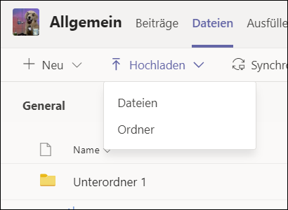
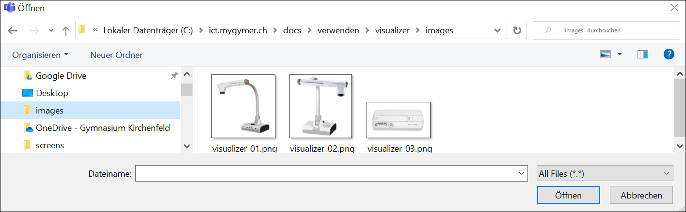

# Dateien hochladen

Videos, Sound- und Textdateien  in _Dateien_ hochladen. Achtung: Videodateien lassen sich nach dem Hochladen in Teams **nicht** direkt in Teams abspielen. Sie müssen heruntergeladen werden und können anschliessend mit einem auf dem Gerät installierten Player abgespielt werden. Sollen Videos im Browser abgespielt werden können, diese bitte in Stream hochladen und auf Teams verlinken:

https://ict.mygymer.ch/anderesoftware/video-audio/stream/

Sound- und Textdateien können hingegen in Teams direkt abgespielt werden, bzw. es wird eine Vorschau angezeigt.

1. Den korrekten Kanal auswählen: 
    * _Allgemein_: Jedes Mitglied des Teams kann die Dateien herunterladen
    * andere Kanäle können je nach Berechtigung nur bestimmten Mitgliedern des Teams Zugriff gewähren (erkennbar am Schloss-Symbol)

2. Den Reiter _Dateien_ auswählen

3. Auf _Hochladen_ klicken:
    * _Dateien_: Eine einzelne Datei oder mehrere Dateien hochladen
    * _Ordner_: Einen ganzen Ordner samt Inhalt hochladen

4. Die Datei(en)/den Ordner auswählen und auf __Öffnen__ klicken

5. Die Dateien sind nun über den Reiter _Dateien_ abrufbar und herunterladbar