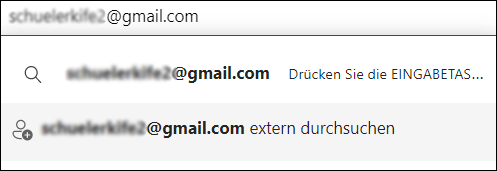
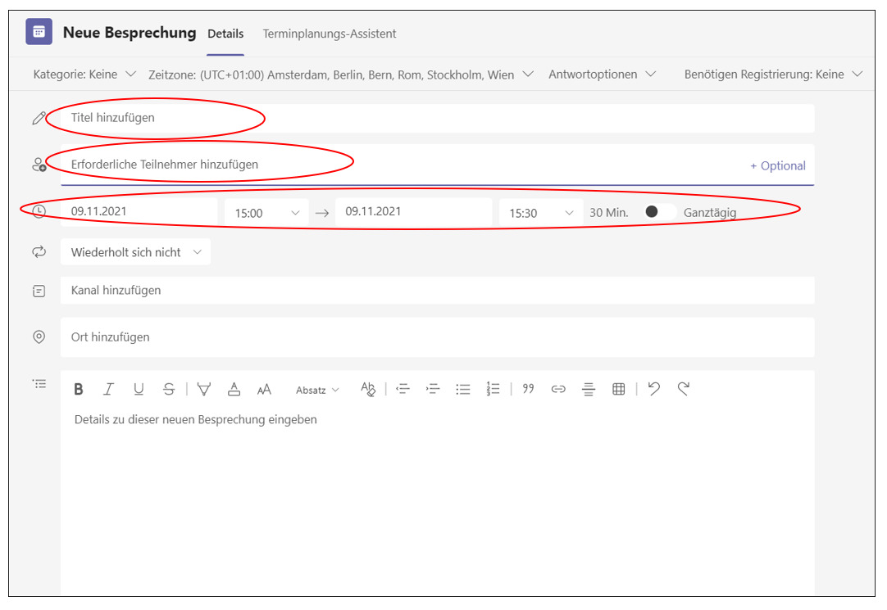
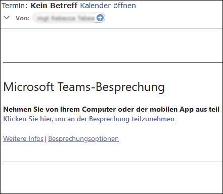
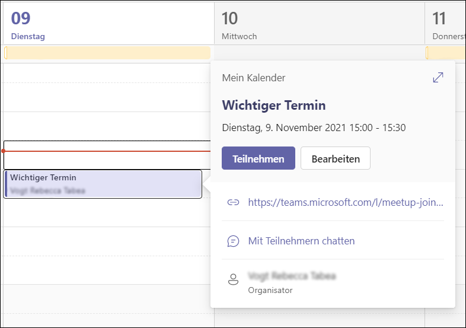

# Externe Nutzer:innen hinzufügen

Exteren Benutzer:innen sind Personen, die nicht Mitglied des Gymnasium Kirchenfeld sind. Z.B. Personen mit E-Mailadressen von anderen Institutionen wie _@stud.phbern.ch_, _@students.unibe.ch_, _@be.ch_, _@eduvaud.ch_ oder Personen mit privaten E-Mailadressen von anderen Anbietern wie z.B. _@yahoo.com_, _@gmx.ch_, etc. Auch mit diesen externen Personen kann in Teams ein Video- oder Audioanruf geführt werden. 

**Voraussetzung:** 
Entweder installiert man die Teams-App https://www.microsoft.com/de-ch/microsoft-teams/download-app (empfohlen) 
oder 
Teams wird im Browser genutzt - hierfür muss der Microsoft Edge Browser installiert sein https://www.microsoft.com/de-de/edge

## Chatfunktion 

Die Chatfunktion kann mit externen Nutzer:innen nur dann verwendet werden, wenn deren eigene Institution ebenfalls Teams nutzt oder es sich um eine Mailadresse handelt, die mit Skype/Microsoft verknüpft ist.
Hierfür im linken Menü in Teams den Button Chat  drücken und in der Suchleiste die E-Mailadresse eingeben. 

Die Option _[E-Mailadresse] extern durchsuchen_ wählen.

Falls ein Chat nicht möglich ist, weil die Adresse nicht mit Microsoft verknüpft ist, erscheint die Meldung _Die Unterhaltung kann nicht eingerichtet werden, da Ihre Organisationen nicht dafür eingerichtet sind._

## Video- oder Audioanruf
Falls es möglich ist, die Person direkt per Chat zu erreichen (siehe Kapitel Chatfunktion), kann auch aus dem Chatfenster direkt mit den entsprechenden Buttons ein Audio- oder Videoanruf gestartet werden:

Falls die Person nicht im Suchfeld des Chats gefunden werden kann, ist es nötig, einen Anruf per Kalenderfunktion zu planen. Hierfür links im Teams-Menu den Kalenderbutton anklicken.

Anschliessend mit einem Doppelklick auf den entsprechenden Termin doppelklicken um das Terminfenster zu öffnen.

Der Sitzung einen Titel geben. Im Feld _Erforderliche Teilnehmer hinzufügen_ die E-Mailadresse der externen Person eingeben. Das Datum und die Uhrzeit ggf. korrigieren und auf den _Senden_-Button klicken. 

Die eingeladene Person erhält eine E-Mail mit einem Teilnehmer-Link.

Wenn die eingeladene Person den Teilnahmelink anklickt, wird sie aufgefordert, entweder per Teams-App oder per Edgebrowser an der Sitzung teilzunehmen. Die Teamsapp oder der Edgebrowser müssen installiert sein. 

Bei Verwendung des **Edgebrowsers** muss jeweils erst eine Erlaubnis durch die Lehrperson erteilt werden, dass die Teilnehmerin die Sitzung betreten darf. Deshalb empfehlen wir, die **Teams-App** zu installieren. In der Teams-App kann sich die externe Person auch vor der Sitzung bereits in den Raum einloggen und das Mikrofon, die Kopfhörer und die _Inhalte teilen_-Funktion testen. Selbstverständlich ist auch ein Testanruf mit beiden Teilnehmern jederzeit möglich. Die Teilnahme ist grundsätzlich bereits vor dem Beginn des Termins über den Teilnahmelink möglich oder über den Eintrag im Kalender (als Organisator/Organisatorin):

Hierfür einen einfachen Klick auf den Termin im Kalender machen und _Teilnehmen_ wählen.
