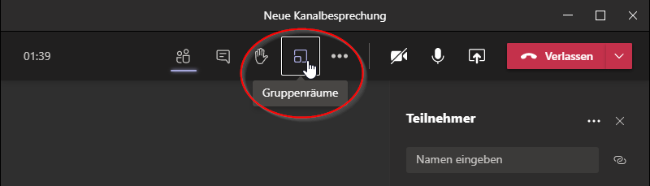
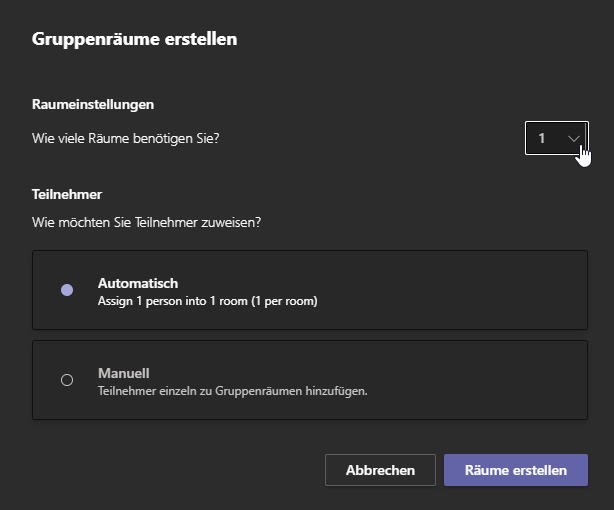
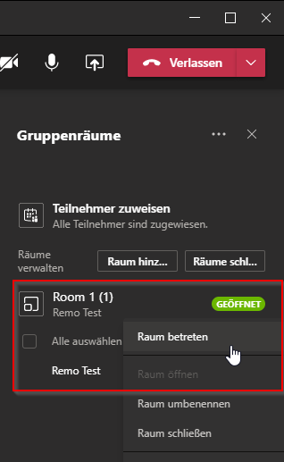
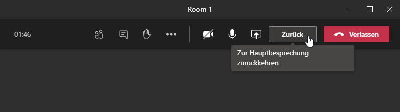
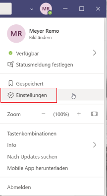
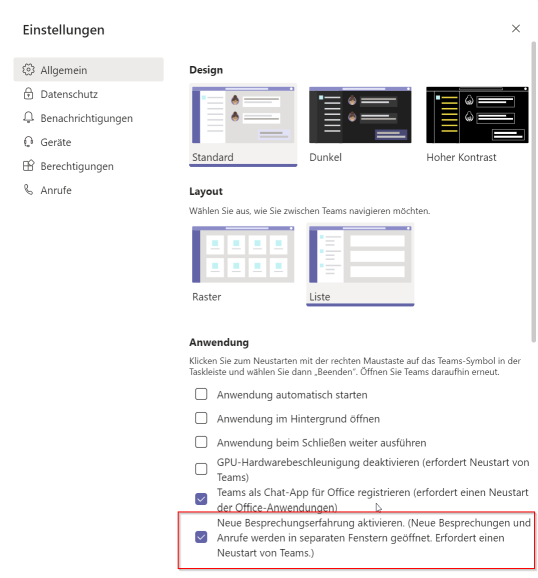
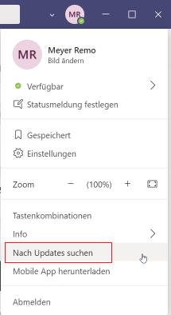

# Gruppenräume erstellen

In Teams Besprechungen können nun Gruppenräume erstellt werden. Meeting Organisator\*innen haben damit die Möglichkeit, Meeting Teilnehmer\*innen in kleinere Gruppen aufzuteilen, z.B. um Diskussionen in Arbeitsgruppen durchzuführen. Organisator\*innen können zwischen den Gruppenräumen hin- und herspringen, Ankündigungen in allen Räumen gleichzeitig machen und alle jederzeit zum Hauptmeeting zurückholen.

## Erstellung von Gruppenräumen

Während Besprechung auf das Gruppenräume-Symbol klicken.

Gewünschte Anzahl Gruppenräume erstellen und Teilnehmer automatisch oder manuell zuweisen.

Um die Gruppenräume zu betreten den gewünschten Raum rechts anklicken und "Raum betreten" auswählen.

So kommt man wieder in die Hauptbesprechung zurück:

Weitere Informationen findest du hier: [Microsoft Gruppenräume](https://news.microsoft.com/de-de/breakout-rooms-in-microsoft-teams/)

## Voraussetzungen

* Gruppenräume können nur in der Teams-App gestartet werden.
* Es sollte sichergestellt werden, dass das neue Meeting Erlebnis aktiviert ist. (Teams -> Einstellungen -> Allgemein -> Check “ Neue Besprechungserfahrung aktivieren”)

Häckchen setzen (falls noch nicht gemacht)

* Die Teams-App muss aktuell sein. Auf Updates prüfen: Teams -> „Nach Updates suchen“

