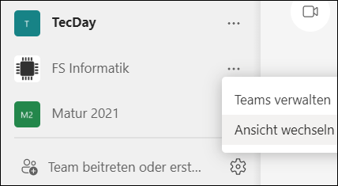
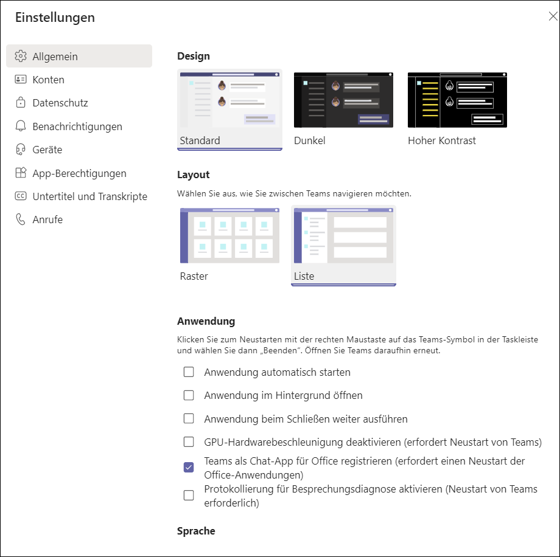

# Layout ändern

Im Teams kann man zwischen einer Listenansicht und einer Kachelansicht wechseln. 

- Hierfür unterhalb der Teamsliste auf das Zahnradsymbol klicken und _Ansicht wechseln_ wählen.

- Unter _Allgemein_ > _Layout_ entweder _Raster_ (Kacheln) oder _Liste_ wählen

