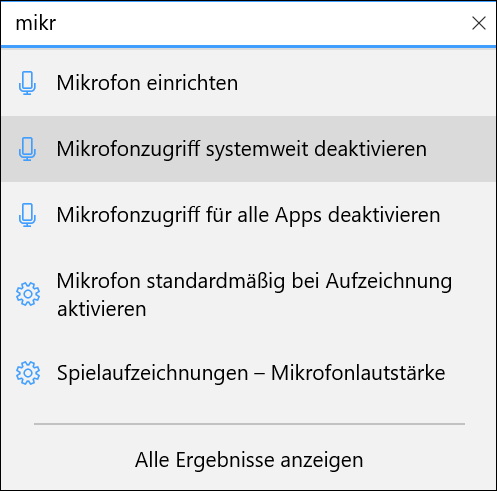
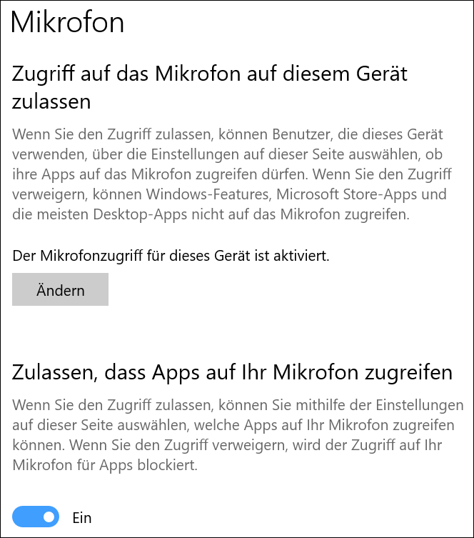
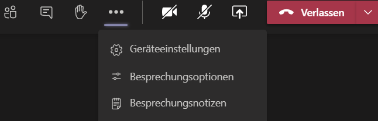
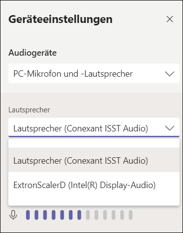
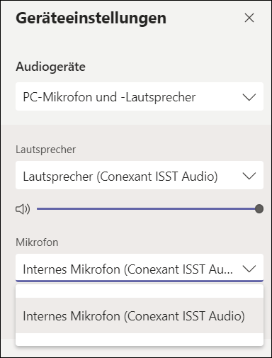

# Einstellungen für Tonausgabe und Mikrofon

Wenn man an einem **Windows-Notebook** arbeitet und in Teams kein Ton hörbar ist bzw. das Mikrofon nicht funktioniert, dann bitte Folgende Dinge kontrollieren:

1. Wenn man eine Ausgabe über den eingebauten Notebooklautsprecher möchte, dann ist Folgendes zu kontrollieren:

  * Am Audioanschluss dürfen keine Kopfhörer angeschlossen sein
  * An den USB-Anschlüssen dürfen keine Receiver für Kopfhörer angeschlossen sein

2. Systemweite Freigabe des Mikrofons aktivieren:

  * Auf den __Startknopf__ klicken
  * Auf __Einstellungen__ Klicken
  * Im nun erscheinenden Suchfeld _mik_ eingeben, bis der Menüpunkt _Mikrofonzugriff systemweit deaktivieren_ erscheint und diesen anwählen

  

 * Unter dem Erklärtext muss _Der Mikrofonzugriff für dieses Gerät ist aktiviert_ zu lesen sein und der Schalter unter _Zulassen, dass Apps auf Ihr Mikrofon zugreifen_ muss auf _ein_ gestellt sein. Sollte dies nicht der Fall sein, kann man mit einem Klick auf __Ändern__ den Zugriff erlauben.

 

3. Korrekte Systemaudioquelle wählen

  * Rechts unten auf das Lautsprechersymbol klicken

  * Auf das __^__-Symbol klicken um das Menu zu öffnen

  * Ton auf Zimmerlautsprecher übertragen: _ExtronScalerD (Intel(R) Display-Audio)_ wählen
  * Ton über eingebauten Notebook-Lautsprecher abspielen: _Lautsprecher (Conexant ISST Audio)_ wählen

4. Korrekte Einstellungen in Teams vornehmen

  * In der Teams-Sitzung auf das __...__ Symbol klicken und _Geräteeinstellungen_ wählen

  

  * Unter _Lautsprecher_ muss die korrekte Option gewählt werden:
    * Zimmerlautsprecher: _ExtronScalerD (Intel(R) Display-Audio)_
    * Notebook-Lautsprecher: _Lautsprecher (Conexant ISST Audio)_

  

  * Unter _Mikrofon_ muss die Option _Internes Mikrofon_ gewählt werden

  
