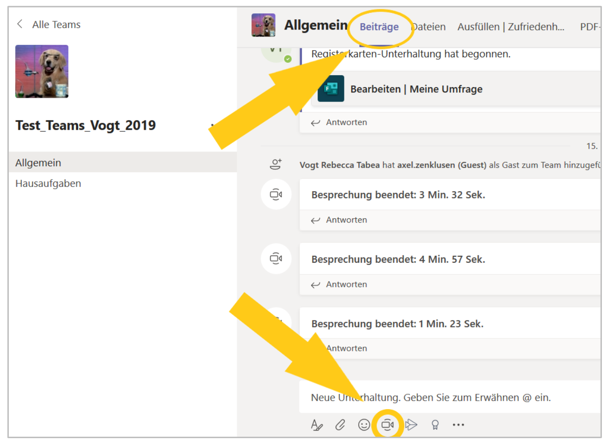
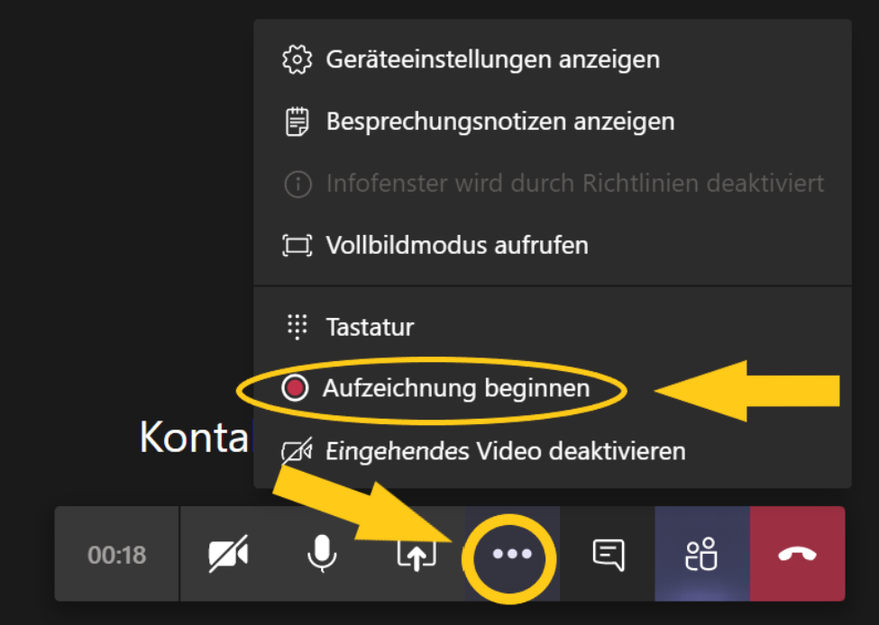
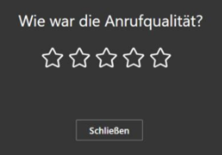
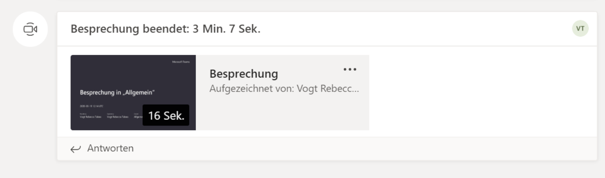

# Ton- und Videoaufnahmen teilen

## Schnelles Aufzeichnen und Teilen

Für das schnelle Teilen von Videos oder Tonaufnahmen, bei denen die Bildqualität eine untergeordnete
Rolle spielt, zum Beispiel Mitteilungen, Erklärungen, organisatorische Fragen:

1. Im entsprechenden Team auf den Reiter «Beiträge» gehen. Das Kamerasymbol unten im Fenster anklicken

    

2. Um Ton und Video aufzuzeichnen: Auf «jetzt besprechen» klicken Um ausschliesslich Ton aufzuzeichnen: Neben Kamerasymbol auf «aus» klicken, dann auf «jetzt
besprechen» klicken

    

3. Auf die drei Punkte im Menü klicken und «Aufzeichnung beginnen» anwählen

    

4. Aufzeichnung machen

5. Zum beenden auf das rote Hörersymbol klicken

    

6. Frage nach der Anrufqualität unbeantwortet lassen und schliessen

    

7. Nach einigen Minuten erscheint das Video im Kanal «Beiträge» und kann von allen TeamMitgliedern abgerufen werden

    

    Achtung: Das Video lässt sich nachträglich nicht mehr editieren oder löschen. Die Möglichkeit, es herunterzuladen oder anzusehen läuft jedoch nach 20 Tagen ab. 

## Video in Teams hochladen

Achtung: In Teams hochgeladene Videodateien lassen sich nicht direkt abspielen. Sie müssen heruntergeladen werden und können anschliessend mit einem auf dem Gerät installierten Player abgespielt werden. Siehe hierzu die Anleitung in der Sektion _Dateien hochladen_: 

https://ict.mygymer.ch//microsoft365/teams/dateien-hochladen

Sollen Videos im Browser abgespielt werden können, diese bitte in Stream hochladen und auf Teams verlinken:

https://ict.mygymer.ch/anderesoftware/video-audio/stream/

## Video auf Stream hochladen und in Teams teilen

Siehe hierzu die Anleitung in der Sektion _Videos_: https://ict.mygymer.ch/anderesoftware/video-audio/stream/
