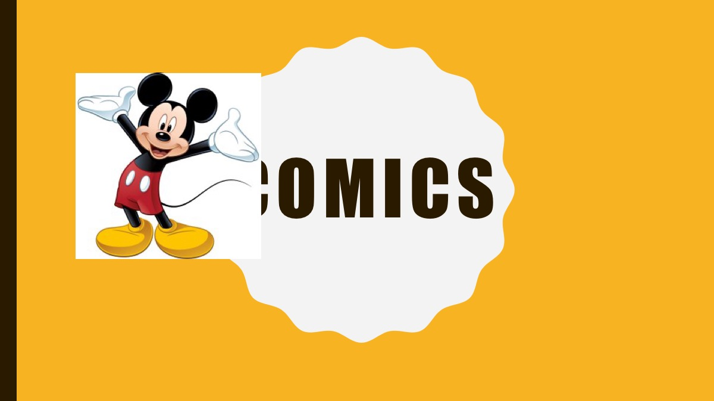

# Bilder

## Transparenz
Bilder sind immer rechteckig. Es gibt aber Bildformate, welche Transparenz unterstützen. Dadurch lassen sich Bilder besser auf einen farbigen Hintergrund platzieren. Falls du ein transparentes Bild brauchst, berücksichtigst du das am besten bereits bei der Suche. Die Google Bilder-Suche bietet bei `Farben` die Option, nach Bildern mit Transparenz zu suchen:

* [Suche nach «Mickey Mouse»](https://www.google.ch/search?q=mickey+mouse&tbm=isch)
* [Suche nach «Mickey Mouse» mit Transparenz](https://www.google.ch/search?q=mickey+mouse&tbm=isch&tbs=ic:trans)

### Titelfolie: Comics
Das linke Bild von Mickey Mouse stammt aus einer jpg-Datei, welche keine Transparenz unterstützt. Der Hintergrund des Bildes ist weiss.
Das rechte Bild von Mickey Mouse stammt aus einer png-Datei, die Transparenz unterstützt. Das Bild macht Gebrauch davon, daher ist der Hintergrund des Bildes durchsichtig: Der Hintergrund der Foie ist sichtbar.

:::cards

***

:::

## Hintergrund
Bilder im Hintergrund sind sehr schwierig. Man muss eine Balance finden, so dass man sie erkennt, der Inhalt aber nicht gestört wird.

### Folie: Comic-Strip
Rechts wurde versucht, das Bild als Hintergrundbild zu verwenden. Wegen des Kontrastes musste das Hintergrundbild aufgehellt werden. Nun trägt das Bild aber nicht mehr viel zum Inhalt bei.

:::cards

***

:::

### Folie: Erste Comic-Autoren
Nochmals ein Versuch mit dem Hintergrundbild. Dieses Mal ist es reine Verzierung und hat nichts direkt mit der Folie zu tun. (Natürlich mit dem Thema «Comics» schon, aber nicht mit den beiden Autoren.) Trotzdem wirkt die Folie links sauberer und klarer.

:::cards

***

:::

### Folien: Comic-Figuren
Asterix & Obelix: Hier wurde mit den grossen Frankreich-Umrissen und einer Wellentextur ein eigenes, dezentes Hintergrundbild erzeugt, welches zum Inhalt passt.
Batman: Hier wurde der farbige Hintergrund mit einem dezentem Batman-Logo und einem weniger dezenten «Bam!» versehen.

:::cards

***

:::
