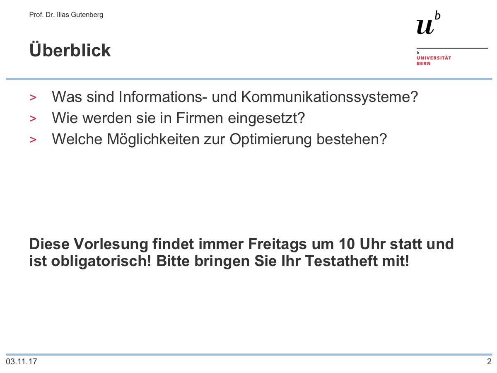

# Präsentation erstellen

Es gibt verschiedene Möglichkeiten mit einer Präsentation zu starten:

* **leere Präsentation** – eine schlichte Vorlage: Schwarz auf weiss, ohne Verzierungen und Schmuck
* **Vorlage** – eine der eingebauten Vorlagen: meist etwas gar farbig, aber wenn man etwas Passendes findet, wieso nicht.
* **alte Präsentation** – man kann auch eine alte Präsentation kopieren und die Folien anpassen. (Achtung! wirklich kopieren, d.h. Datei zuerst kopieren und dann öffnen oder direkt unter einem neuem Namen abspeichern. Sonst besteht die Gefahr, dass man die alte Präsentation verliert)

Folgende Gedanken sollte man sich zu Beginn machen:

## Seitenverhältnis
**16:9 (Breitbild)** oder **4:3**? Hängt vom Beamer ab und davon, wo man präsentiert. Heute ist der Standard das neuere und breitere Format, also **16:9**. (Die meisten Projektoren, wie auch Laptop- und Desktop-Bildschirme, besitzen heute ein Breitformat von 16:9, 16:10 oder etwas Ähnliches.)

<ImagesBox caption="Breitformat vs älteres 4:3-Format">

<!-- {.zoom} -->

<!-- {.zoom} -->

</ImagesBox>

## Design
- Familienfeier? Lustiges, verspieltes Design ist möglich.
- Schule? Dem Thema angepasstes Design.
- Firma oder offizieller Anlass? Falls möglich eine offizielle Vorlage verwenden.

Nachfolgend einige Titelfolien von möglichen Designs und ihrem Einsatz. Die Inhaltsfolien (hier wird jeweils nur die erste gezeigt) orientieren sich bei der Gestaltung an den Titelfolien (Schriftart, Farben, Design, ...)

### Privat/Familie
Ein farbenfrohes Design: Gezeichnet, diverse Farben, viel Grafik, lustige Schriftart. Nett, aber für die Schule (jedenfalls auf unserer Stufe) unpassend.

<ImagesBox caption="5 Jahre Tim">

<!-- {.zoom} -->

<!-- {.zoom} -->

</ImagesBox>

### Schule 1
Die untenstehende Präsentation könnte eine Präsentation im Schwerpunktfach Musik sein. Die Titelgrafik nimmt das Thema des Vortrages auf und wirkt dabei schlicht. Der helle Text auf dem schwarzen Hintergrund erinnert entfernt an die weissen Tasten eines schwarzen Klaviers.

<ImagesBox caption="Das Klavier">

<!-- {.zoom} -->

<!-- {.zoom} -->

</ImagesBox>

### Schule 2
Die herbstlichen Farben und das Titelbild nehmen das Thema auf. Die Schriftart ist leicht verziert, aber formell. Könnte z.B. zu einer Maturaarbeit gehören.

<ImagesBox caption="Im Garten">

<!-- {.zoom} -->

<!-- {.zoom} -->

</ImagesBox>

### Offiziell
Eine Präsentation am Institut für Wirtschaftsinformatik der Universität Bern, basierend auf der offiziellen Vorlage. Professionell und schlicht. Natürlich in den offiziellen Farben und inklusive Uni-Logo.

<ImagesBox caption="Kurs Grundlagen">

<!-- {.zoom} -->

<!-- {.zoom} -->

</ImagesBox>
