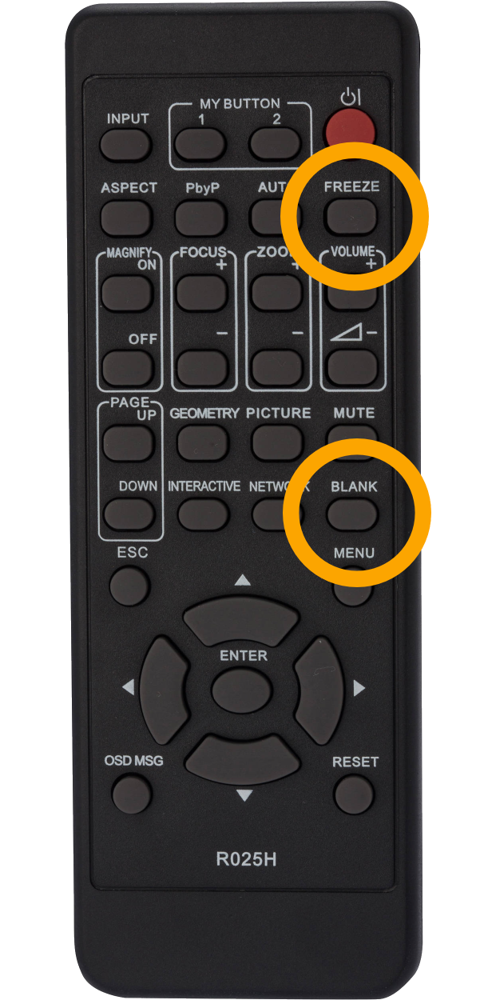

# Starten, pausieren und fortsetzen

Zu einer guten Präsentationsvorführung gehört auch ein **kompetenter Umgang mit der Technik**. Es macht sich nicht gut, wenn der Vortragende zuerst lange seine Präsentations-Datei sucht und man ihm auf dem Beamer dabei zuschauen kann!

## Präsentation starten
Eine Präsentation kannst du mit dem Tastaturkürzel [[F5]] starten. Das geht schnell und du musst nicht mit der Maus zielen oder mehrmals klicken. Am Besten gehst du wie folgt vor:

1. Computer und Beamer starten
2. Korrekter Bildschirm-Modus auswählen (siehe Tipp [Zwei Bildschirme](../zwei-bildschirme))
3. Den Beamer mit der Fernbedienung schwarz stellen (mit [[Blank]]-Taste, siehe unten)
4. Dann die Präsentations-Datei suchen und öffnen
5. Die Präsentation starten
6. Wenn's losgehen soll: den Beamer wieder aktivieren (nochmals [[Blank]]-Taste)

## Präsentation unterbrechen und weiterfahren
Um eine Präsentation zu unterbrechen, drückst du [[Esc]]. Dadurch wechselt die Anzeige ins normale Programm-Fenster. Wenn du die Präsentation weiterführen möchtest, dann stellst du sicher im Programm-Fenster die entsprechende Folie ausgewählt ist und startest die Präsentation von dieser Folie. Am einfachsten geht das mit [[Shift]] + [[F5]].

## Präsentation pausieren
Wenn du etwas diskutieren und einfach die Präsentation ausblenden möchtest, dann kannst du den Bildschirm entweder in der **Referentenansicht oder im Kontextmenu** beim Rechtsklick schwarz (__Bildschirm__ :mdi-chevron-right: __schwarz__ oder __Präsentation ausblenden__) oder weiss (__Bildschirm__ :mdi-chevron-right: __weiss__) schalten.

Noch einfacher klappt das mit der **Tastatur**: Drücke [[W]] für weiss oder [[B]] für schwarz (*black*).
Bei den meisten Beamern kannst du direkt mit der **Beamerfernbedienung** den Beamer auf schwarz stellen, oder alternativ ein Standbild aktivieren. Dies hat den zusätzlichen Vorteil, dass du etwas ändern oder vorbereiten kannst, ohne dass die Leute die Arbeit am Beamer nachverfolgen können.

|---- |-----|
|  |  Mit [[Freeze]] kann ein **Standbild** aktiviert werden. D.h. der Beamer bleibt stehen und zeigt das aktuelle Bild als Standbild an. Durch nochmaliges Drücken der [[Freeze]]-Taste wird das Standbild wieder deaktiviert.
| ^^   | Mit [[Blank]] wird das Beamer-Bild schwarz gestellt. Du kannst nun etwas vorbereiten, z.B. eine Webseite öffnen. Wenn du so weit bis, kannst du durch erneutes Drücken der [[Blank]]-Taste auf der Fernbedienung das Bild wieder anzeigen.    |
[Fernbedienung Hitachi]

