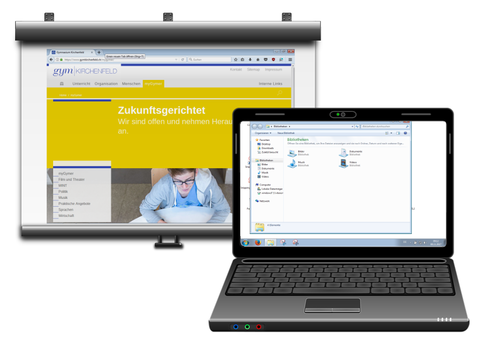
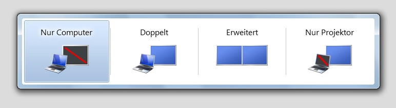

# Zwei Bildschirme

Schliesst du an einem Computer oder einem Laptop einen Beamer an, so verhält sich dieser wie ein zweiter Bildschirm.

Nun gibt es zwei Möglichkeiten diesen zweiten Bildschirm anzusteuern.

## 1. Klonen
**Beide Bildschirme zeigen das selbe Bild an.** Dieser Modus macht Sinn, wenn du etwas vorführen möchtest, z.B. das Verwenden eines Programms, oder eine Webseite zeigen möchtest. Du kannst in diesem Modus auch Präsentationen vorführen. Man sieht dann aber auf beiden Bildschirmen die Folien in der Präsentationsansicht.

## 2. Erweiterter Desktop
Die Einstellung «Erweiterter Desktop» **kombiniert zwei Bildschirme zu einem**: Du kannst Fenster beliebig auf den Bildschirmen hin- und herschieben. Die Bildschirme lassen sich neben oder übereinander anordnen. Diese Einstellung verwendet man, wenn man einen Arbeitsplatz mit mehreren Bildschirmen betreibt, oder aber für die Referenten-Ansicht bei einer Präsentation (siehe [Referentenansicht Powerpoint](../../powerpoint/referentenansicht/) oder siehe [Referentenansicht Impress](../../impress/referentenansicht/))

## Umschalten
Um zwischen den beiden Modi umzuschalten, drückst du (bei Windows) die Tastenkombination [[:mdi[microsoftWindows]]] + [[P]]. Anschliessend kannst du im erschienen Fenster (siehe Screenshot unten) einen der beiden Bildschirme deaktivieren oder eben den Modus des Zweibildschirm-Betriebs («Doppelt» oder «Erweitert» festlegen.

