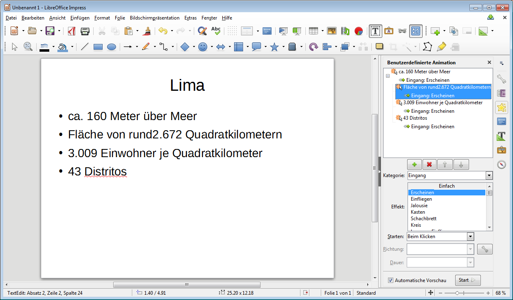

# Animationen

:::warning Animationen sollen den Inhalt unterstützen!
Gehe spärlich mit ihnen um und überlege dir jeweils, ob es diese Animation wirklich braucht!
:::

Häufig werden Animationen zum Erscheinen einzelner Punkte (Aufzählungspunkte, Bilder, Beschriftungen, Einträge auf einer Timeline, ...) verwendet. So stellst du sicher, dass der Zuhörer dir folgt und sich nicht bereits Gedanken zum nächsten Punkt auf der Folie macht.

Zum **Einfügen und Bearbeiten von Animationen** lässt du dir am Besten den Bereich __Benutzerdefinierte Animation__ rechts einblenden. Dies erreichst über den gelben Stern oder __Ansicht__ :mdi[chevronRight] __Benutzerdefinierte Animation__. Um **neue Animationen** einzufügen, wählst du ein Element aus und klickst im rechten Bereich auf das grüne plus-Symbol. Anschliessend wählst du ein Kategorie, je nachdem ob das Element erscheinen, hervorgehoben werden oder verschwinden soll. Schlussendlich kannst du einen der Effekte der gewählten Kategorie wählen.

Du kannst jederzeit die **Reihenfolge anpassen**. Zudem kannst du bestimmen, wie die **Animation gestartet** wird. Normal wird eine Animation nach einem Mausklick gestartet. Man kann eine Animation aber auch nach oder gleichzeitig mit der vorherigen Animation ausführen lassen.

:::tip
Neben Animationen sind sogenannte **Folienübergänge** möglich. Diese beschreiben, mit welchem Effekt die nächste Folie eingeblendet wird. Z.B. bei einer Diashow mit Überblenden. Du findest die Auswahl über das lila Symbol oberhalb des Sterns oder über __Ansicht__ :mdi[chevronRight] __Folienübergang__.
:::
