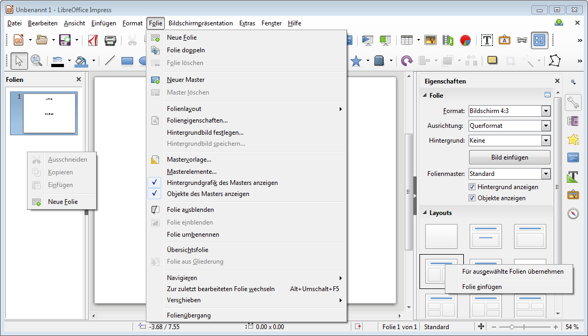

# Folienlayout

Eine neue Präsentation startet normalerweise mit einer Titelfolie. Weitere Folien kannst du über __Folie__ :mdi-chevron-right: __Neue Folie__ eingefügen. (oder mit Rechtsklick bei der Folienvorschau oder den Layouts)

Beim **Folienlayout** handelt es sich um eine vordefinierte Anordnung von Elementen auf der Folie. Dazu gehören z.B. Bereiche für Überschrift, Text und Bilder. Durch die Verwendung von Folienlayouts stellst du sicher, dass Elemente auf allen Folien korrekt und konsistent platziert sind. Folienelemente manuell anpassen solltest du nur in ganz speziellen Situationen.

Das Layout einer Folie kannst du auch nachträglich anpassen. Dies klappt entweder mit Rechtsklick auf das Vorschaubild der entsprechenden Folie oder bei den __Eigenschaften__ rechts unter __Layouts__.
