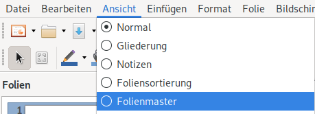
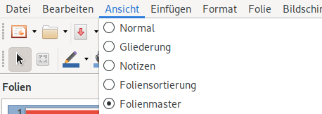
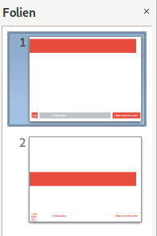
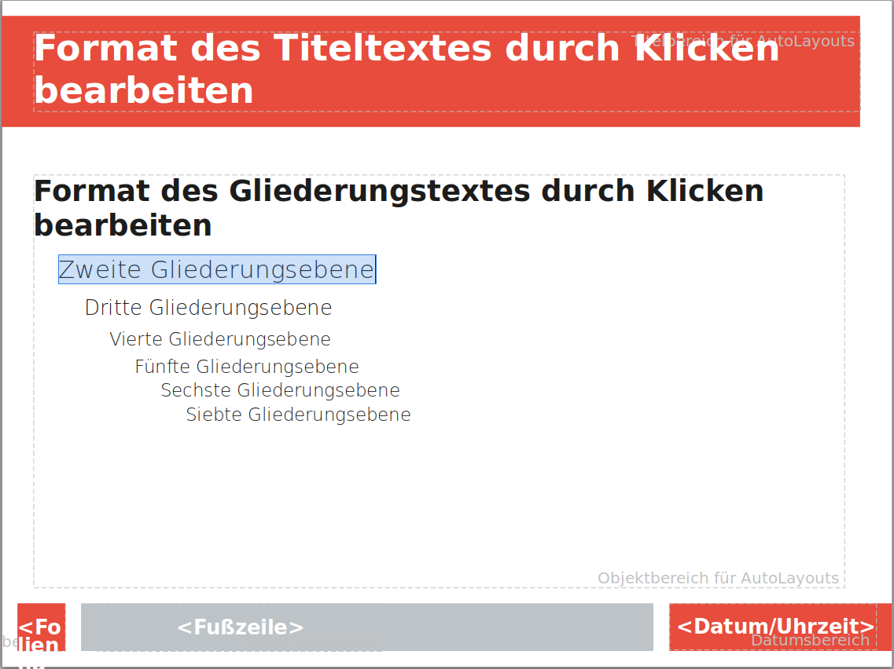
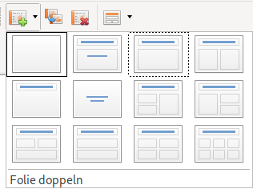
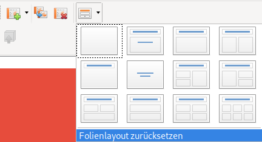

## Die Idee des Folienmasters
Die Folienmaster-Ansicht ermöglicht es dir, **Vorlage-Folien** mit dem Design einer Präsentation selber zu erstellen resp. zu verändern. Dies spart – analog zu den Formatvorlagen in der Textverarbeitung – Zeit und ermöglicht ein einheitliches Design, ohne dass bestehende Folien kopiert oder von Hand angepasst werden müssen.

## Folienmaster anzeigen
Den Folienmaster findest du unter __Ansicht__ :mdi-chevron-right: __Folienmaster__.

Um den Folienmaster zu schliessen und zur normalen Ansicht zurückzukehren, navigierst du __Ansicht__ und wählst __Normal__.

## Der Master und die verschiedenen Layoutvorlagen
Für die Folienlayouts Titelfolie und Aufzählung existiert in der linken Spalte je eine eigene Vorlage.

## Master anpassen
Du kannst die vorhandenen Layouts wie gewohnt anpassen. Beispielsweise kannst du bei Aufzählungen die Schrift gezielt für jede Ebene anpassen:

## Folienlayout wählen
Zurück in der normalen Ansicht kannst du neue Folien mit einem bestimmten Layout hinzufügen, indem du in der Symbolleiste auf den kleinen Pfeil am rechten Rand des entsprechenden Icons klickst und anschliessend das gewünschte Layout auswählst:

## Auswirkungen auf die Folien
Alle im Folienmaster vorgenommenen Änderungen wirken sich sofort auf sämtliche existierenden und neuen Folien aus. Ausnahme: Wenn du die in der Masteransicht angepasste Eigenschaft auf einer Folie bereits manuell geändert hast.

Du kannst eine Folie jederzeit wieder auf die Einstellungen gemäss Layoutvorlage zurücksetzen, in dem du beim Icon zum Anpassen des Layouts auf __zurücksetzen__ klickst:

