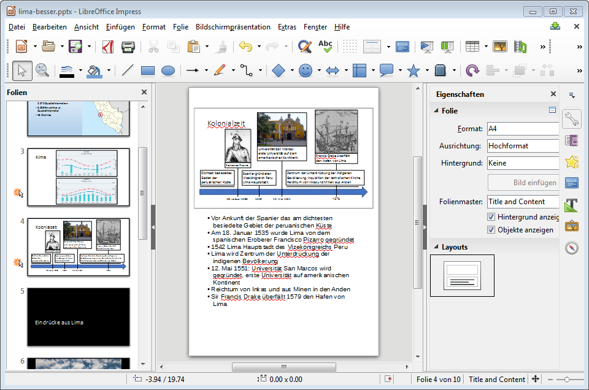

Über __Ansicht__ :mdi-chevron-right: __Notizen__ kannst du dir die Notizenansicht anzeigen lassen. Hier hast du auf einer Hochformat-Seite oben die Folie und unten einen Bereich in welchem du beliebigen Text notieren kannst.

Die Notizen kannst du dann entweder ausdrucken (siehe [Drucken](../drucken) oder während der Präsentation anzeigen lassen (siehe  [Referentenansicht](../referentenansicht)).

