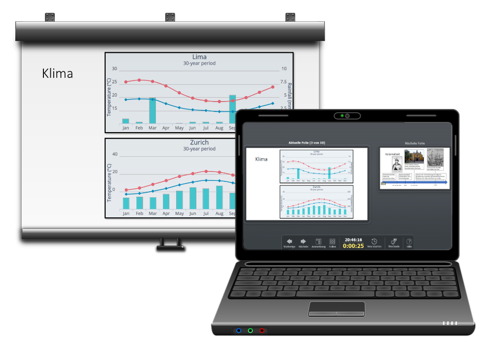
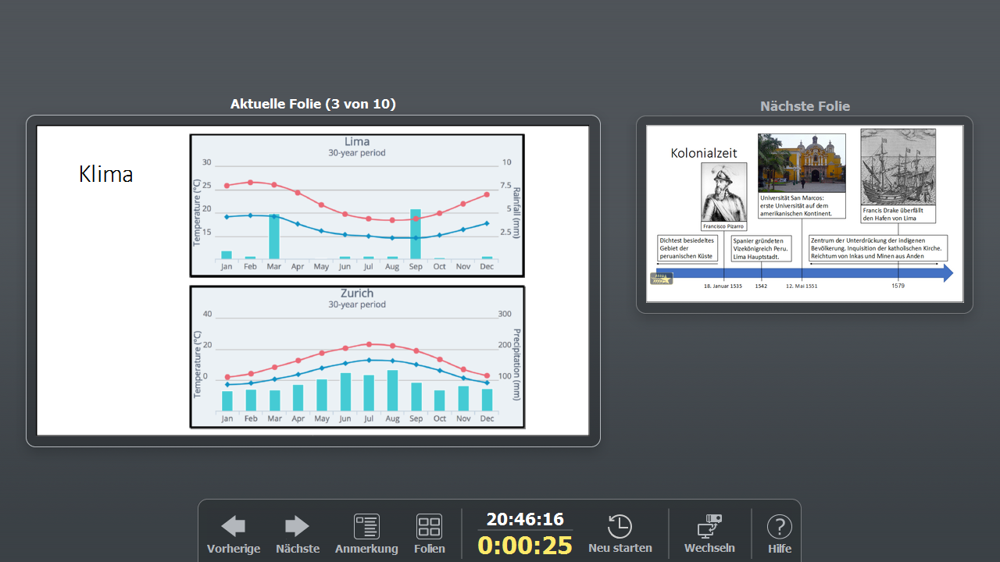
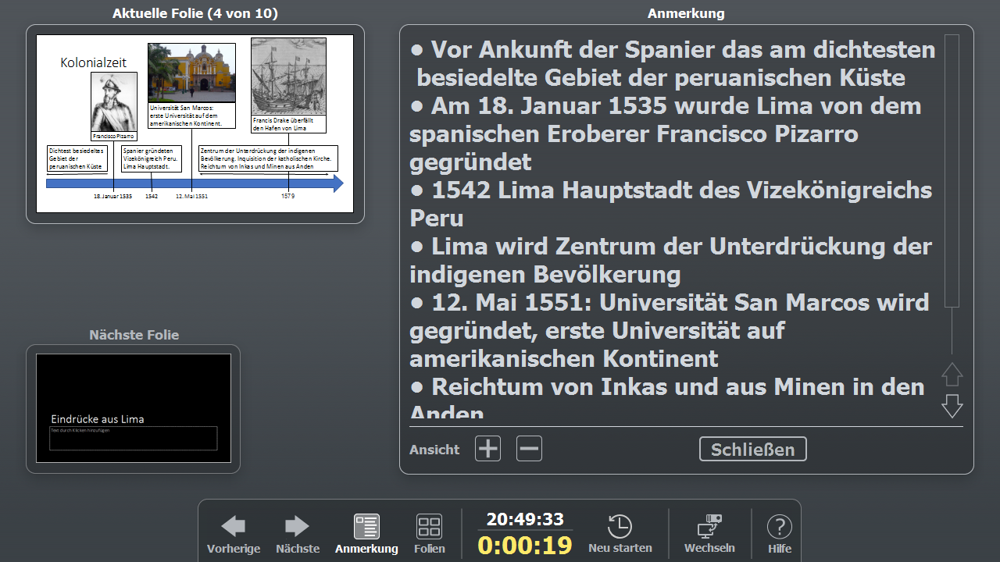
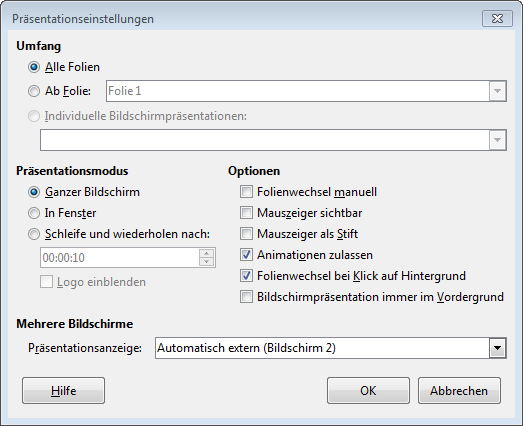

:::warning Warnung
Um die Referentenansicht zu verwenden, benötigst du mindestens zwei Bildschirme, resp. einen Bildschirm (eingebaut oder extern) und einen Projektor. Zudem müssen diese in der Einstellung «Erweiterter Desktop» betrieben werden. (siehe [Zwei Bildschirme](../../allgemein/zwei-bildschirme))
:::

Schauen wir die Referentenansicht etwas genauer an, so sehen wir, dass neben der **aktuellen Ansicht** die am Beamer gezeigt wird (grosses Fenster), rechts daneben die **nächste Folie** angezeigt wird. Es existiert eine Navigation um weiterzublättern, eine Uhr sowie ein Timer der die vergangene Zeit seit Präsentationsbeginn anzeigt.

Über den Knopf __Anmerkungen__ lässt sich die Ansicht ändern – zusätzlich werden jetzt prominent die **Notizen** der Folie angezeigt.

## Referentenansicht einstellen
Über __Bildschirmpräsentation__ :mdi-chevron-right: __Präsentationseinstellungen__ kommst du zum unten dargestellten Fenster. Hier kannst du – bei mehreren Bildschirmen – auswählen, auf welchem die Präsentation angezeigt werden soll. Der andere Bildschirm wird dann automatisch für die Referentenansicht verwendet.

