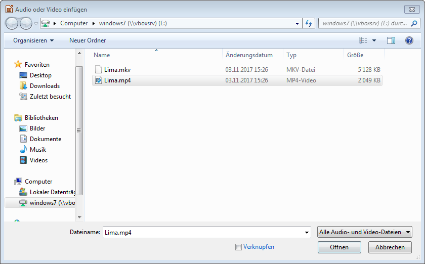
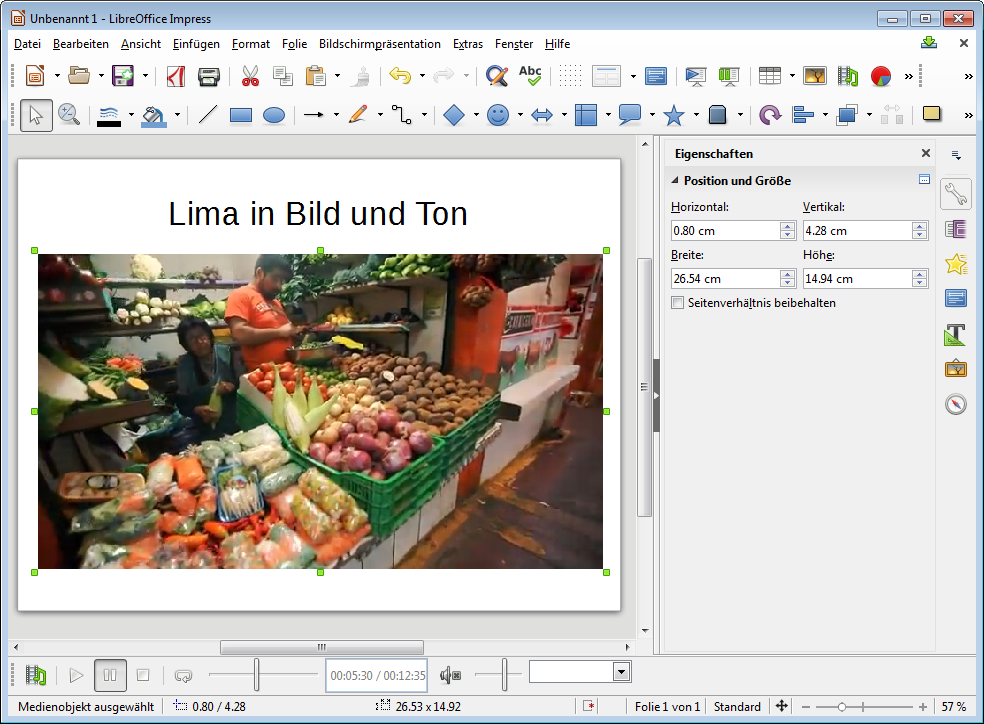

# Videos

## Video aus Datei
Über __Einfügen__ :mdi-chevron-right: __Audio/Video...__ kann eine Video-Datei ausgewählt werden. Beim Einfügen kannst du wählen, ob die Video-Datei in der Impress-Datei **integriert** oder **nur verknüpft** werden soll. Wird das Video nur verknüpft, dann kann Impress das Video nur abspielen, wenn auf dieses zugegriffen werden kann!

## Youtube
Youtube-Clips können in Impress **nicht direkt integriert** werden. Man muss diese zuerst als Video-Datei abspeichern. Dazu existieren diverse Tools und Programme. Am besten nach «[youtube download video](https://www.google.ch/search?q=download+youtube+video)» googeln.

## Video bearbeiten
Wählt man ein eingefügtes Video-Element aus, so kann man bei __Eigenschaften__ die Grösse und das Seitenverhältnis einstellen. Am unteren Rand des Programmfensters erhält man eine zusätzliche Leiste. Hier kann man **Start- und Endposition** sowie **Lautstärke** des Clips einstellen.

