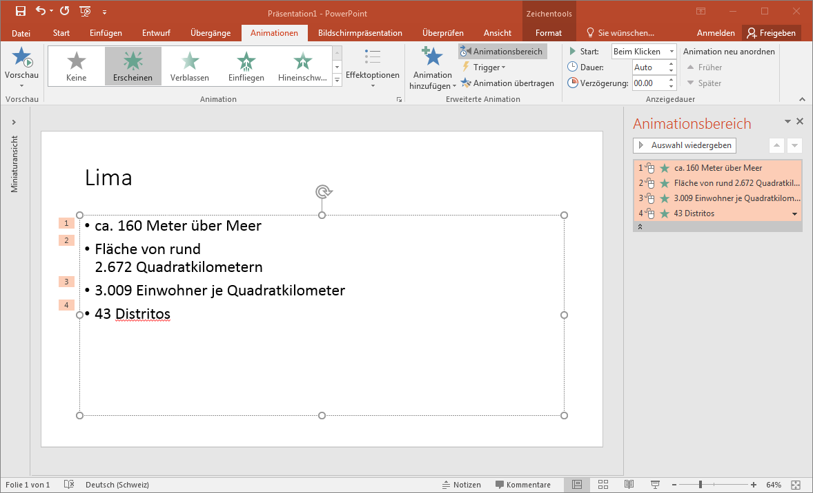

# Animationen

:::warning Animationen sollen den Inhalt unterstützen!
Gehe spärlich mit ihnen um und überlege dir jeweils, ob es diese Animation wirklich braucht!
:::

Häufig werden Animationen zum Erscheinen einzelner Punkte (Aufzählungspunkte, Bilder, Beschriftungen, Einträge auf einer Timeline, ...) verwendet. So stellst du sicher, dass der Zuhörer dir folgt und sich nicht bereits Gedanken zum nächsten Punkt auf der Folie macht.

Zum **Einfügen und Bearbeiten von Animationen** lässt du dir am Besten den Animationsbereich rechts einblenden. Dies erreichst über __Animationen__ :mdi[chevronRight] __Animationsbereich__. Um **neue Animationen** einzufügen, wählst du ein Element aus und klickst unter __Animationen__ auf ein grünes Symbol. Die Animationen sind farbig codiert: Grün steht für Erscheinen, Gelb für Hervorheben (Element ist schon da, wird aber hervorgehoben), Rot für Verschwinden (Element wird wieder ausgeblendet) und dann gibt es noch Pfade, welche ein Element verschieben.

Im Animationsbereich kannst du die **Reihenfolge anpassen**. Zudem kannst du sagen, wie die **Animation ausgelöst** wird. Normal wird eine Animation nach einem Mausklick gestartet. Man kann eine Animation aber auch nach oder gleichzeitig mit der vorherigen Animation ausführen lassen.

:::tip
Neben Animationen sind sogenannte **Folienübergänge** möglich. Diese beschreiben, mit welchem Effekt die nächste Folie eingeblendet wird. Z.B. bei einer Diashow mit Überblenden. Du findest die Auswahl im Menuband gleich neben Animationen unter __Übergänge__.
:::
