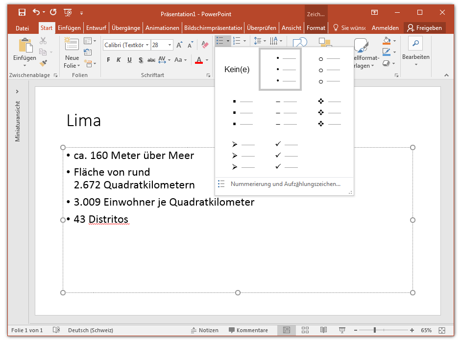
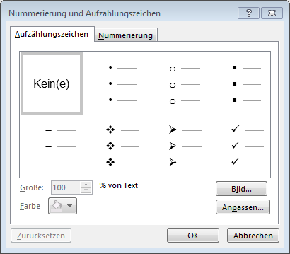

# Aufzählung

Die Folie soll den Vortrag unterstützen. Oft erreicht man das durch Stichwörter, welche auf der Folie stehen. Diese Stichwörter werden meist in Listen mit Aufzählungszeichen gesetzt.

Anpassen kannst du die Aufzählungszeichen unter __Start__ :mdi-chevron-right: __Absatz__ oder im separaten Fenster.

Auch verschachtelte Aufzählungslisten sind möglich. Um die Listenebene eines Aufzählungspunktes zu ändern, geht man an den Anfang der Zeile und drückt [[Tab :mdi-keyboard-tab:]] (eine Ebene höher) oder [[Shift :mdi-apple-keyboard-shift:]] + [[Tab :mdi-keyboard-tab:]] (eine Ebene tiefer). Mehr als zwei Ebenen sind aber selten sinnvoll.

:::tip

Zu lange und zu viele Aufzählungen werden langweilig. Es gibt aber Alternativen zu den Aufzählungszeichen:

* Kleine Bilder mit einem Stichwort anstelle der Aufzählungsliste
* Grössere Bilder, pro Aufzählungspunkt eine Folie
* Aufzählung grafisch aufwerten, z.B. in Form einer Zeitachse, einer Karte oder anhand eines Schemas

Zudem gibt es Folien, bei denen man auf die Aufzählung verzichten kann und besser Bilder oder Grafiken zeigt, welche dem Vermitteln des Sachverhalts dienen. Z.B. die Komponenten eines Computers, den Graphen einer Funktion, eine statistische Auswertung einer Umfrage, ...

:::
