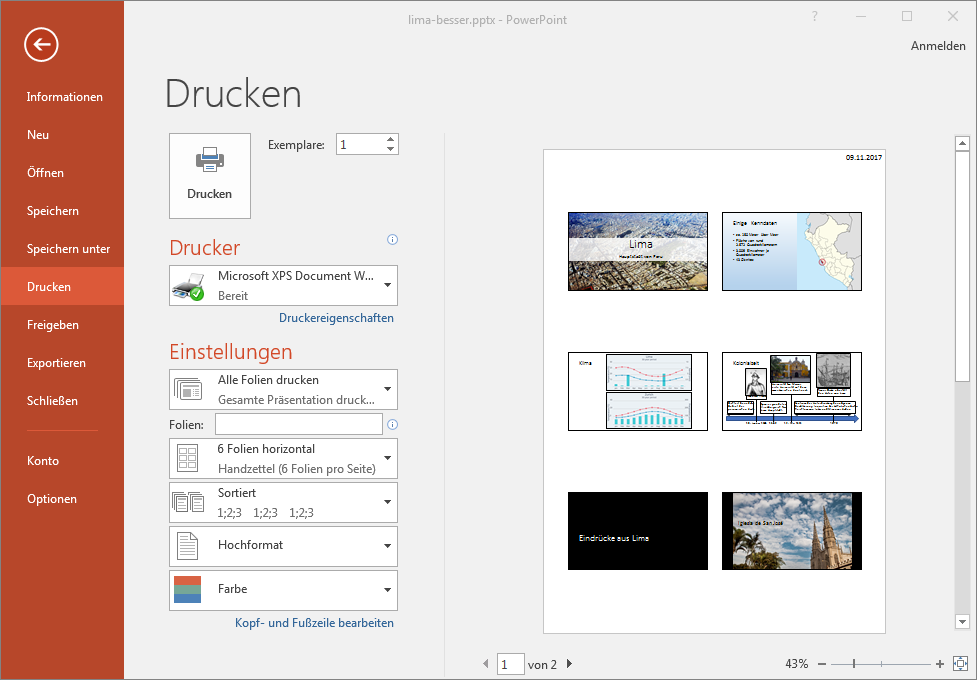
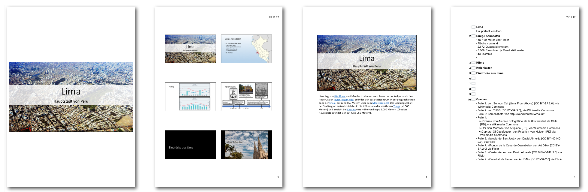

Dei erstellte Präsentation kannst du in diversen Formaten ausdrucken. Über __Datei__ :mdi-chevron-right: __Drucken__ oder [[Ctrl]] + [[P]] rufst du das Druck-Fenster auf:

Unter __Einstellungen__ kann ausgewählt werden zwischen Folien, Handzettel, Notizen und Gliederung.

Folie
: Jede Folie kann **formatfüllend auf ein Blatt** gedruckt werden. (Natürlich auch im Querformat.) Du kannst diese Ausdrucke von Hand kommentieren und als Spickzettel während der Präsentation verwenden, oder – für ganz wichtige Präsentationen – auf eine Folie drucken, damit du sie über den Hellraumprojekt zeigen könntest, sollte der Beamer oder der Computer nicht funktionieren.

Handzettel
: Handzettel werden häufig als **Handout** verwendet: Du verteilst den Zuhörern vor der Präsentation einen Ausdruck – 3, 4 oder 6 Folien pro Seite. Diesen können die Zuhörer während der Präsentation mit Notizen ergänzen und dann mit nach Hause nehmen.

Notizen
: Hier erhältst du pro Folie eine Seite – im oberen Bereich siehst du **die Folie**, in der unteren Hälfte werden die **zur Folie notierten Anmerkungen** (siehe Tipp [Notizen](/praesentation/powerpoint/notizen)) ausgedruckt. Diese Blätter eignen sich als Spickzettel, wenn du mit der eingebauten Notizfunktion arbeitest.

Gliederung
: Dabei handelt es sich um die **Gliederungsansicht zum Ausdrucken**. Dabei wird nur der Titel und Text aller Folien in der korrekten Reihenfolge gedruckt. Grafiken und andere Elemente sind hier nicht ersichtlich. Dafür passen mehrere Folien auf eine Seite und du kannst so schnell die Präsentation noch einmal im Geiste durchspielen.

