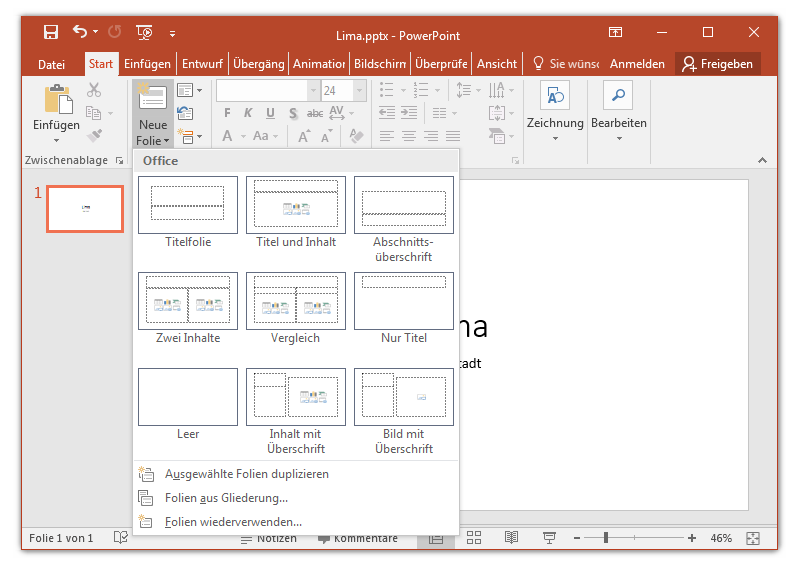
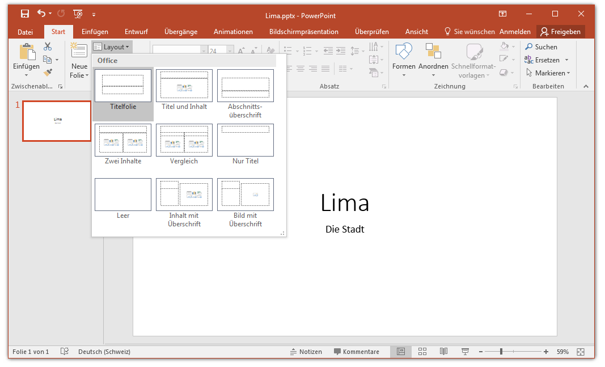

# Folienlayout

Eine neue Präsentation startet normalerweise mit einer Titelfolie. Weitere Folien kannst du über __Start__ :mdi[chevronRight] __Neue Folie__ eingefügen.

Dabei wählst du das gewünschte Folienlayout aus.

Beim **Folienlayout** handelt es sich um eine vordefinierte Anordnung von Elementen auf der Folie. Dazu gehören z.B. Bereiche für Überschrift, Text und Bilder. Durch die Verwendung der Folienlayouts stellst du sicher, dass Elemente auf allen Folien korrekt und konsistent platziert sind. Folienelemente manuell anpassen solltest du nur in ganz speziellen Situationen.

Das Layout einer Folie kannst du auch nachträglich anpassen. Dies klappt entweder mit Rechtsklick auf das Vorschaubild der entsprechenden Folie oder über __Start__ :mdi[chevronRight] __Layout__.

Beim Ändern des Layouts können gewisse Inhalte verloren gehen, wenn das neue Layout Bereiche des alten Layouts nicht unterstützt,
