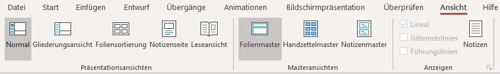
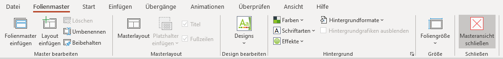
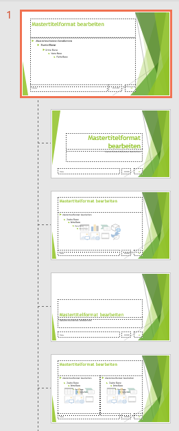
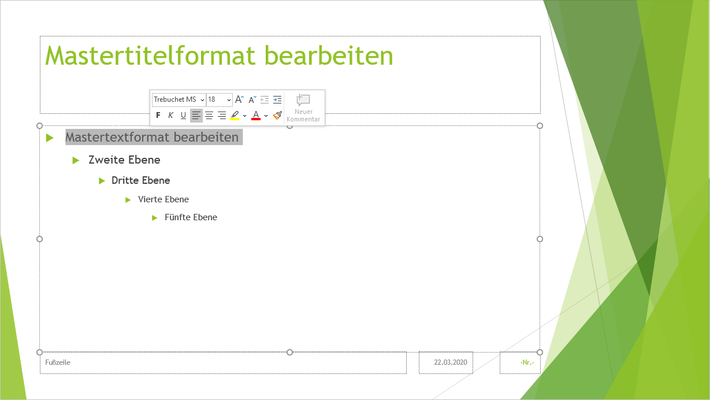
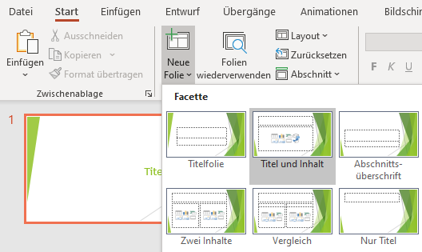
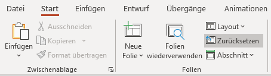

# Masterfolie

## Die Idee des Folienmasters
Die Folienmaster-Ansicht ermöglicht es dir, **Vorlage-Folien** mit dem Design einer Präsentation selber zu erstellen resp. zu verändern. Dies spart – analog zu den Formatvorlagen in der Textverarbeitung – Zeit und ermöglicht ein einheitliches Design, ohne dass bestehende Folien kopiert oder von Hand angepasst werden müssen.

## Folienmaster anzeigen
Den Folienmaster findest du unter __Ansicht__ :mdi[chevronRight] __Folienmaster__.

Um den Folienmaster zu schliessen und zur normalen Ansicht zurückzukehren, navigierst du zum Ribbon __Folienmaster__ und wählst __Masteransicht schliessen__.

## Der Master und die verschiedenen Layoutvorlagen
Für jedes Folienlayout (z.B. Titelfolie, Aufzählung, Zwei Inhalte, ...) existiert in der linken Spalte eine eigene Vorlage.

:::warning Wichtig zu wissen
Ganz zu oberst gibt es eine übergeordnete Vorlage, den sogenannten **Master**. Er wird etwas grösser dargestellt als die Layoutvorlagen. Alle hier vorgenommenen Einstellungen wirken sich sofort auf sämtliche untergeordneten Layoutvorlagen aus. Die meisten Änderungen sollten also am Master vorgenommen werden (Schriftart, -grösse, -farbe, Hintergrund, Logo, ...).
:::

## Master anpassen
Wie oben erwähnt, lohnt es sich, zuerst den übergeordneten **Master** anzupassen und nur noch die Details der verschiedenen Ausprägungen in den untergeordneten Layoutvorlagen anzupassen.

Beispielsweise kannst du bei Aufzählungen die Schrift gezielt für jede Ebene anpassen:

## Layoutvorlagen hinzufügen/löschen
Gehst du von einer leeren Präsentation aus, gibt es für viele verschiedene Layoutvorlagen. Falls du gewisse spezielle Layouts nicht brauchst, kannst du diese in der Masteransicht löschen (__Rechtsklick auf das Layout__ :mdi[chevronRight] __Layout löschen__). Der übergeordnete Master sowie Master für das Layout für die Titelfolie können nicht gelöscht werden.

Ebenso kannst du Layoutvorlagen hinzufügen, indem du bei den existierenden Layouts wie folgt vorgehst: Rechtsklick :mdi[chevronRight] __Layout einfügen__ oder __Layout duplizieren__

### Folienlayout wählen
Zurück in der normalen Ansicht kannst du neue Folien mit einem bestimmten Layout wie folgt hinzufügen: __Start__ :mdi[chevronRight] __Neue Folie__ :mdi[chevronRight] __gewünschtes Layout__

### Auswirkungen auf die Folien
Alle im Folienmaster vorgenommenen Änderungen wirken sich sofort auf sämtliche existierenden und neuen Folien aus. Ausnahme: Wenn du die in der Masteransicht angepasste Eigenschaft auf einer Folie bereits manuell geändert hast.

Du kannst eine Folie jederzeit wieder auf die Einstellungen gemäss Layoutvorlage zurücksetzen, in dem du __Start__ :mdi[chevronRight] __zurücksetzen__ anklickst:

