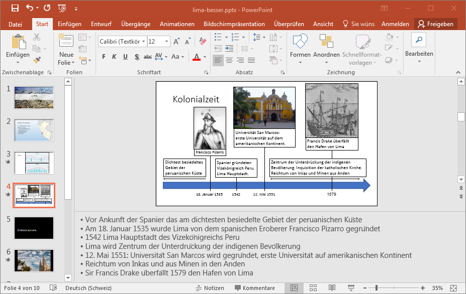

# Notizen

Du kannst dir den Notizenbereich mit __Notizen__ in der Fussleiste des Programmfensters einblenden lassen. Anschliessend kannst du unterhalb jeder Folie beliebigen Text erfassen.

Die Notizen kannst du dann entweder ausdrucken (siehe Tipp [Drucken](../drucken) oder während der Präsentation anzeigen lassen (siehe Tipp [Referentenansicht](../referentenansicht)).

