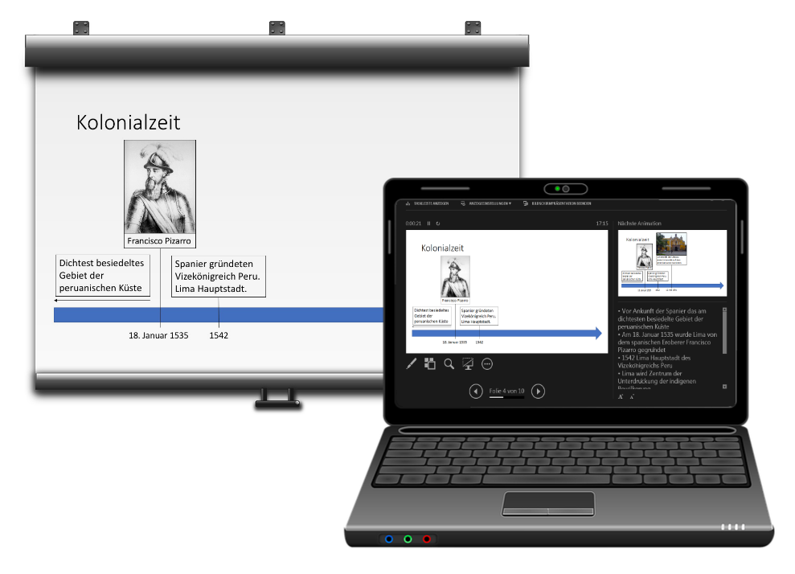

# Referentenansicht

:::warning Warnung
Um die Referentenansicht zu verwenden, benötigst du mindestens zwei Bildschirme, resp. einen Bildschirm (eingebaut oder extern) und einen Projektor. Zudem müssen diese in der Einstellung «Erweiterter Desktop» betrieben werden. (siehe Tipp [Zwei Bildschirme](../../allgemein/zwei-bildschirme))
:::

Schauen wir die Referentenansicht etwas genauer an, so sehen wir, dass neben der **aktuellen Ansicht** die am Beamer gezeigt wird (grosses Fenster), rechts daneben der **nächste Animationsschritt** oder die **nächste Folie** angezeigt wird. Darunter erscheinen die **Notizen** der Folie. Ebenso existiert eine Navigation um weiterzublättern, Tools um in die Folie reinzuschreiben, den Bildschirm zu vergrössern oder schwarz zu stellen, und ein Timer der die vergangen Zeit seit Präsentationsbeginn anzeigt.

## Referentenansicht einstellen
Im Menuband __Bildschirmpräsentation__ findest du die Einstellungen zur Referentenansicht. Hier kannst du sie aktivieren/deaktivieren und sagen auf welchem Bildschirm die Präsentation laufen soll. (Falls ein zusätzlicher Bildschirm vorhanden sein sollte, wird darauf automatisch die Referentenansicht dargestellt.)

## Referentenansicht testen (ohne zweiten Bildschirm)
Wenn du die Präsentation startest und dann in der Präsentationsansicht einen Rechtsklick auf den Hintergrund machst, dann kannst du mit __Referentenansicht__ zur Referentenansicht wechseln, obschon gar kein zweiter Bildschirm angeschlossen ist

