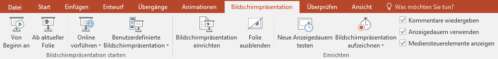
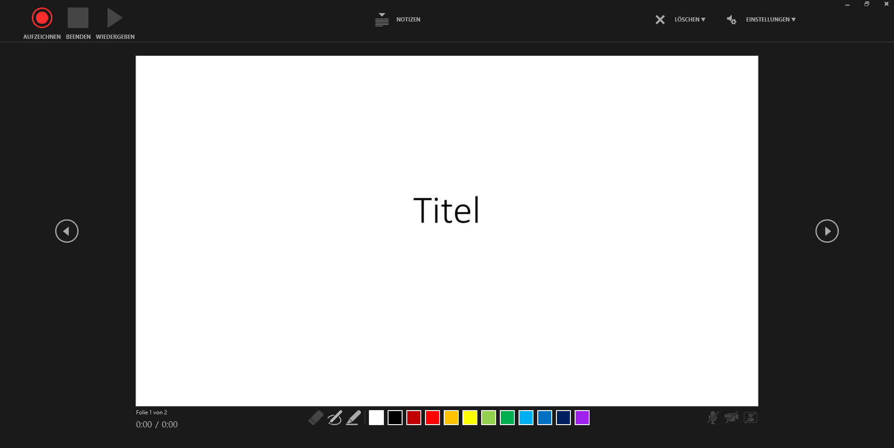
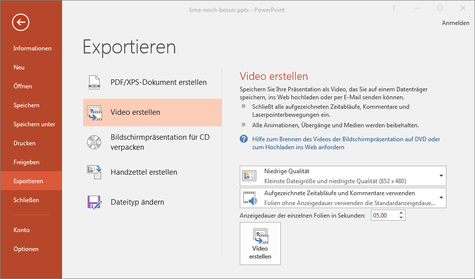

Die Verwandten des Slidecast sind *Podcast* und *Screencast*. Während beim *Podcast* allgemein Medieninhalte und beim Screencast der Bildschirm übertragen resp. aufgezeichnet wird, macht dies der Slidecast mit den *Slides*, auf deutsch *Folien*, einer Präsentation.

So ein *Slidecast* ist also eine automatisch ablaufende Präsentation mit Sprachkommentar welche in Form eines Videos abgespeichert und übertragen werden kann.

## Aufnahme eines Slidecast
Als Ausgangsmaterial dient eine ganz normale PowerPoint-Präsentation. Zur Aufzeichnung eines Slidecast werden Zeitabläufe und eine Tonspur aufgezeichnet. Für die Tonspur muss natürlich ein Mikrofon vorhanden sein. (Die meisten Notebooks haben ein solches eingebaut.)

Im Ribbon __Bildschirmpräsentation__ findest du einen Button __Bildschirmpräsentation aufzeichnen__. Damit wechselst du zum Aufnahmemodus und siehst folgende Ansicht:

Sobald du auf den roten Aufnahmeknopf links oben klickst, siehst du einen Countdown. Anschliessend wir deine Stimme (und ein Video von dir, falls eine Kamera vorhanden ist) aufgezeichnet, ebenso das Auslösen von Animationen. Wenn du auf den Pfeil nach rechts klickst, wechselst du zur nächsten Folie. Es wird nun auch die Foliendauer für die letzte Folie gespeichert.

So kannst du den gesamten Vortrag durchspielen und aufnehmen.

### Einzelne Folien aufzeichnen
Du kannst auch jede Folie einzeln aufnehmen, indem zu vor dem Drücken des roten Aufnahmeknopfs mit den Pfeilen links und rechts der Folienansicht zur gewünschten Folie navigierst. Anschliessend startest du die Aufnahme und spielst die Animationen durch. Sobald du mit der Präsentation der aktuellen Folie fertig bist, klickst du auf den quadratischen Knopf __Beenden__. Nun wird die Aufzeichnung der aktuellen Folie beendet und du kannst sie abspielen oder sogar löschen, falls du nicht zufrieden bist.

Durch Drücken der [[ESC]]-Taste gelangst du zurück in die gewohnte Ansicht von Powerpoint und du kannst die Präsentation speichern, so dass eine andere Person Aufzeichnungen hinzufügen kann.

### Zeitabläufe
Diese werden in den Folienübergängen und im Animationsbereich abgespeichert.

### Tonspur
Jede Folie erhält so einen Sprachkommentar. Dieser wird unten rechts in der Folie in Form einer kleinen Video-Vorschau dargestellt. Im Animationsbereich ist ersichtlich, dass dieser Kommentar automatisch abgespielt wird.

[Offizielle Anleitung von Microsoft](https://support.office.com/de-de/article/aufzeichnen-einer-bildschirmpr%C3%A4sentation-mit-kommentaren-und-folienanzeigedauern-0b9502c6-5f6c-40ae-b1e7-e47d8741161c#OfficeVersion=Windows) (mit Videocast)

## Abspielen eines Slidecasts
Nach dem Aufzeichnen kannst du die Präsentation ganz normal mit <kbd>F5</kbd> starten. Sie sollte nun automatisch ablaufen und dabei die Sprachkommentare der einzelnen Folien abspielen.

## Export eines Slidecast
Ein Slidecast kann natürlich als `.pptx` gespeichert werden. Das macht Sinn so lange man ihn weiterbearbeiten möchte. Möchten wir aber unseren Slidecast veröffentlichen, z.B. auf Youtube, dann müssen wir ein Video daraus generieren.

Dazu wählen wir in PowerPoint unter __Start__ den Eintrag __Exportieren__. Dort finden wir einen Punkt __Video erstellen__.

Es stehen drei Qualitätseinstellungen zur Verfügung und natürlich möchten wir die aufgezeichneten Zeitabläufe und Sprachkommentare für unseren Video-Clip verwenden.

Mit einem Klick auf __Video erstellen__ wählen wir einen Ort und einen Namen für unsere Video-Datei. Am Besten wählt man wohl `.mp4` als Format. Anschliessend wird das Video erstellt – das kann einige Sekunden dauern.

Nun können wir die Videodatei ohne PowerPoint einfach abspielen oder eben auf Youtube laden oder sonstwo veröffentlichen.

*Die Datei eignet sich nicht zum Versand per E-Mail! E-Mail-Anhänge sind meistens in der Dateigrösse auf 5-10 MB beschränkt.*
