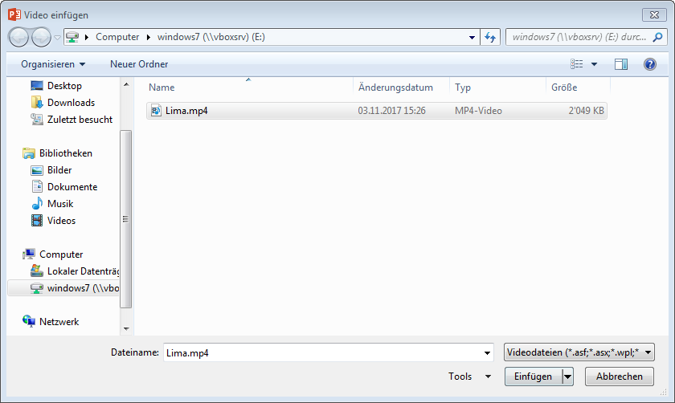
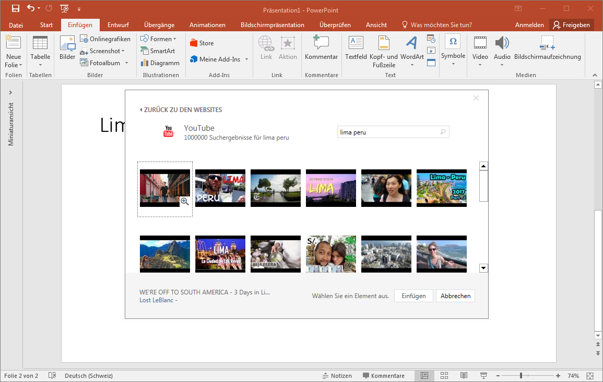
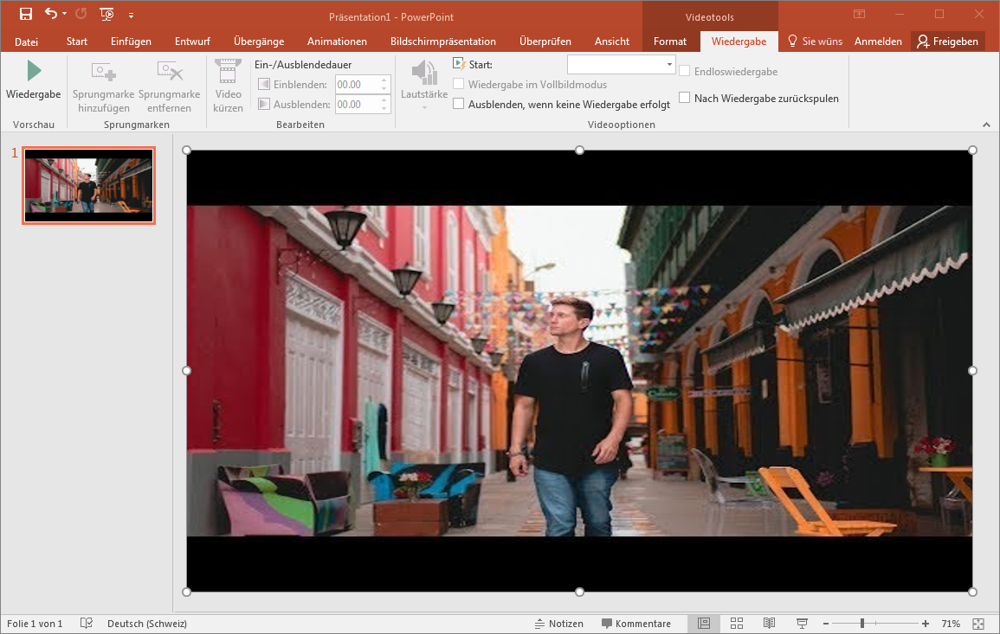

# Videos

## Video aus Datei einfügen
Über __Einfügen__ :mdi[chevronRight] __Video__ :mdi[chevronRight] __Video auf meinem Computer...__ kann eine Video-Datei ausgewählt werden. Der Einfügen-Button bietet mit dem Pfeil eine Option an: Das Video kann entweder in der Präsentations-Datei **integriert** oder **nur verknüpft** werden. Wird das Video nur verknüpft, dann kann Powerpoint das Video nur abspielen, wenn auf dieses zugegriffen werden kann!

## Youtube-Clip einfügen
Über __Einfügen__ :mdi[chevronRight] __Video__ :mdi[chevronRight] __Onlinevideo...__ kann man direkt Videos auf Youtube suchen oder einen «Einbett-Code» einfügen. Anschliessend wird der Youtube-Clip als Element eingefügt und kann platziert werden. Der Clip spielt natürlich nur, wenn der Computer mit dem Internet verbunden ist und der verlinkte Youtube-Beitrag nicht entfernt wurde. Also unbedingt kurz vor der Präsentation nochmals überprüfen!

Alternativ können Youtube-Videos auch heruntergeladen werden. Dazu existieren diverse Tools und Programme. Am besten nach «[youtube download video](https://www.google.ch/search?q=download+youtube+video)» googeln.

## eingefügtes Video bearbeiten
Wählt man ein eingefügtes Video-Element an, erscheint oben eine neue Menuband-Kategorie: __Videotools__. Unter __Format__ kann das Aussehen des Clips verändert werden und unter __Wiedergabe__ können Start- und Endposition gesetzt und z.B. die Lautstärke geändert werden.

