# Präsentieren

## Schlechtes Beispiel

Was kann man alles falsch machen beim Erstellen eine Präsentation?

:::tip Aufgabe
Schaue dir die folgenden 5 Folien an und besprich mit deinem Pultnachbar, was an ihnen schlecht ist.
:::

### Folie 1
:::details Lösung
Durch das Hintergrundbild und den kleinen hellen Text, lässt sich der Titel fast nicht lesen. Der Kontrast ist viel zu schlecht und der Text zu klein.
:::

<ImagesBox caption="Folie 1">

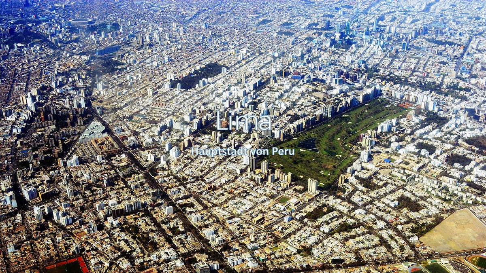<!-- { .zoom } -->

</ImagesBox>

### Folie 2
:::details Lösung
Auch hier gibt es Probleme mit dem Kontrast: Das relativ dunkle Blau des Hintergrundes bewirkt, dass der schwarze Text schlecht lesbar ist.
Beim Text handelt es sich um ganze Sätze, wie sie in einem Artikel stehen. So dienen Sie nicht der Unterstützung des Vortragenden und es besteht die Gefahr, dass dieser die Sätze genauso vorliest, wie sie auf der Folie stehen.
:::

<ImagesBox caption="Folie 2">

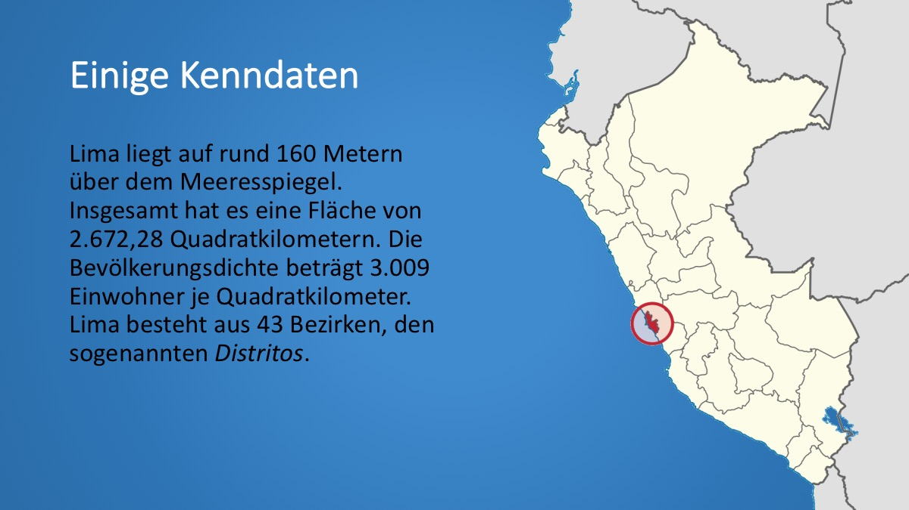<!-- { .zoom } -->

</ImagesBox>

### Folie 3
:::details Lösung
In der Tabelle stehen viele Zahlen, die evtl. nicht so gut gelesen werden können. Unter der Temperatur können sich die Zuhörer etwas vorstellen, aber beim Niederschlag fehlen Vergleichsmöglichkeiten, da die meisten Leute wohl nicht wissen, ob 5mm viel oder wenig Niederschlag sind.
:::

<ImagesBox caption="Folie 3">

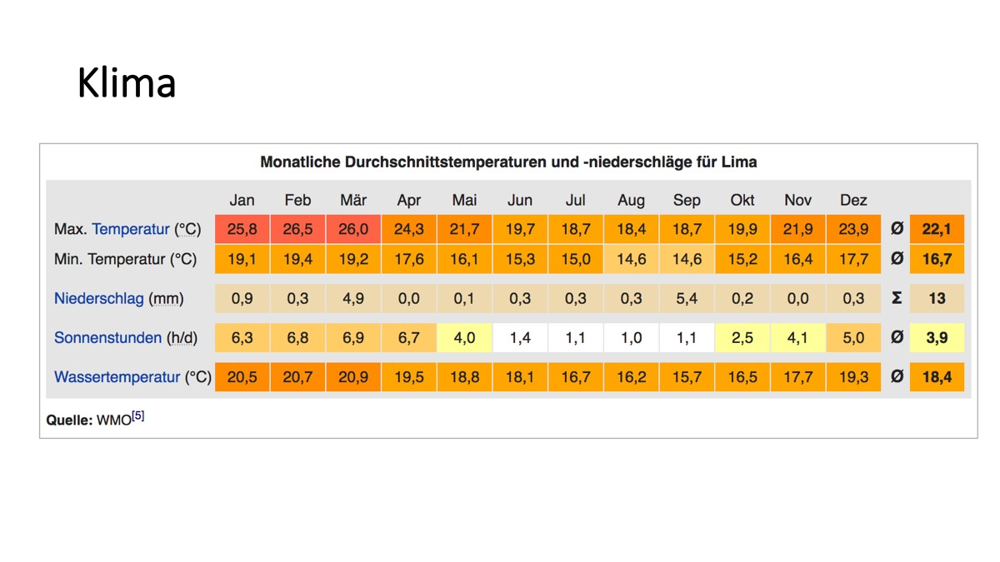<!-- { .zoom } -->

</ImagesBox>

### Folie 4
:::details Lösung
Die animierte Peru-Flagge unterstützt den Inhalt nicht, sondern lenkt davon ab. Die Aufzählungspunkte sind sehr textlastig und wirken etwas langweilig.
:::

<ImagesBox caption="Folie 4">

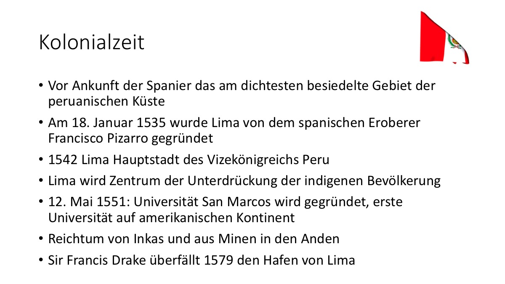<!-- { .zoom } -->

</ImagesBox>

### Folie 5
:::details Lösung
Die Bilder sind sehr klein und man erkennt nicht viel. Zudem hat es verschiedene Schriftarten in den Bildunterschriften und die Ausrichtung ist nicht überall gleich. Die Animationen beim Erscheinen der einzelnen Bilder sind übertrieben.
:::

<ImagesBox caption="Folie 5">

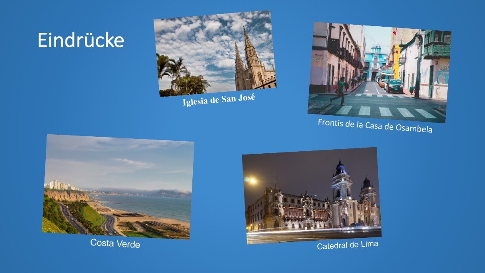<!-- { .zoom } -->

</ImagesBox>

## Präsentationsregeln
Basierend auf dem schlechten Beispiel, tragen wir einige Regeln zusammen

### Folien

einheitliches Design
: Es soll nicht jede Folie komplett anders aussehen. Die Schriftart sollte gleich sein und die Position der Elemente auch. Sonst springt z.B. der Titel beim Wechsel auf die nächste Folie und die Präsentation wirkt dadurch unruhig.

übersichtlich, nicht überladen
: Manchmal ist es besser, man teilt Inhalt auf mehrere Folien auf oder noch besser, man beschränkt sich aufs Wesentliche! Es muss nicht alles, was gesagt wird, auch auf der Folie stehen.

### Schrift

nur eine Schriftart
: Oder eine für Überschriften und eine für Inhalt. Allerdings sollten die Schriftarten optisch zusammenpassen. Im Zweifelsfall lieber sich auf nur eine Schriftart beschränken.

grosse Schrift
: Vermeide kleine Schriften, die niemand lesen kann! Lieber etwas weniger Text, dafür lesbar.

guter Kontrast zum Hintergrund (an Beamer testen!)
: Ein starker Kontrast zwischen Text und Hintergrund ist zwingend nötig. Besonders bei Hintergrundbildern ist das nicht immer einfach. Zudem kann die Projektion am Beamer dunkler sein als die Vorschau an deinem Bildschirm. Deshalb wenn möglich testen!

nur Stichworte oder kurze Sätze
: Der Inhalt der Präsentation soll unterstützender Natur sein. Ganze Sätze gehören nur auf eine Folie, wenn man die Zuhörer sie auch lesen lässt! (Dies könnte z.B. bei einem Zitat der Fall sein)

### Animationen

spärlich einsetzen
: Nicht übertreiben mit den Animationen. Man kann Elemente auch zusammen erscheinen lassen, z.B. eine Gruppen von Unterpunkten in einer Aufzählung.

sollen Inhalt unterstützen, nicht davon ablenken
: Unsinnige Animationen lenken ab. Animationen machen vor allem dort Sinn, wo mit ihnen ein Sachverhalt erklärt werden kann.

### Folienübergänge

einheitlich
: Bei jeder Folie ein anderer Übergang wirkt gebastelt und unprofessionell.

schlicht
: Wenn schon Übergänge, dann einfache wie überblenden.

Ausnahme: Diashow
: Bei einer Diashow (Bilder im Vollformat) machen Übergänge mehr Sinn. Aber auch hier gelten die beiden oberen Punkte.

### Sprache

nicht die Folien vorlesen
: Sich vorher überlegen, was man zu welchem Punkt sagen möchte und evtl. dies in leicht anderen Worten als notiert tun.

### Hilfsmittel

Pointer/Stab, nicht Mauszeiger
: Nicht mit dem Mauszeiger herumfuchteln. Besser mit einem Laserpointer oder einem Stab auf Punkte auf der Folie hinweisen. Auch hier gilt: nur kurz was zeigen, dann wieder weg.

ruhig und zielgerichtet bewegen
: Wenn man die Maus bewegt, dann sollte man das langsam und ohne Umwege tun, so dass die Zuhörer der Bewegung folgen können.

Achtung: dem Publikum nicht den Rücken zudrehen
: Nicht zur Leinwand sprechen. Entweder mit zweitem Bildschirm arbeiten, oder nur kurze Kontrollblicke zurück zur Leinwand.

## Verbessertes Beispiel
Beachtet man die [Präsentationsregeln](#prasentationsregeln) und überarbeitet die Präsentation aus dem [«schlechten» Beispiel](#schlechtes-beispiel), könnte man auf die folgenden überarbeiteten Folien kommen.

:::tip Aufgabe
- Vergleiche jeweils die linke und die rechte Folie und überlege, was wie verbessert wurde.
- Die rechte Version ist nicht perfekt! Überlege, was man noch besser machen könnte.
:::

### Folie 1
:::details Lösung
Der Titel wurde mit einem weissen, halb-transparenten Rechteck hinterlegt. Dadurch wird der Kontrast zum Hintergrundbild erhöht. Die Schriftgrösse des Titels wurde erhöht.
:::

<ImagesBox caption="Folie 1">

<!-- { .zoom } -->

<!-- { .zoom } -->

</ImagesBox>

### Folie 2
:::details Lösung
Der Kontrast wurde mit einem helleren Hintergrund und durchgängig schwarzem Text verbessert. Zudem wurde der Text in stichwortartige Aufzählungspunkte aufgeteilt.

Aber: Sind diese Angaben alle wichtig? Bräuchte man nicht einen Vergleich, um etwas damit anfangen zu können?
:::

<ImagesBox caption="Folie 2">

<!-- { .zoom } -->

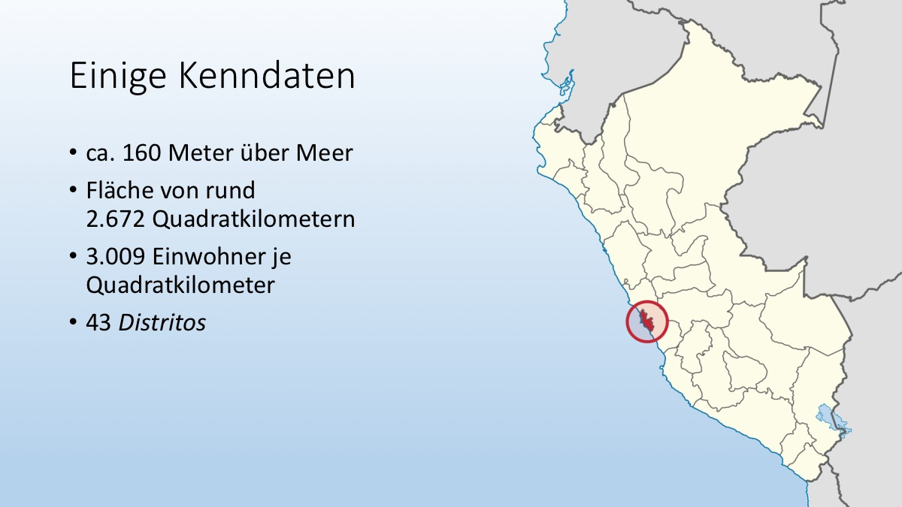<!-- { .zoom } -->

</ImagesBox>

### Folie 3
:::details Lösung
Anstelle der unübersichtlichen Tabelle wurde der Sachverhalt grafisch mit einem Diagramm dargestellt. Als Vergleich wurde ein Klimadiagramm aus der Schweiz hinzugefügt.

Aber: Was ist die Kernaussage? Lassen sich die beiden Diagramme gut vergleichen? Wo regnet es im September mehr?
:::

<ImagesBox caption="Folie 3">

<!-- { .zoom } -->

<!-- { .zoom } -->

</ImagesBox>

### Folie 4
:::details Lösung
Die Ereignisse werden statt mit Aufzählungspunkten in einer Zeitachse grafisch dargestellt und mittels Bildern aufgewertet. Die sinnlose und vom Inhalt ablenkende, animierte Peru-Flagge wurde entfernt. Dafür wurde eine Animation (hier chronologisches Erscheinen der Element) der Zeitachse verwendet.

Aber: Ist das nicht zu viel für eine Folie? Müsste man mehrere Folien machen? Was bedeuten die kleinen schwarzen, horizontal angeordneten Pfeile?
:::

<ImagesBox caption="Folie 4">

<!-- { .zoom } -->

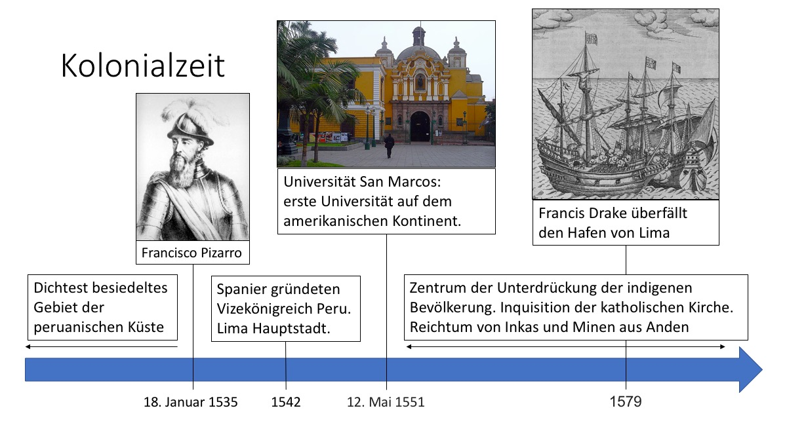<!-- { .zoom } -->

</ImagesBox>

### Folie 5
:::details Lösung
Anstelle der einen Folie mit 4 mickrigen Bildchen, wurde eine Titelfolie und dann pro Bild eine Folie erzeugt. So können die Bilder als Diashow in voller Grösse gezeigt werden. Anstelle der übertriebenen Effekte, werden die Folien nun mit einem simplen Folienübergang ein- und ausgeblendet.

Aber: Sagen diese Bilder etwas aus? Entsteht daraus ein Eindruck/ein Mehrwert fürs Publikum?s
:::

<ImagesBox caption="Folie 5">

<!-- { .zoom } -->

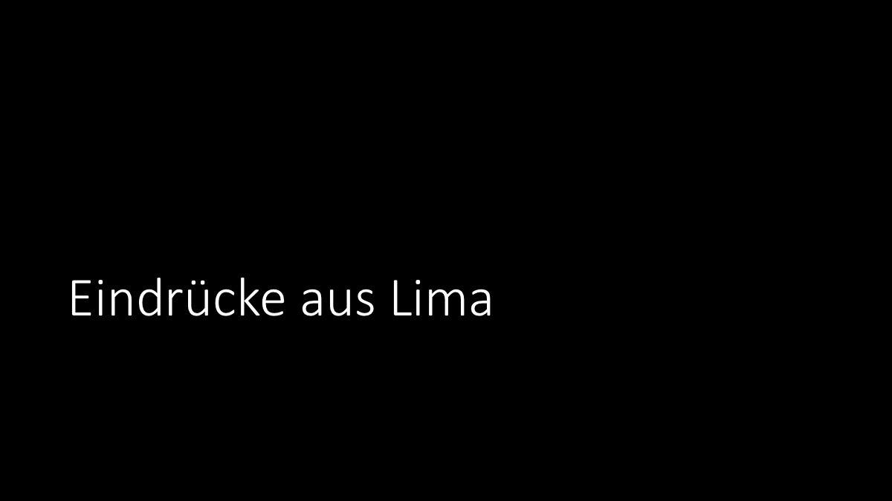<!-- { .zoom } -->

</ImagesBox>
<ImagesBox caption="Folien 6-9, zusätzlich">

<!-- { .zoom } -->

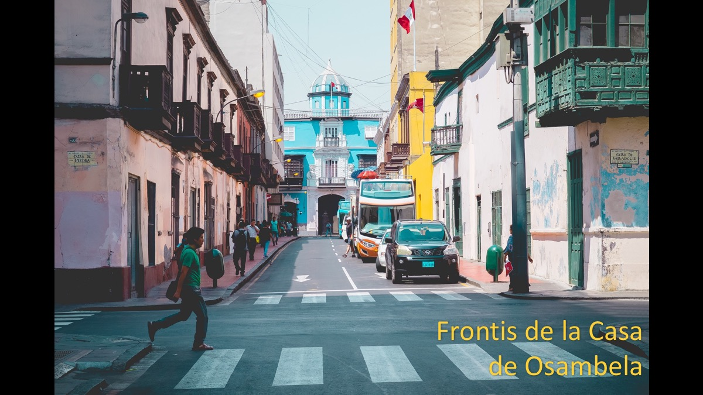<!-- { .zoom } -->

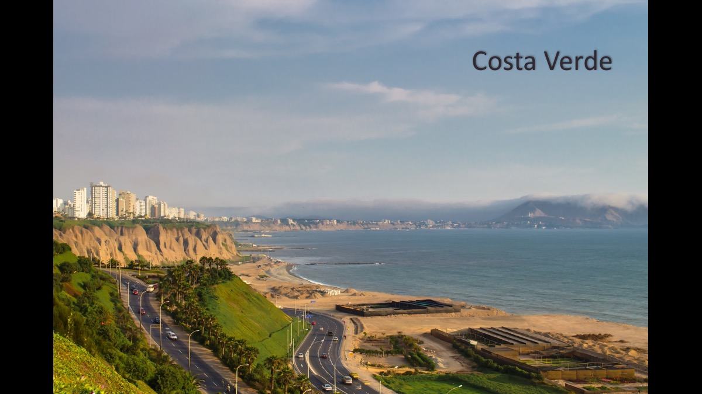<!-- { .zoom } -->

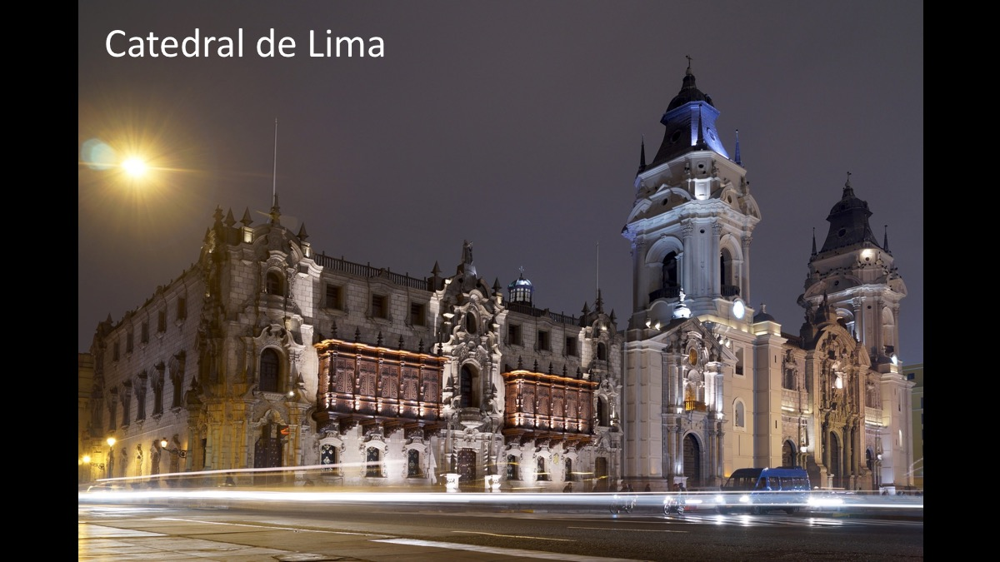<!-- { .zoom } -->

</ImagesBox>

## Regeln zum Inhalt
Nach den zahlreichen Präsentationsregeln zur Gestaltung und zum Vortragen der Präsentation fehlen einige wichtige Regeln zum Inhalt.

Hier beschränken wir uns auf die folgenden vier Regeln, welche wir aber dafür etwas ausführlicher erläutern:

Eine Aussage pro Folie
: Überlege dir genau, was die Hauptaussage sein soll. Dann versuche, diese dem Publikum zu vermitteln. Findest du mehrere wichtige Aussagen, solltest du wohl den Inhalt in mehrere Folien unterteilen.

Zahlen nicht nackt, sondern eingeordnet
: Nackte Zahlen bringen kaum etwas. Wir brauchen Vergleiche, um die Zahlen einzuordnen.

Mehr wissen als auf der Folie steht
: Eine gute Präsentation ist ohne deinen Vortrag unverständlich! Sie unterstützt dich dabei; aber du musst mehr über das Thema wissen und erzählen können, als auf den Folien steht. Wenn du sattelfest das Thema beherrschst, dann fühlst du dich auch beim Vortrag sicherer und kannst die Inhalte dem Publikum kompetent vermitteln.

Interessanter Start und klarer Schluss
: Deine Präsentation sollte einen Aufbau haben. Zu Beginn sollte versucht werden, das Interesse der Zuhörer zu wecken. Z.B. ein Bild zeigen, eine Frage stellen, etwas Lustiges machen oder erzählen, eine persönliche Geschichte bringen oder etwas Aktuelles aus der Zeitung aufgreifen. Genauso am Schluss: Das Ende der Präsentation muss klar ersichtlich sein. Man kann die Präsentation abrunden, indem man auf den Start zurückkommt oder ein Fazit zieht. Wichtig: Sagen, dass der Vortrag nun vorbei ist und sich beim Publikum fürs Zuhören bedanken!

## Inhaltlich verbessert

Berücksichtigt man die [Inhaltsregeln](#regeln-zum-inhalt) und überarbeitet die Präsentation aus dem [«besseren» Beispiel](#verbessertes-beispiel), könnte man auf die folgende, überarbeitete Präsentation kommen.

:::tip Aufgabe
Gehe die Folien durch und überlege dir, welche Inhaltsregel angewandt wurde.
:::

### Einstieg
Statt nur einer Titelfolie, folgt eine zweite Folie. Diese zeigt ein persönliches Erlebnis des Präsentierenden, z.B. «Letzten Sommer konnte ich zwei Monate in Lima verbringen. Ihr seht hier die Iglesia de San José, die ich jeden Tag auf meinem Weg zur Schule passierte.»

:::details Lösung
Interessanter Start
:::

<ImagesBox caption="Folie 1">

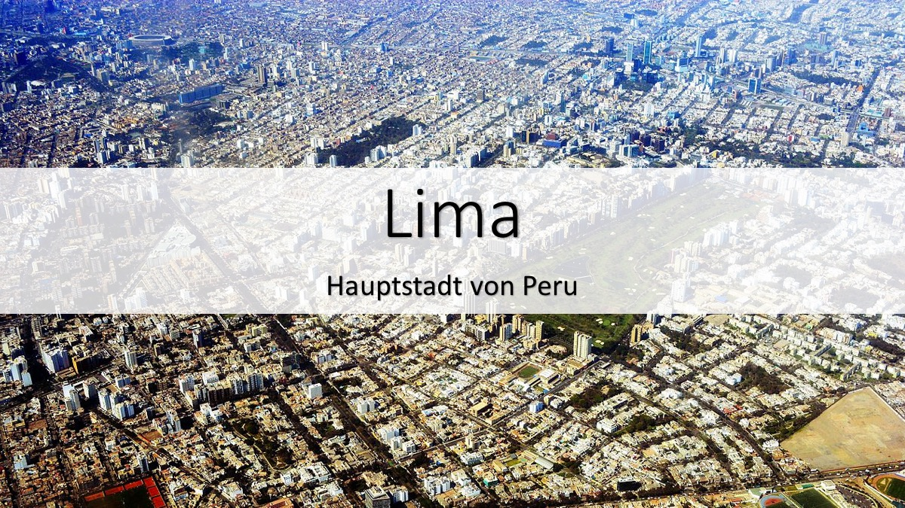<!-- { .zoom } -->

<!-- { .zoom } -->

</ImagesBox>

### Kenndaten
Die Höhe über Meer wurde als unwichtig weggelassen. Die Einwohnerzahl wird nicht mehr pro km2 angegeben und erlaubt, zusammen mit dem CH-Umriss auf der Karte einen direkten Vergleich zur Schweiz.

:::details Lösung
Zahlen nicht nackt, sondern eingeordnet
:::

<ImagesBox caption="Folie 2">

<!-- { .zoom } -->

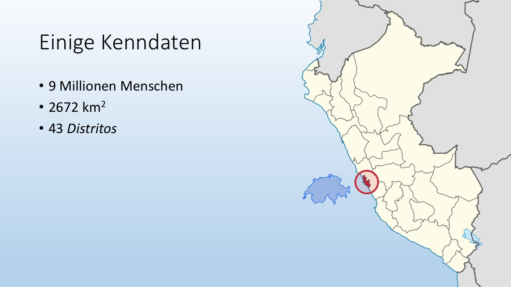<!-- { .zoom } -->

</ImagesBox>

### Klima
Da das Hauptthema nicht das Klima ist, ist ein Klimadiagramm (oder sogar zwei) etwas übertrieben. Die Kernaussage soll sein, dass es im tropischen Wüstenklima von Peru fast nie regnet, und immer zwischen 18 und 26 Grad warm ist. (Man könnte den Wetter-Screenshot gleich vor dem Vortrag aktualisieren!)

:::details Lösung
Eine Aussage pro Folie
:::

<ImagesBox caption="Folie 3">

<!-- { .zoom } -->

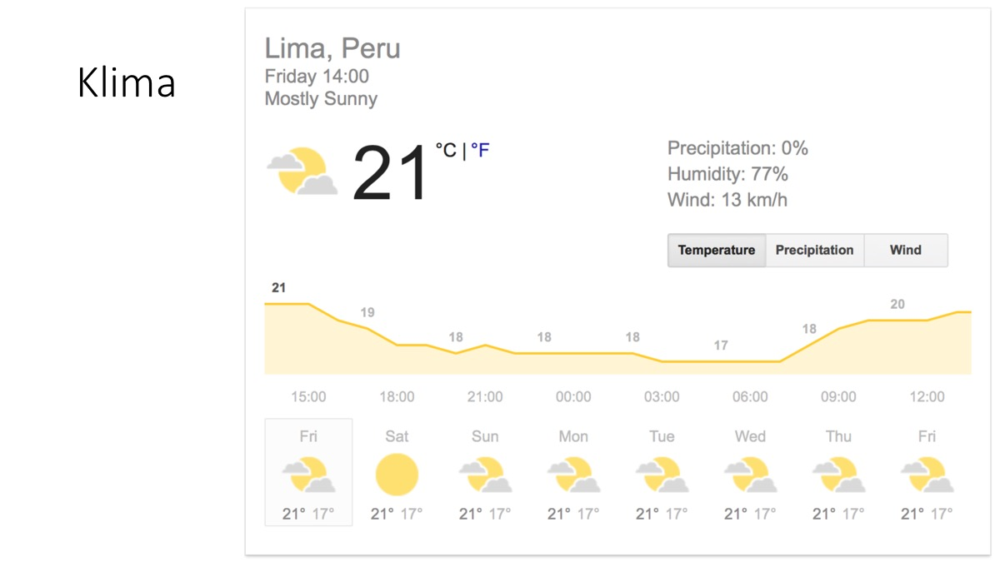<!-- { .zoom } -->

</ImagesBox>

### Kolonialzeit
Die nicht ganz klar verständlichen Kästchen wurden entfernt, der Text im Allgemeinen reduziert. Dafür haben jetzt alle 4 Kästchen ein Bild. Die Folie wird relativ lange gezeigt und die Zeitlinie wird aufgebaut. Dabei können die nicht mehr eingeblendeten Inhalte mündlich erläutert werden. Z.B. «Die Umgebung des heutigen Limas, war bereits vor der Entdeckung durch Francisco Pizarro, das dichtest besiedelte Gebiet der peruanischen Küste.»

:::details Lösung
Mehr wissen, als auf der Folie steht
:::

<ImagesBox caption="Folie 4">

<!-- { .zoom } -->

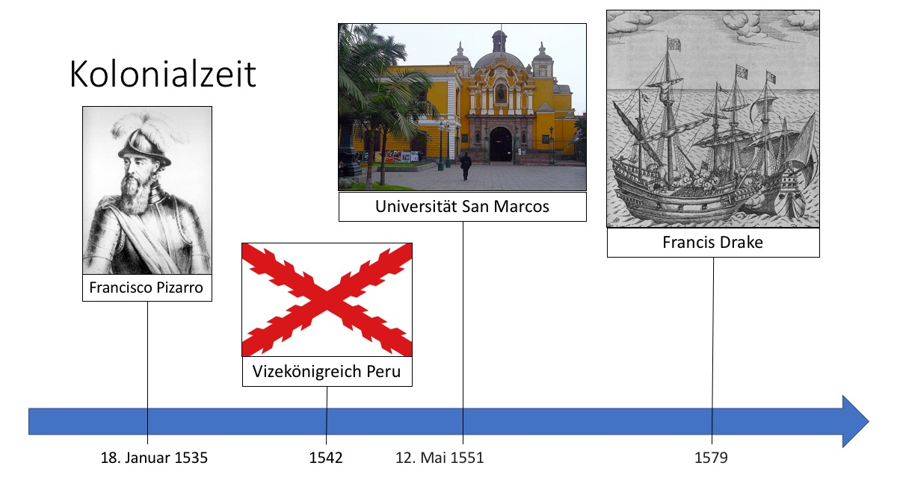<!-- { .zoom } -->

</ImagesBox>

### Ende
Statt mehreren, nicht viel aussagenden Bildern, wird ein Bild gezeigt und der Bogen zurück zum Start gemacht: «Falls ihr einmal Lima besucht, verpasst es nicht, dem Casa de Osambela einen Besuch abzustatten. Glaubt mir: es lohnt sich. – Vielen Dank für die Aufmerksamkeit und Adios»

:::details Lösung
Klarer Schluss
:::

<ImagesBox caption="Folie 5">

<!-- { .zoom } -->

<!-- { .zoom } -->

</ImagesBox>
