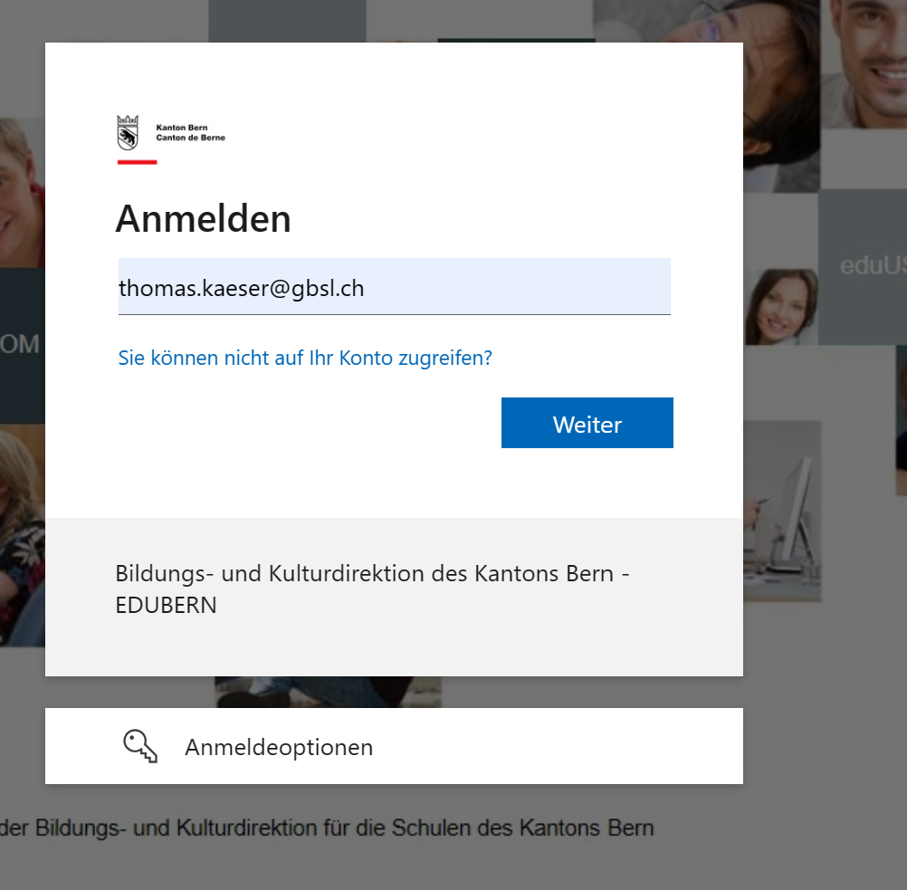

---
sidebar_custom_props:
  icon: mdi-cellphone-basic
  source: 
  path: /docs/byod/schulkonto/Mobilenummer/README.md
sidebar_position: 31

draft: false
---

import BrowserWindow from '@tdev-components/BrowserWindow'

# Mobile-Nummer

Zu deinem Schulkonto gehört auch deine Telefonnummer. Bist du neu an der Schule, hat das Sekretariat deine Telefonnummer weitergeleitet und sie sollte in deinem Konto registriert sein. Mit der Telefonnummer kannst du dein Passwort zurücksetzen, falls du es vergessen hast.

Auf dein Smartphone erhältst du einen Code, um dich zu authentifizieren beim Zurücksetzen deines Passwortes für dein Schulkonto.

Passwort zurücksetzen:

<BrowserWindow url="https://password.edubern.ch/">
  
</BrowserWindow>

Und hast du eine neue Mobile-Nummer, kannst du die Nummer selber ändern, wenn du noch Zugriff auf die alte Nummer hast. Das kannst du direkt in deinem Konto vornehmen.

Konto aufrufen:

<BrowserWindow url="https://aka.ms/mfasetup">
  
</BrowserWindow>