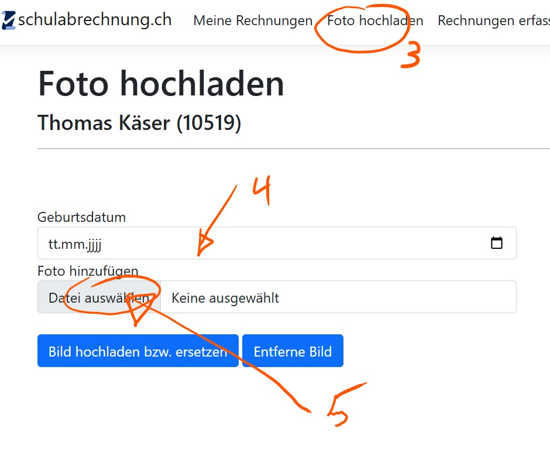
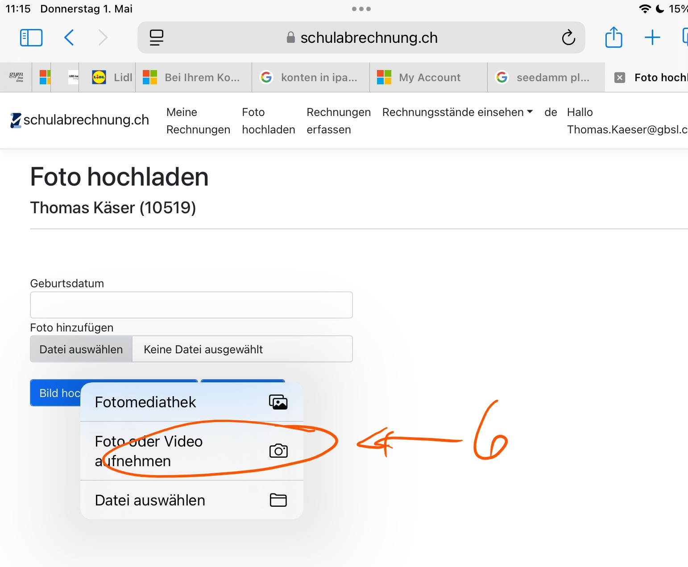
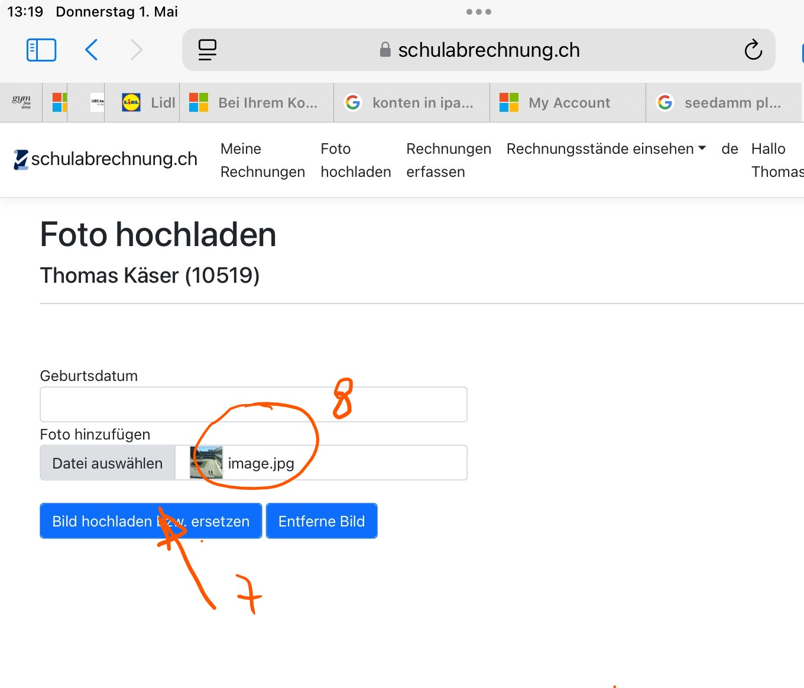
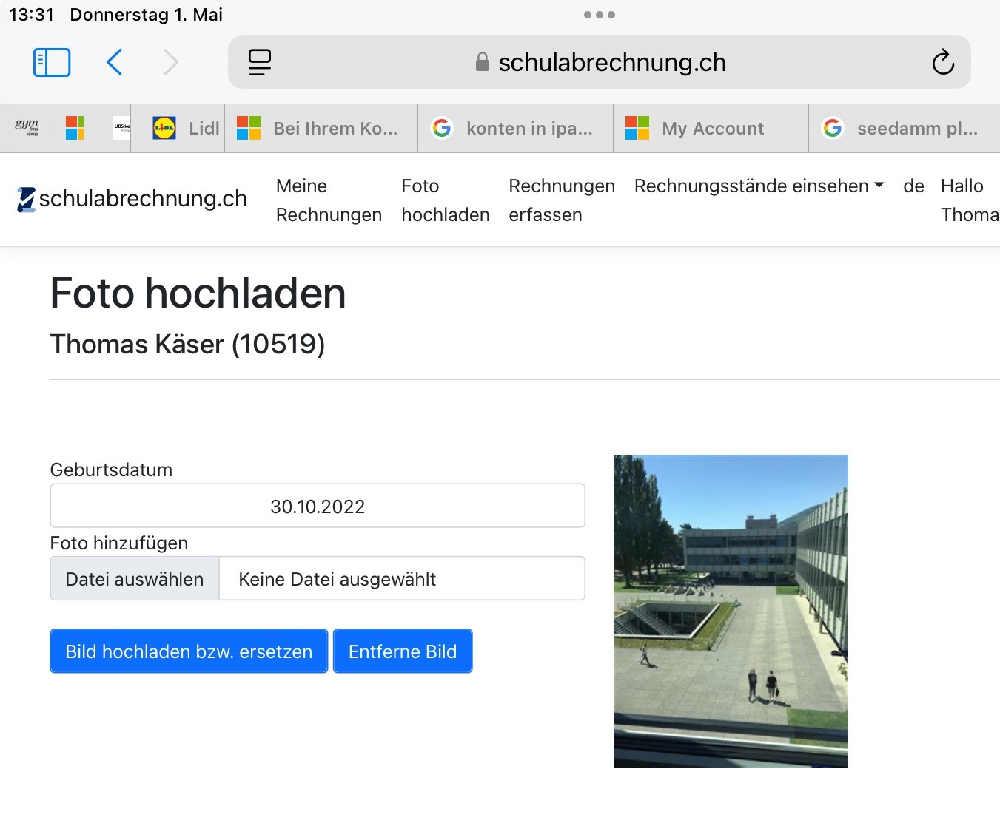

# Foto für den Schülerausweis erstellen

Alle Schüler:innen des Gymnasiums Biel-Seeland erhalten zu Beginn ihrer Schulzeit einen persönlichen Schülerausweis. Damit können sie:

- Bücher aus der Bibliothek ausleihen
- in der Bibliothek kopieren und drucken, indem sie ein Guthaben auf die Karte laden
- Türen öffnen (gemäss persönlicher Berechtigung, z. B. Musik-Übungsräume, Lift usw.)

Das Foto wird in der internen Datenbank gespeichert und ist für die Lehrpersonen sichtbar.

---
### Anforderungen an das Foto:

- Passender Bildausschnitt (Gesicht)
- Heller und einfarbiger Hintergrund
- Zubehör (z. B. Mützen, Sonnenbrillen) ist nicht erlaubt

:::solution[Musterbeispiele für Foto]
_Seite_1.jpg)
_Seite_2.jpg)
_Seite_3.jpg)

(Quelle: fedpol.ch)
:::

---

## Foto erstellen und hochladen

Du kannst den ganzen Prozess mit deinem Smartphone durchführen.

:::solution[Klicke für QR Code]

:::

:::details[Anleitung für iPhone]

1. Öffne diesen Link: [https://schulabrechnung.ch](https://schulabrechnung.ch)
2. Melde dich mit deinem **Schul-E-Mail-Account** an.
3. Wähle im Register **Foto hochladen** aus
4. Gibt dein Geburtsdatum ein
5. Klicke auf Datei hinzufügen

6. Folgendes Fenster öffnet sich, in dem du auf **Foto oder Video aufnehmen klickst**:

Danach machst du das Bild für den Schüler:innenausweis und klickst auf **Foto benutzen**. Es öffnet sich wieder **schulabrechnung.ch**

7. Nun siehst du das Bild als kleines icon im Feld (8). Kontrolliere, ob die Dateiendung __jpg__ lautet. (Möglicherweise musst du das Handy vom Hochformat ins Querformat drehen, um das kontrollieren zu können). Wenn die Dateiendung anders lautet, musst du weiter unten die andere Methode für die Erstellung des Fotos wählen.

Wenn die Dateiendung richtig ist, klickst auf **Bild hochladen** und wartest einen Moment, bis du dein Bild rechts etwas grösser siehst. Wenn das der Fall ist, ist das Bild erfolgreich hochgeladen. Wenn das Bild aber kein korrektes Passbild zeigt, musst du weiter unten die andere Methode für die Erstellung des Fotos wählen.

:::

:::details[Anleitung für Android Phone]

1. Öffne diesen Link: [https://schulabrechnung.ch](https://schulabrechnung.ch)
2. Melde dich mit deinem **Schul-E-Mail-Account** an.
3. Wähle im Register **Foto hochladen** aus
4. Gibt dein Geburtsdatum ein
5. Klicke auf Datei hinzufügen

6. Folgendes Fenster öffnet sich, in dem du auf **Kamera klickst**:

Danach machst du das Bild für den Schüler:innenausweis und klickst auf **Foto benutzen**. Es öffnet sich wieder **schulabrechnung.ch**

7. Nun siehst du den Dateinamen deines Fotos im Feld (8). Kontrolliere, ob die Dateiendung __jpg__ lautet. (Möglicherweise musst du das Handy vom Hochformat ins Querformat drehen, um das kontrollieren zu können). Wenn die Dateiendung anders lautet, musst du weiter unten die andere Methode für die Erstellung des Fotos wählen.

Wenn die Dateiendung richtig ist, klickst auf **Bild hochladen** und wartest einen Moment, bis du dein Bild rechts etwas grösser siehst. Wenn das der Fall ist, ist das Bild erfolgreich hochgeladen. Wenn das Bild aber kein korrektes Passbild zeigt, musst du weiter unten die andere Methode für die Erstellung des Fotos wählen.

klickst auf **Bild hochladen** und wartest einen Moment, bis du dein Bild rechts etwas grösser siehst.

:::

:::solution[Das Format deines Fotos ist nicht __.jpg__ oder zeigt kein korrektes Passbild]

Verwenden Sie die Selfie-Funktion auf Ihrem Mobiltelefon oder lassen Sie sich fotografieren.

Speichern Sie das Bild auf Ihrem Computer. Sie können es z.B. sich selber mailen und danach auf dem PC öffnen

---

### Mac

1. Öffnen Sie die Fotodatei mit der App **„Vorschau“**.
2. Wählen Sie unter **Ablage > Exportieren** im Feld **Format** den Dateityp **JPEG** aus.

### Windows

1. Öffnen Sie das Foto mit der App **„Fotos“**.
2. Klicken Sie oben rechts auf die drei Punkte **(...)** und wählen Sie **Speichern unter**.
3. Wählen Sie unter **Dateityp** das Format **.jpg**.

---

## Foto hochladen

1. Öffnen Sie diesen Link: [https://schulabrechnung.ch](https://schulabrechnung.ch)
2. Melden Sie sich mit Ihrem **Schul-E-Mail-Account** an.
3. Laden Sie Ihr Foto hoch und geben Sie Ihr **Geburtsdatum** ein.

👉 [Foto hochladen - Schulabrechnung](https://schulabrechnung.ch)
:::
---

Falls Sie Fragen haben, melden Sie sich bitte unter:

📞 **032 327 07 07**

✉️ **[sekretariat@gbsl.ch](mailto:sekretariat@gbsl.ch?subject=Frage%20zum%20Schülerausweis&body=Guten%20Tag%2C%0A%0AIch%20habe%20eine%20kurze%20Frage%20zum%20Schülerausweis:%0A%0AMit%20freundlichen%20Gr%C3%BCssen%0A%5BIhr%20Name%5D)**
