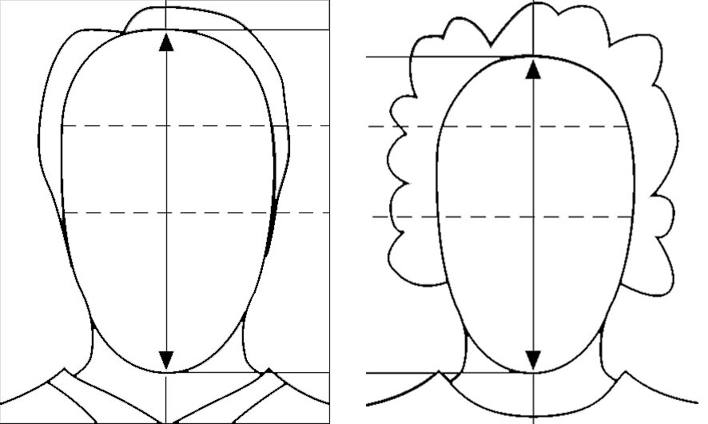

# Foto für den Schülerausweis erstellen

Alle Schülerinnen und Schüler des Gymnasiums Biel-Seeland erhalten zu Beginn ihrer Schulzeit einen persönlichen Schülerausweis. Damit können sie:

- Bücher aus der Bibliothek ausleihen
- in der Bibliothek kopieren und drucken, indem Sie ein Guthaben auf die Karte laden
- Türen öffnen (gemäss persönlicher Berechtigung, z. B. Musik-Übungsräume, Lift usw.)

Das Foto wird in der internen Datenbank gespeichert und ist für die Lehrpersonen sichtbar.

---
### Anforderungen an das Foto:

- Passender Bildausschnitt (Gesicht)
- Heller und einfarbiger Hintergrund
- Zubehör (z. B. Mützen, Sonnenbrillen) ist nicht erlaubt

---

## Foto erstellen und hochladen

:::details[Anleitung für iPhone]
Du kannst den ganzen Prozess mit deinem iPhone durchführen.

1. Öffne diesen Link: [https://schulabrechnung.ch](https://schulabrechnung.ch)
2. Melde dich mit deinem **Schul-E-Mail-Account** an.
3. Wähle im Register **Foto hochladen** aus
4. Gibt dein Geburtsdatum ein
5. Klicke auf Datei hinzufügen

6. Folgendes Fenster öffnet sich, in dem du auf **Foto oder Video aufnehmen klickst**:

Danach machst du das Bild für den Schüler:innenausweis und klickst auf **Foto benutzen**. Es öffnet sich wieder **schulabrechnung.ch**

7. Nun siehst du das Bild als kleines icon im Feld (8), klickst auf **Bild hochladen** und wartest einen Moment, bis du dein Bild rechts etwas grösser siehst.

:::

:::details[Anleitung für Android-Smartphone]

Verwenden Sie die Selfie-Funktion auf Ihrem Mobiltelefon oder lassen Sie sich fotografieren.
---

## Format der Fotodatei

Die Fotodatei muss als **.jpg** gespeichert sein. Falls dies nicht der Fall ist:

### Windows

1. Öffnen Sie das Foto mit der App **„Fotos“**.
2. Klicken Sie oben rechts auf die drei Punkte **(...)** und wählen Sie **Speichern unter**.
3. Wählen Sie unter **Dateityp** das Format **.jpg**.

---

## Foto hochladen

1. Öffnen Sie diesen Link: [https://schulabrechnung.ch](https://schulabrechnung.ch)
2. Melden Sie sich mit Ihrem **Schul-E-Mail-Account** an.
3. Laden Sie Ihr Foto hoch und geben Sie Ihr **Geburtsdatum** ein.

:::
---

Falls Sie Fragen haben, melden Sie sich bitte unter:

📞 **032 327 07 07**

✉️ **[sekretariat@gbsl.ch](mailto:sekretariat@gbsl.ch?subject=Frage%20zum%20Schülerausweis&body=Guten%20Tag%2C%0A%0AIch%20habe%20eine%20kurze%20Frage%20zum%20Schülerausweis:%0A%0AMit%20freundlichen%20Gr%C3%BCssen%0A%5BIhr%20Name%5D)**
