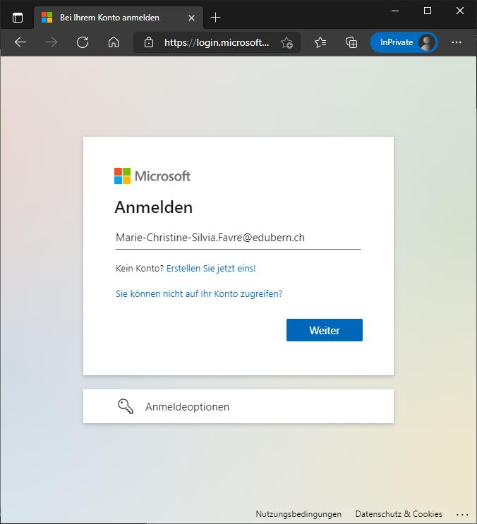
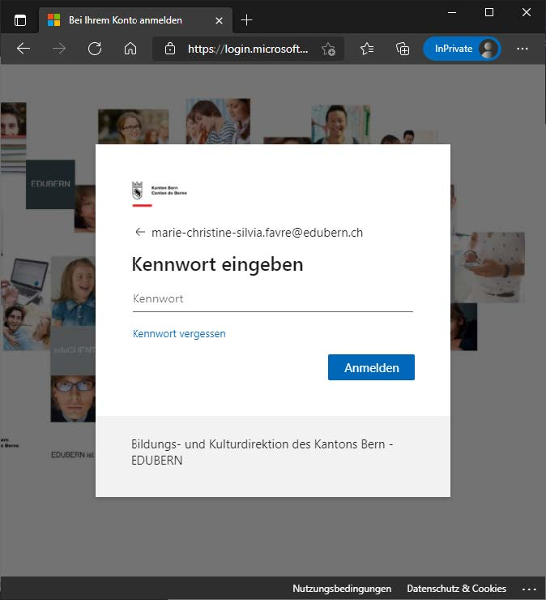
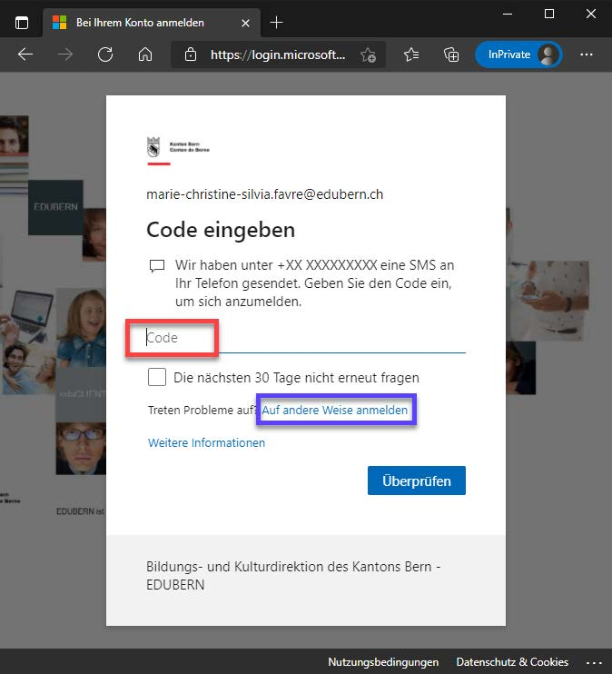
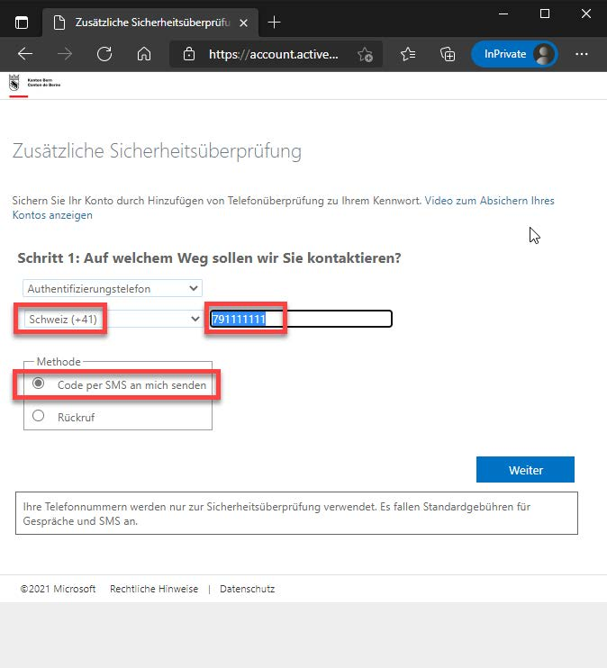
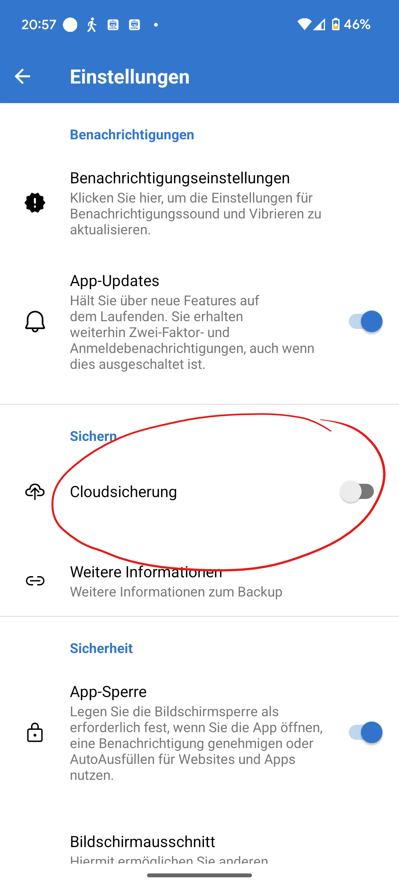

---

sidebar_custom_props:
  icon: mdi-two-factor-authentication
  path: /docs/byod/mfa/README.md
sidebar_position: 12
---

# Multi-Faktor-Authentifikation

<Features />

Eine "Multi-Faktor-Authentifizierung" (kurz __MFA__) dient der Sicherheit. Wenn man sich mit 2 Faktoren authentifizieren muss, kann bspw. ein gestohlener Lapatop nicht dazu verwendet werden, um sich Zutritt zu einem Konto zu verschaffen. Alle Lehrer:innen und Schüler:innen müssen diese einrichten. Wenn du im Schulnetz bist, reichen Mailadresse und Passwort, aber sonst musst du dich immer doppelt authentifizieren.
Zuerst musst du dich mit Mailadresse der Schule und Passwort anmelden.
Danach erhältst du auf deinem Smartphone entweder eine SMS mit einem Code oder einen Code in deiner Authenticator-App.

# Anleitung: Einrichtung 

:::tip[Authentifizierung über SMS]
Für die Zweifaktorauthentifizierung muss eine **aktive Mobile Telefonnummer** hinterlegt sein. Weitere Varianten (App oder E-Mail) können zusätzlich hinzugefügt werden.
:::

## Überprüfung und Einrichten der Sicherheitsinformationen mit SMS

Um MFA zu nutzen, müssen weitere Sicherheitsinformationen für die Anmeldemethode hinterlegt werden. 

### Schritte zur Einrichtung

1. Im Browser folgende Adresse eingeben:
   - [https://aka.ms/mfasetup](https://aka.ms/mfasetup)

   Es erscheint die Aufforderung zur Eingabe der E-Mail-Adresse (Benutzernamen). E-Mail-Adresse eingeben und mit [Weiter] bestätigen.

   :::warning[Wichtig]
   Hier die Schul-Email-Adresse verwenden: __Vorname.Name@edu.gbsl.ch__
   :::

   

3. Eingabe des Passworts und [Anmelden] wählen.

   

4. Wurde bereits eine Mobiltelefonnummer hinterlegt, erhältst du einen Code per SMS. In diesem Fall kannst du die Webseite verlassen.

:::details[Klicke, wenn du eine andere Meldung erhalten hast]  

4. Falls die Mobiltelefonnummer noch nicht in deinem Konto hinterlegt wurde, hast du folgende Meldung erhalten, die du mit [Weiter] bestätigst.

   

   Die Methode [Authentifizierungstelefon], das Land des Providers, die Mobiltelefonnummer und die Auswahl [Code per SMS an mich senden] anwählen. Eingaben mit [Weiter] bestätigen.

   

5. Auf das Mobiltelefon mit der unter Punkt 4 angegebenen Mobiltelefonnummer wird eine SMS mit einem Prüfcode (zufällige Zahlennummer) geschickt.

   **Hinweis:** Die Bildschirmaufnahme stammt von einem Google-Android-Smartphone. Die Darstellung ist abhängig vom Smartphone-Typ und kann abweichen.

   

6. Den Prüfcode aus Punkt 5 im Eingabefeld eingeben und Eingabe mit [Überprüfen] bestätigen.

   
   

7. Abschlussmeldung mit [Fertig] bestätigen.

   

8. Bei der nächsten Anmeldung via Link unter Punkt 1 erscheint nun die Aufforderung, den SMS-Code einzugeben.

   
:::

:::details[Klicke, wenn du eine weitere Authentifikationsmethode hinzufügen möchtest, z.B. die App __Authenticator__]  

[Anleitung - Einrichten MFA EDUBERN](https://erzbe.sharepoint.com/sites/EDUBERN-Infohub-Hilfsmittel/Lists/Hilfsmittel/Attachments/4/Anleitung%20-%20Einrichten%20MFA%20EDUBERN%20.pdf)

:::

:::danger[Problem mit dem Authenticator]

Wenn du versucht hast den Authenticator einzurichten, aber keinen Code erhältst oder keinen Code auf deinem Smartphone eingeben kannst, so musst du den Account zurücksetzen lassen. Das machst du per Mail, gib darin deine Schulmailadresse an und deine Mobilenummer: [👉 :mdi[emailEditOutline]](mailto:soarhe.jahany@bernedu.ch?subject=Account%20Sch%C3%BCler%3Ain%20zur%C3%BCcksetzen&body=Guten%20Tag%20Herr%20Jahany%2C%0A%0ABitte%20setzen%20Sie%20meinen%20Account%20zur%C3%BCck%3A%0A%0A%40edu.gbsl.ch%0A%0ATel.%2007%0A%0ABesten%20Dank%20und%20freundliche%20Gr%C3%BCsse)
:::

:::details[**Backup für den Authenticator** - Bei Verlust, Defekt, Wechsel des Smartphones gibt es Schwierigkeiten mit dem Authenticator. Klicke hier, wenn du erfahren willst, wie du diese vermeiden kannst.] 
Sichere die Einstellungen des Authenticators, dann kannst du sie auf einem neuen Gerät leicht wiederherstellen.

Öffne die Authenticator-App auf deinem Smartphone

Füge ein private Microsoft-Konto hinzu (Mailadresse mit @outlook.de oder @hotmail.de), wenn du keines hast, so erstelle dir eines __+__ (1).

Klicke auf __⋮__ (2) und danach auf __Einstellungen__ (3).

Danach kannst du die Cloudsicherung einrichten mit deinem privaten Microsoft-Konto und hast damit ein Backup.

Hier findest du die ausführliche Anleitung von Microsoft für iPhone und Android-Phone: 👉 [Klicke hier](https://support.microsoft.com/de-de/account-billing/sichern-von-kontoanmeldeinformationen-in-microsoft-authenticator-bb939936-7a8d-4e88-bc43-49bc1a700a40#ID0EBJ=iOS)

:::
