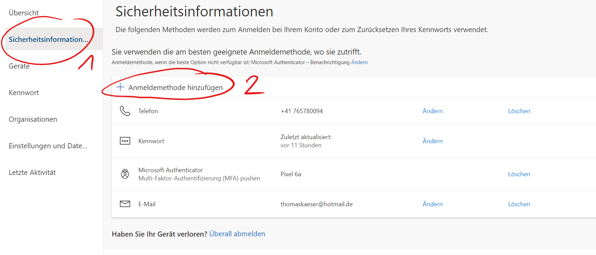
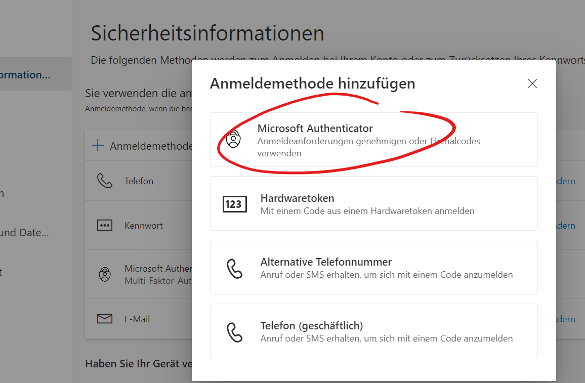
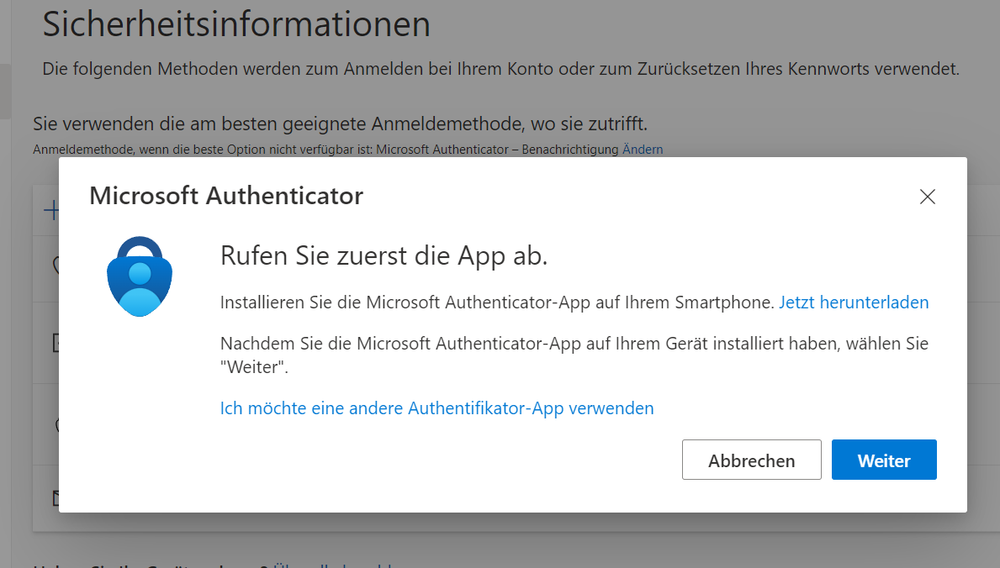
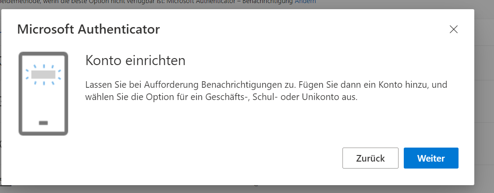
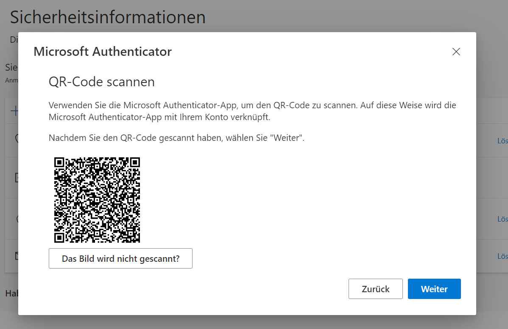

# Wechsel des Smartphones

Wenn du keinen Zugriff auf dein altes Smartphone mehr hast, dann musst du deinen Account zurücksetzen lassen: [👉 ](docs\support\it-hilfe\README.md)

Wenn du dein altes Smartphone noch hast und die Authenticator App noch funkioniert, starte deinen PC und geh im Browser zur Adresse deines [Schulkontos](https://login.microsoftonline.com/)

Melde dich mit deiner GBSL-Mailadresse und deinem Passwort an, wähle im Konto __Sicherheitsinformationen__ (1) und anschliessend __Methode hinzufügen__ (2)

Danach den __Authenticator__

und folgst den Anweisungen

Im folgenden Schritt fügst du dein GBSL-Konto hinzu

Schliesslich erhältst du den QR-Code und folgst dann den weiteren Anweisungen

