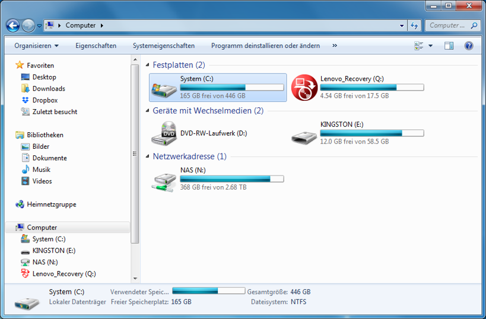

# Datenspeicherorte

## Daten auf dem PC
Auf jedem Windows-PC gib es mindestens ein Laufwerk, das System-Laufwerk `C:\`, dort sind meist die gesamte Software und die Benutzerdaten gespeichert. Daneben gibt es aber oft weitere Laufwerke, z.B. USB-Sticks, CD/DVD-Laufwerke, etc. – genannt **Wechseldatenträger**. Dieser Name deutet darauf hin, dass die Daten auf dem PC selber gespeichert sind sondern auf einem austauschbaren Medium.

Oft stehen aber noch zusätzlich Laufwerke zur Verfügung (wie z.B. hier am Gymnasium), dies sind meist **Netzlaufwerke**. Im Beispiel oben ist das Laufwerk `N:\` ein Netzlaufwerk.

Bei uns am Gymnasium stehen die Laufwerke `H:\`, `K:\` und `V:\` als Netzlaufwerke zur Verfügung. Die Daten auf diesen Laufwerken sind nicht lokal gespeichert sondern auf einem Netzwerkspeicher – also einer Art *Cloud*.

## Daten auf mobilen Geräten
Wir besprechen die Speicherorte von App-Daten beispielhaft anhand der folgenden Apps:

| App          | Speicherort                  | Bemerkung                                                                               |
| ------------ | ---------------------------- | --------------------------------------------------------------------------------------- |
| Google Drive | Cloud                        |                                                                                         |
| iCloud       | Cloud                        |                                                                                         |
| Dropbox      | Cloud                        |                                                                                         |
| WhatsApp     | Smartphone                   | Cloud-Backup möglich, muss aktiviert werden.                                            |
| SMS          | Smartphone                   | Cloud-Backup möglich (Android: Zusatzapp, iOS: iCloud).                                 |
| E-Mail       | Smartphone oder Cloud        | IMAP wählen! Wenn Webmail alle Mails zeigt, sind sie in der Cloud.                      |
| Fotos        | Smartphone                   | Foto-Upload möglich mit Dropbox, iCloud, ... (muss aktiviert werden).                   |
| Kontakte     | SIM-Karte, Smartphone, Cloud | Je nach Setup. Beim Erfassen eines Kontaktes das richtige Adressbuch (Speicher) wählen. |
| Kalender     | Smartphone oder Cloud        | Je nach Setup. Beim Erfassen eines Termins den richtigen Kalender (Speicher) wählen.    |
| SBB          | Beim Anbieter im Internet    | Meist der Fall, wenn die App ein Login erfordert.                                       |
