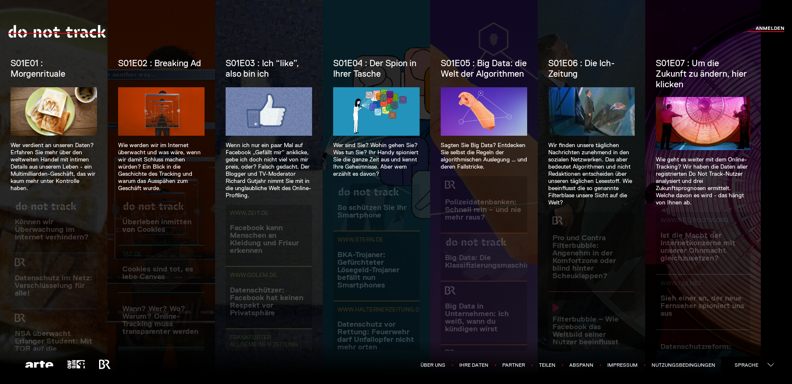
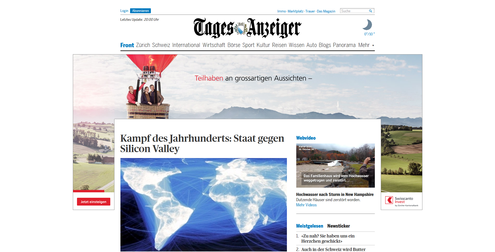
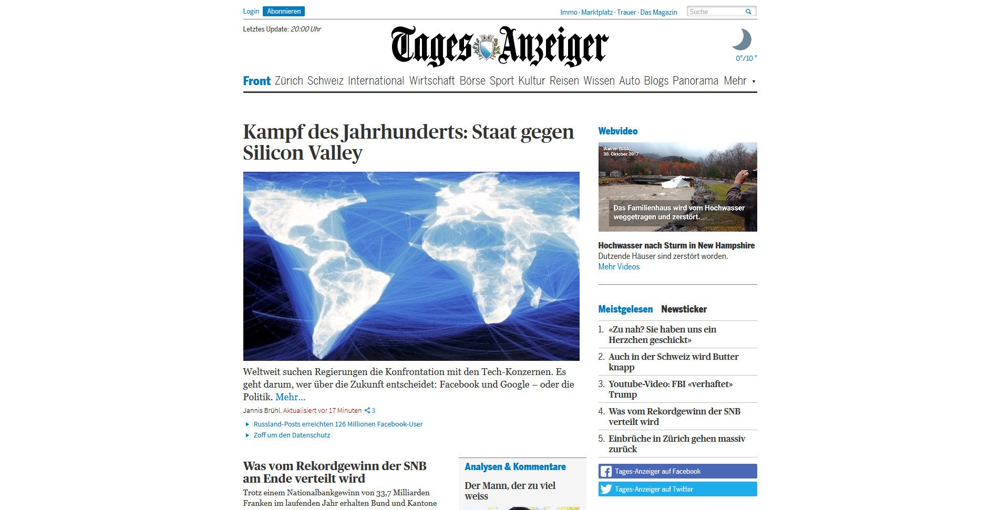

# Do not Track

## Interaktive Dokumentation «Do not track»
Die Webseite https://donottrack-doc.com/ bietet mit 7 kurzen, interaktiven Videos einen guten Überblick über die Themen *Online-Tracking* und *Big Data*.

## Werbeblocker für den Browser

Die meisten Webseitenbetreiber betten Werbeanzeigen und andere kleine Elemente in ihre Webseiten ein und verfolgen uns damit. Mit der Browsererweiterung **uBlock Origin** existiert für *Firefox*, *Chrome* und *Safari* eine effiziente Möglichkeit, solche unnötigen Inhalte zu blockieren:

Die Erweiterung zeigt zudem über ein kleines Icon in der Symbolleiste für jede Webseite an, wie viele Zugriffe zu fremden Servern blockiert worden sind.

