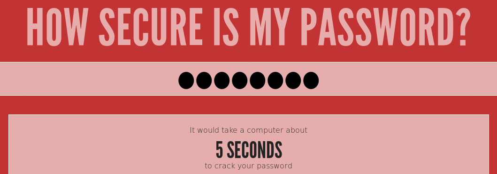

# Passwörter im Internet

:::tip Passwort-Check
Auf der Seite https://howsecureismypassword.net/ können Sie Ihre Passwörter testen. Sie erhalten eine Schätzung zur Sicherheit Ihres Passwortes. Ihre Passwörter werden dabei **nicht** übers Internet übertragen, die Berechnung findet auf dem eigenen PC statt.
:::

## Empfohlene Massnahmen
Ideal ist folgendes Vorgehen
- Sie wählen für jede Webseite ein individuelles Passwort
- Das Passwort ist 10 Zeichen lang oder länger
- Es kommen Buchstaben (gross und klein), Zahlen und Sonderzeichen vor

## Absolutes Minimum
Auf folgenden Seiten sind individuelle Passwörter (= die nirgends sonst gebraucht werden) **unerlässlich**:
- :mdi[email] E-Mail-Konten
- :mdi[cash] Geldinstitute (Banken, Paypal, ...)
- :mdi[medicalBag] Gesundheit (Krankenkassen-Login, ...)
