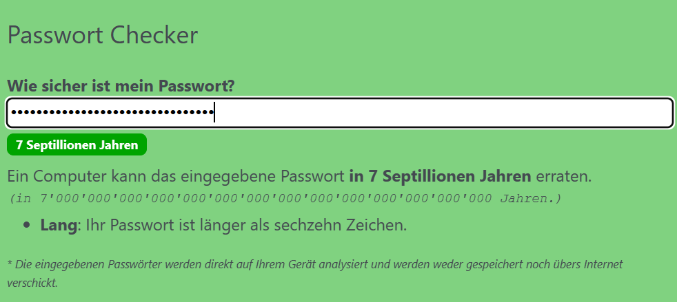

import PasswordChecker from '@site/src/components/PasswordChecker'
import BitwardenSvg from './images/bitwarden.svg'
import KeypassSvg from './images/keepass2.svg'

Mit dem untenstehenden Tool (Quelle: [hsimp](https://github.com/howsecureismypassword/hsimp))  kann die Sicherheit Ihres Passworts analysiert werden - insbesondere spannend ist die geschätzte Zeit, um das Passwort zu knacken - die trifft allerdings nur dann zu, wenn das Passwort eine genug hohe Komplexität aufweist.

<PasswordChecker />

## Tipps für gute Passwörter

- Wählen Sie für jede Webseite ein individuelles Passwort
- Das Passwort ist mindestens 10 Zeichen lang
- Es kommen Buchstaben (gross und klein), Zahlen und Sonderzeichen vor

## Gute, merkbare Passwörter
Es gibt Strategien, um gute Passwörter zu erstellen, die man sich einfach merken kann. Im folgenden sind drei Strategien aufgeführt:

### 1. Anfangsbuchstaben

`Jeden Abend vor dem Schlafen trinke ich eine Tasse Kräutertee!`

> `JA4dStieTKt!`

### 2. Vier zufällige Wörter
Wählen Sie vier zufällige Wörter. Verwenden Sie beispielsweise einen [Webdienst](https://capitalizemytitle.com/zufallswort-generator/) dazu.
Überlegen Sie sich anschliessend eine Visualisierung, mit welcher Sie sich diese Wörter merken können.

Weiter können Buchstaben durch Sonderzeichen und Zahlen ersetzt werden, z.B. jedes 2te `l` wird zu einer `1`, oder alle `s` werden als `$` geschrieben.

> Wahrscheinlich, Utopisch, Futurlos, Propeller

`Wahr$chein1ichUt0pi$chFuturl0$Pr0pe1ler`

### 3. Königsweg: Passwortmanager 🏅 
Am sichersten ist es, zufällige Passwörter zu verwenden, welche Sie in einem Passwortmanager verwalten.
So müssen Sie sich nur ein (sicheres!) Passwort merken; dasjenige für den Passwortmanager.
Im Manager können Sie für jeden Dienst automatisch ein sicheres Passwort erzeugen lassen.
Für gängige Passwort-Manager gibt es auch Browser-Plugins, welche das Ausfüllen von Passwörtern unterstützen.

- [BitWarden <BitwardenSvg />](https://bitwarden.com/) (Empfehlung) - gute Basis-Funktionen, einfaches Handling, open-source.
- [KeePass <KeypassSvg />](https://keepass.info/)
- [LastPass :mdi[lastpass]{.red}](https://www.lastpass.com/)

:::info[Browser-Passwort-Manager]
Im Gegensatz zu Lösungen wie dem Browser-Passwort-Manager sind Passwort-Manager speziell für die Verwaltung von Passwörtern entwickelt und bieten mehr Sicherheit. Zudem sind sie unabhängig vom Browser und können auf verschiedenen Geräten verwendet werden.
:::

## Passwort überprüfen

Die Stärke des Passworts kann mit dem untenstehenden Tool überprüft werden. Wichtig ist, dass alle Hinweise beachtet werden, und der Hintergrund des Tools am Ende grün ist:

<PasswordChecker />
