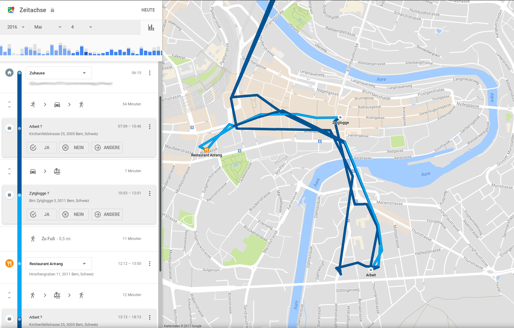

# Tracking

## Beispiel Facebook

Angenommen, du bist nicht Mitglied bei Facebook. Trotzdem weiss Facebook jede Menge über dich:

:::details Facebook kennt einen grossen Teil deines Freundes-/Kollegenkreises! Wie geht das?
Es gibt sicher etliche Leute in deinem Umfeld, die bei Facebook Mitglied sind. Einige davon suchen bei Facebook nach dir. Facebook speichert solche Anfragen und weiss nun, dass ihr euch kennen müsst.
Andere haben die Facebook-App installiert. Diese App greift auf das Adressbuch zu und kann annehmen, dass du eine Person kennst, wenn du in deren Adressbuch stehst. Da du wohl in vielen Adressbüchern auftauchst, kann sich Facebook deinen Bekanntenkreis ziemlich genau ausmalen.
:::

:::details Facebook kennt deine Kontaktdaten (E-Mail-Adresse, Mobiltelefonnummer, Wohnadresse) und vielleicht sogar dein Geburtsdatum! Wie geht das?
Wenn Leute, die du gut kennst, die Facebook-App verwenden, dann teilen sie automatisch ihr Adressbuch mit Facebook. Alle Informationen, die über dich in diesen Adressbüchern vorhanden sind, wandern automatisch zu Facebook und werden dort gespeichert.
:::

## Beispiel Standortdienst (GPS-Daten)

Smartphones protokollieren in regelmässigen Abständen unseren Standort (sei dies anhand von WLAN-Netzwerken oder über GPS) und übermitteln diesen Standort an Google oder Apple. Dort werden unsere Standortdaten peinlich genau gespeichert:

Diese Daten können jederzeit eingesehen werden:

* Google Timeline: direkt online unter https://www.google.com/maps/timeline
* Apple Location History: gemäss Anleitung direkt auf dem Gerät: http://www.iclarified.com/36198/how-to-view-the-location-history-of-your-iphone

Standortverlauf deaktivieren/löschen:

* Android: https://support.google.com/accounts/answer/3118687?hl=de
* iOS: http://www.watson.ch/Digital/Videos/134176987-Das-iPhone-verfolgt-jeden-Schritt-von-dir--So-stoppst-du-die-Handy-%C3%9Cberwachung
