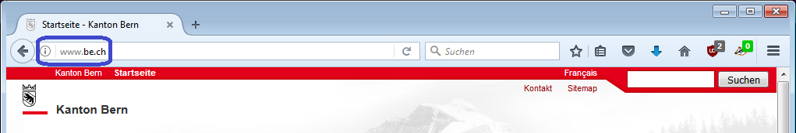
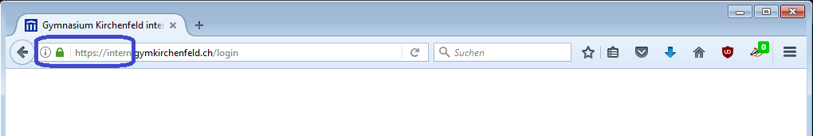
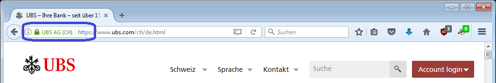

## Unverschlüsselte Webseiten
Herkömmliche Webseiten verwenden keine Verschlüsselung. Dies erkennt man daran, dass **kein** grünes Schloss vor der Adresse sichtbar ist und die Adresse **nicht** mit `https://` beginnt:

**Wichtig**
- Unverschlüsselte Verbindungen erlauben das Mitlesen der gesamten Kommunikation irgendwo auf dem Weg zwischen dem Client und dem Server.
- Es kann nicht festgestellt werden, wenn ein Angreifer sich als den Server ausgibt, den ich kontaktieren möchte (hier `www.be.ch`).

## Verschlüsselte Verbindungen
Verschlüsselte Verbindugnen werden immer häufiger eingesetzt. Sogar die Google-Suchanfragen finden seit einiger Zeit über eine verschlüsselte Verbindung statt und können somit unterwegs nicht mehr abgehört werden. Zu sehen ist dies am **grünen Schloss** und am – der Adresse vorangestellten – `https://`.

**Wichtig**
- Die Verbindung kann nicht abgehört werden.
- Verschlüsselung ist **zwingend notwendig** für alle Webseiten, bei denen man sich **einloggen** muss.
- Das Schloss garantiert, dass man mit demjenigen Server spricht, der in der Adresse aufgeführt ist.
- **Achtung**: die Verschlüsselung schützt nicht vor geschickt manipulierten Adressen wie z.B. `https://intern.gymkirchenfe1d.ch/` (siehe [Thema Phishing](../phishing/)).

## Verschlüsselte Verbindungen mit zusätzlichen Angaben
Webseiten von hoher Bedeutung und mit grösserem Angriffsrisiko haben die Möglichkeit, Zertifikate mit einer erweiterten Überprüfung zu beziehen. Diese sind viel teurer und lohnen sich insbesondere für Finanzinstitute. In der Adresszeile wird die umfassendere Überprüfung dadurch sichtbar, dass neben der Adresse und dem grünen Schloss auch noch der **offizielle Firmenname** und der **Firmensitz grün hinterlegt** dargestellt wird.

**Wichtig**
- Die Verbindung ist genau gleich geschützt wie "normale" verschlüsselte Verbindungen.
- Zudem wird das Erkennen von Phishing-Webseiten dadurch vereinfacht, dass neben der Internet-Adresse auch noch der Firmenname eingeblendet wird.
