# IT-Hilfe zur Selbsthilfe

Hier solltest du Lösungen für dein technisches Problem finden können.

Falls für dein Problem keine Lösung zu finden ist oder du eine Lösung ausprobiert hast, aber dein Problem damit nicht gelöst werden konnte, so kannst du das hier melden. Gib bitte genau an, was das Problem ist und was du für Lösungen probiert hast. Screenshots sind hilfreich für den Support. 
[Mail schreiben](mailto:ithelp@bernedu.ch?subject=IT-Hilfe%20zur%20Selbsthilfe&body=Guten%20Tag%0A%0AIch%20habe%20folgendes%20Problem%2C%20f%C3%BCr%20das%20auf%20ict.gbsl.website%20keine%20L%C3%B6sung%20zu%20finden%20ist%3A%0A%0A*Beschreibe%20das%20Problem%20genau%2C%20h%C3%A4nge%20Screenshots%20ans%20Mail%20an%2C%20wenn%20du%20es%20dadurch%20besser%20erkl%C3%A4ren%20kannst.*%0A%0Aoder%0A%0AIch%20habe%20folgendes%20Problem%2C%20f%C3%BCr%20das%20ich%20folgende%20hier%20gefundene%20L%C3%B6sung%20ausprobiert%20habe%2C%20aber%20mein%20Problem%20konnte%20dadurch%20nicht%20gel%C3%B6st%20werden%3A%0A%0A*Beschreibe%20das%20Problem%20und%20gib%20exakt%20an%2C%20was%20du%20ausprobiert%20hast%2C%20mach%20von%20eventuellen%20Fehlermeldungen%20Screenshots%20und%20h%C3%A4nge%20die%20ans%20Mail%20an.*%0A%0AW%C3%A4re%20es%20m%C3%B6glich%2C%20dass%20ich%20beim%20Support%20vorbeikommen%20kann%20und%20k%C3%B6nnen%20Sie%20mir%20einen%20Termin%20angeben%3F%0A%0ABesten%20Dank%20f%C3%BCr%20Ihre%20Hilfe%0A%0AMit%20freundlichen%20Gr%C3%BCssen)

<Tabs>
  <TabItem value="Mein Gerät" label="Mein Gerät">
::::info[Ich habe Probleme mit meinem Konto, mit Office 365, mit Authentifizieren]

:::solution[Lösung]
Melde, dass dein Konto zurückgesetzt werden muss, vergiss nicht deine Mailadresse und deine Mobilenummer anzugeben: [👉 :mdi[emailEditOutline]](mailto:soarhe.jahany@bernedu.ch?subject=Account%20Sch%C3%BCler%3Ain%20zur%C3%BCcksetzen&body=Guten%20Tag%20Herr%20Jahany%2C%0A%0ABitte%20setzen%20Sie%20meinen%20Account%20zur%C3%BCck%3A%0A%0A%40edu.gbsl.ch%0A%0ATel.%2007%0A%0ABesten%20Dank%20und%20freundliche%20Gr%C3%BCsse)
:::
::::

::::info[Smartphone verloren, gestohlen, kaputt, ein neues und kein Zugriff auf den Authenticator]
:::solution[Lösung]
Solltest du ein neues Smartphone haben und noch Zugriff auf dein altes:
[👉](docs\schulkonto\/mfa\wechselhandy\README.md)

Sonst:
Melde, dass dein Konto zurückgesetzt werden muss, vergiss nicht deine Mailadresse und deine Mobilenummer anzugeben: [👉 :mdi[emailEditOutline]](mailto:it-help-for-students@bernedu.ch?subject=Account%20Sch%C3%BCler%3Ain%20zur%C3%BCcksetzen&body=Guten%20Tag%2C%0A%0ABitte%20setzen%20Sie%20meinen%20Account%20zur%C3%BCck%3A%0A%0A%40edu.gbsl.ch%0A%0ATel.%2007%0A%0ABesten%20Dank%20und%20freundliche%20Gr%C3%BCsse)

Wenn du die Meldung erhalten hast, dass dein Account zurückgesetzt worden ist,  kannst du den Authenticator wieder einrichten auf deinem Smartphone oder es bei der Authentifikation über SMS belassen: [👉](docs\schulkonto\mfa\README.md)

Tipp: [👉](docs\schulkonto\mfa\tipsnoproblem\README.md)
:::
::::

::::info[Meine MFA / die Authenticator App ist zurückgesetzt worden - was muss ich jetzt tun?]

:::solution[Lösung]
Quickstart Neukonfiguration MFA:

Der/die Lernende öffnet auf dem Computer folgenden Link: https://qr.edubern.ch/mfasetup
Mit E-Mail-Adresse und Passwort anmelden. Es erscheint die Meldung: «Weitere Informationen erforderlich». Auf [Weiter] klicken.
Bei Fenster «Angemeldet bleiben?» auf [Ja] klicken.
Bei Fenster «Microsoft Authenticator» unten links auf [Ich möchte eine andere Methode einrichten] klicken.
Methode «Telefon» gemäss Anweisungen auf Bildschirm einrichten.
Der/die Lernende öffnet auf dem Computer nochmals folgenden Link:https://qr.edubern.ch/mfasetup
Im neuen Fenster [Anmeldemethode hinzufügen] auswählen.
Methode «Microsoft Authenticator» gemäss Anweisungen auf Bildschirm einrichten.
Anschliessend kann die MFA für das Login wieder wie gewohnt verwendet werden. Informationen und Anleitungen dazu sind auf der [Website von EDUBERN](https://www.edubern.bkd.be.ch/de/start/portal.html) zu finden.

Freundliche Grüsse
EDUBERN
:::
::::

::::info[Ich muss meinen Laptop zur Reparatur einschicken - gibt es Ersatzgeräte?]

:::solution[Lösung]
Unsere Bibliothek leiht Laptops aus: 

1. Klicke auf __Suchergebnisse__
2. Setze das Häkchen bei __Laptops__

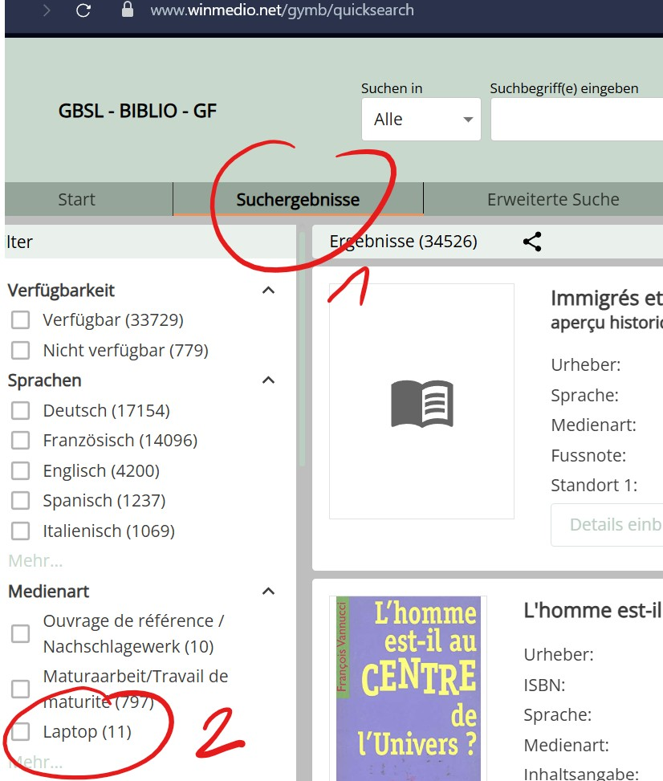
:::
::::

::::info[Ich kann mich bei Word oder einer andern App nicht anmelden]
:::solution[Lösung]
## Hast du Probleme mit Anmelden, gibt es zwei Hauptursachen

### 1. Bei Anmeldung Häkchen nicht deaktiviert

Anmeldung nicht möglich tritt auf, wenn du folgendes Häkchen nicht gelöscht hast.

Versuche dich bei einer App anzumelden, wenn folgende Box angezeigt wird, Häkchen deaktivieren und markierte Variante anklicken:

Unten Links auf __Nein, nur bei dieser App anmelden__ klicken.

Taucht diese Box nicht auf, so schau hier nach:

### 2. Ein Schulkonto ist fälschlicherweise eingerichtet 

Entweder hast du von deiner alten Schule die Office-Installation nicht vollständig gelöscht oder du hast versehentlich ein Schulkonto hinzugefügt.

Um ein bestehendes Schulkonto zu entfernen, ist wie folgt vorzugehen:

<Tabs groupId="os">
  <TabItem value="win" label="Windows">

Unter __Einstellungen :mdi[cog]{.blue}__ klicke auf __Konten :mdi[account]{.cyan}__ scrolle runter auf __Auf Arbeits-, Schulkonto...zugreifen__ danach auf __trennen__ klicken.

  </TabItem>
  <TabItem value="osx" label="Mac">

Unter Mac OS X muss ein Tool für die Entfernung von bestehenden Konten verwendet werden. 

Anleitung
: [👉 Anleitung](https://support.microsoft.com/de-de/office/entfernen-von-office-lizenzdateien-auf-einem-mac-b032c0f6-a431-4dad-83a9-6b727c03b193)
Tool
: [👉 Removal-Tool](https://go.microsoft.com/fwlink/?linkid=849815)

  </TabItem>
</Tabs>
:::
::::

::::info[Ich komme mit meinem Macbook nicht ins Internert, obwohl ich im WLAN angemeldet bin]
:::solution[Lösung]
1. Installiere (daheim ober über Hotspot) einen andern Browser (Chrome, Opera, Edge) damit kommst du auch in der Schule ins Internet.
2. Kontrolliere, ob du ein iCloud+-Abo hast und __Privat-Relay__ eingeschaltet ist:

Klicke auf das Apple-Menü __:mdi[apple]__, wähle __Systemeinstellungen__ . Klicke dann oben in der Seitenleiste auf „[dein Name]“ und anschließend auf __iCloud__. Klicke anschliessend auf __Privat-Relay__.

Schalte es aus.

**Was ist Private-Relay und wieso gibt es Probleme?- Eine elegante Lösung**
Private-Relay schützt dich vor Angriffen aus dem Internet, indem es deine Identität verbirgt und deine Anfragen versteckt. Das macht durchaus Sinn etwa im WLAN daheim, aber nicht in gut gesicherten Netzwerken, weil in diesen gerade mit der Kontrolle der Identität die Sicherheit erhöht wird.

Die beste Lösung besteht darin, __Private-Relay__ nur für das BYOD-WLAN auszuschalten, so bist du weiterhin auch in den einfacheren Netzwerken gut geschützt:

Klicke auf das Apple-Menü __:mdi[apple]__, wähle __Systemeinstellungen__ . Klicke in der Seitenleiste auf __Netzwerk__ und anschliessend auf der rechten Seite __WLAN-BYOD__, Klicke auf die __:mdi[informationOutline]__.

Deaktiviere zum Schluss die Option __Tracking der IP-Adresse beschränken__.
:::
::::

::::info[WLAN]
Ich kann mit meinem Mac nicht mehr direkt drucken über **uniflow**
:::solution[Lösung]
Wenn deinstallieren und neu installieren nicht hilft, so musst du folgendermassen vorgehen, um ein deep clean zu erzwingen, damit keine alten Installationsdateien zurückbleiben:

Oeffne den __Finder__, gehe zu __Programme__ dann zu __Dienstprogramme__ und öffne die **Aktivitätsanzeige** (gelb markiert) mit einem Doppelklick.

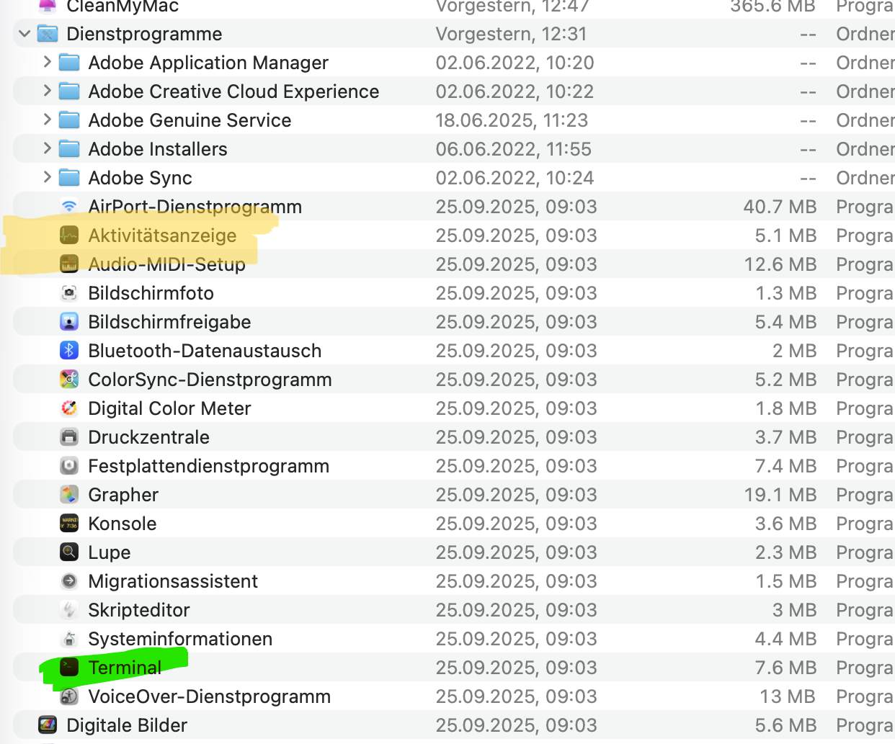

Anschliessend suchst du **smartclient**, doppelklicke und wähle __Sofort beenden__.

Du befindest dich immer noch im Finder, suche __Terminal__ (im Screenshot oben grün markiert), doppelklicke und gib folgendes ein:

sudo bash /etc/smartclient/uninstall-smartclient.bash

Gib dein Passwort ein für dein Macbook - es klappt, auch wenn du keine Eingabe siehst. Drücke __Enter__.

Danach kannst du den Druckertreiber über das Dashboard installieren [👉 ](https://gymb.eu.uniflowonline.com/#Dashboard).
:::
::::

::::info[WLAN]
Problem mit dem **Passwort** beim Anmelden
:::solution[Lösung]
Kein neues Passwort setzen im Anmeldeprozess des WLAN! 

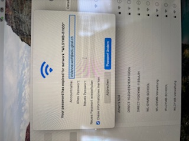

Setze dir hier ein neues Passwort, das gilt für alle Anmeldungen in der Schule (Apps, WLAN, Mail): [👉 ](https://password.edubern.ch/)

Klappt auch das nicht, dann ist dein Account gesperrt und muss zurückgesetzt werden. Melde dich mit diesem Mail, gib deine gbsl-Mailadresse und deine Mobilenummer ein: [👉 :mdi[emailEditOutline]](mailto:soarhe.jahany@bernedu.ch?subject=Account%20Sch%C3%BCler%3Ain%20zur%C3%BCcksetzen&body=Guten%20Tag%20Herr%20Jahany%2C%0A%0ABitte%20setzen%20Sie%20meinen%20Account%20zur%C3%BCck%3A%0A%0A%40edu.gbsl.ch%0A%0ATel.%2007%0A%0ABesten%20Dank%20und%20freundliche%20Gr%C3%BCsse)

Wenn dein Account zurückgesetzt ist, kannst du dir ein neues Passwort setzen [👉 ](https://password.edubern.ch/) und dich danach damit wieder beim WLAN-BYOD anmelden.
:::
::::

::::info[Mein Windows-Notebook geht in den Ruhezustand oder der Bildschirm wird dunkel während einer Präsentation.]

:::solution[Lösung]
Eine einfache und praktische Lösung ist die Installation von __Microsoft PowerToys__ über den __Microsoft Store__. Interessant ist __PowerToys Awake__, das du aufrufen kannst, nachdem du __PowerToys__ installiert hast. Dort wählst du folgende Einstellungen:

:::
::::

::::info[Bei der Erstanmeldung oder dem Passwort-Reset erhalte ich keine SMS]

Das kann 2 mögliche Ursachen haben: Entweder ist auf deinem Smartphone ein SMS-Filter aktiviert oder auf der SIM-Karte deines Mobile-Anbieters verhindert eine Einstellung den Empfang.

:::solution[SMS-Filter prüfen]

<Tabs groupId="phone">
  <TabItem value="iPhone" label="iPhone">

Wähle __Einstellungen__ scrolle runter zu __App__, wähle __App__.

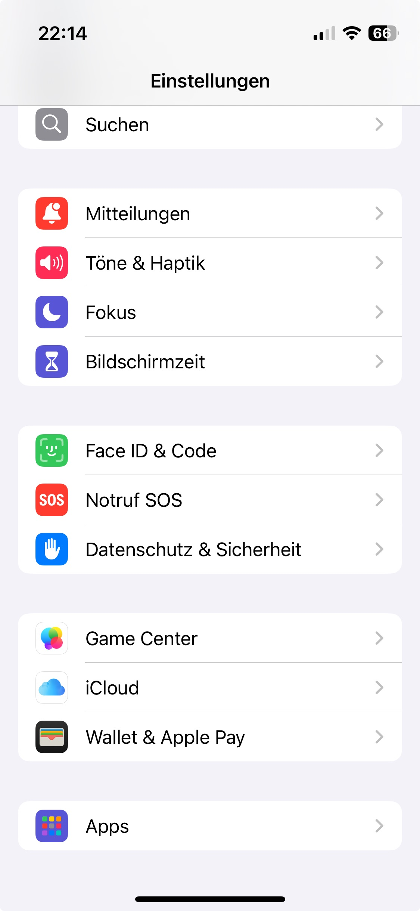

Scrolle runter zu __Nachrichten__ und wähle diese.

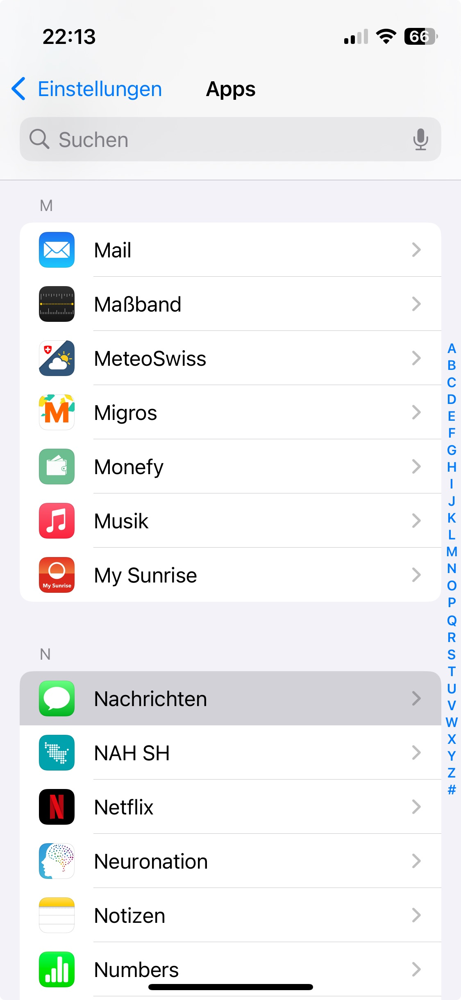

Ist dieser Filter gesetzt, kannst du in der Liste nachschauen, ob du eine SMS von 079 807 10 11 erhalten hast und diese Nummer zu den bekannten Absendern hinzufügen.

Wenn dieser Filter nicht gesetzt ist, dann gehe zur nächsten Lösung "Netzwerk zurücksetzen".

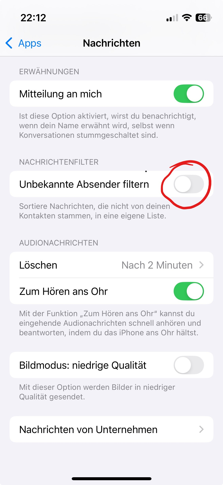

  </TabItem>
  <TabItem value="android" label="Android">

Hinweis: Je nach Android-Version oder Hersteller können die Screenshots anders aussehen.

Öffne die Nachrichten-App und tippe danach auf das Symbol für deinen Kontonamen:

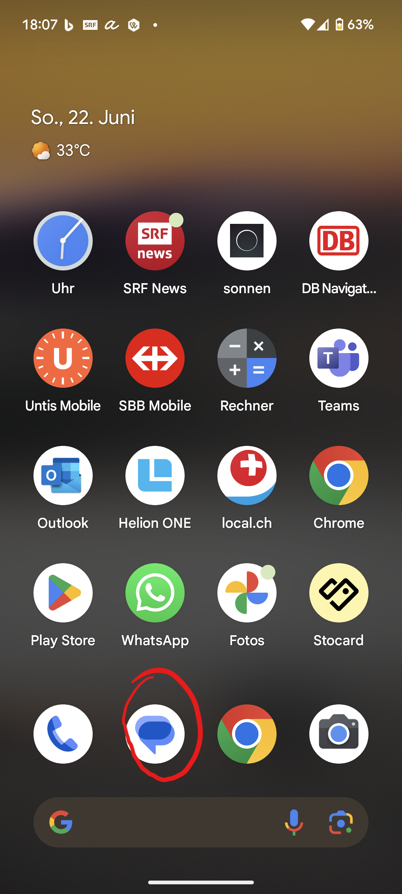

Hier wählst du __Als Spam markiert und blockiert__.

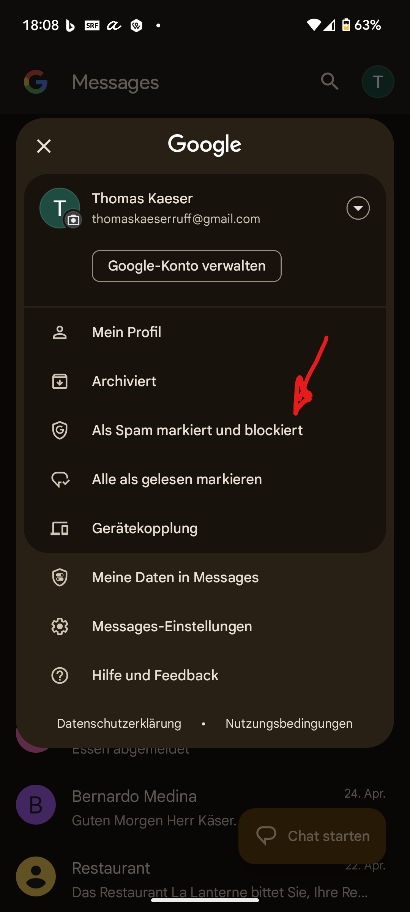

Wenn du folgenden Screen siehst, musst du die Lösung "Netzwerkeinstellungen zurücksetzen" wählen.

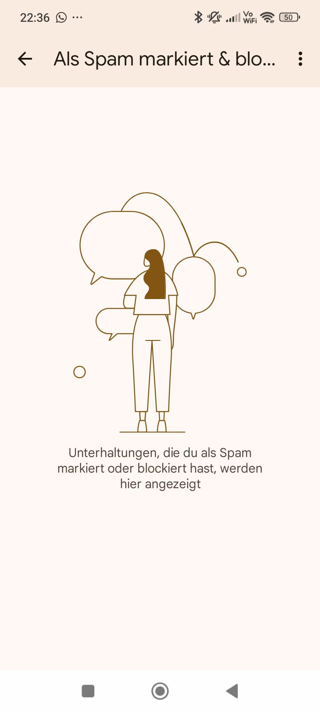

Siehst du einen Ordner mit SMS-Nachrichten, suchst du eine Nachricht von 079 807 10 11, öffne sie und tippe auf __Kein Spam__ danach solltest du die SMS empfangen können.

  </TabItem>
</Tabs>

:::

:::solution[Netzwerk-Einstellungen zurücksetzen]

<Tabs groupId="phone">
  <TabItem value="iPhone" label="iPhone">

Wähle __Einstellungen__    und danach __Allgemein__ 

 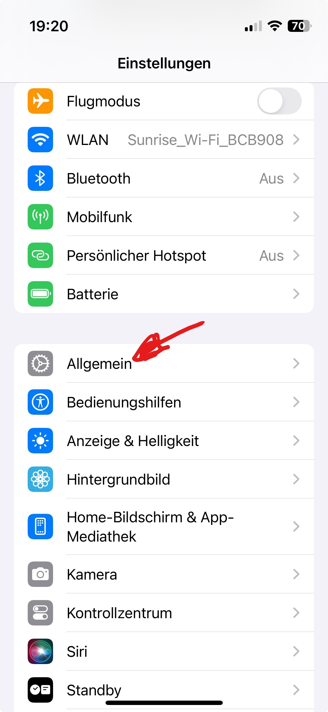

 Hier wählst du __iPhone übertragen/zurücksetzen__ 
 
 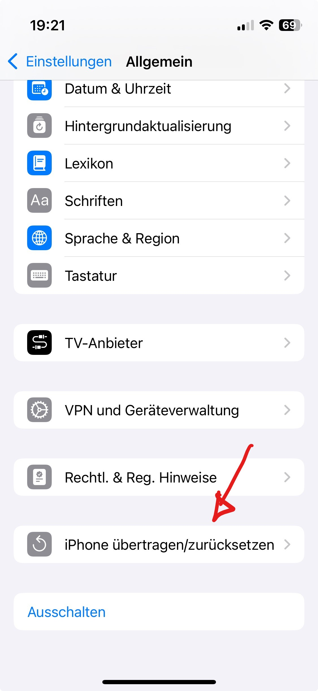
 

 

ACHTUNG: Nichts Falsches wählen, wenn du die Option „Alle Inhalte & Einstellungen löschen“ wählst, wird dein gesamter Inhalt gelöscht.

Wähle 

**Netzwerkeinstellungen**: Alle Netzwerkeinstellungen werden zurückgesetzt. Außerdem wird der unter „Einstellungen“ > „Allgemein“ > „Info“ zugeordnete Name auf „iPhone“ zurückgesetzt. Zertifikate, die manuell als vertrauenswürdig eingestuft wurden (etwa für Websites), werden in „nicht vertrauenswürdig“ geändert.

  </TabItem>
  <TabItem value="android" label="Android">

Wähle __Einstelllungen__ und scrolle runter zu __System__, wähle dies an.

Die Screenshots stammen von einem Pixel mit Android 15 und Android 16. Je nach Android-Version und Hersteller des Smartphones können die Menüs anders ausschauen.

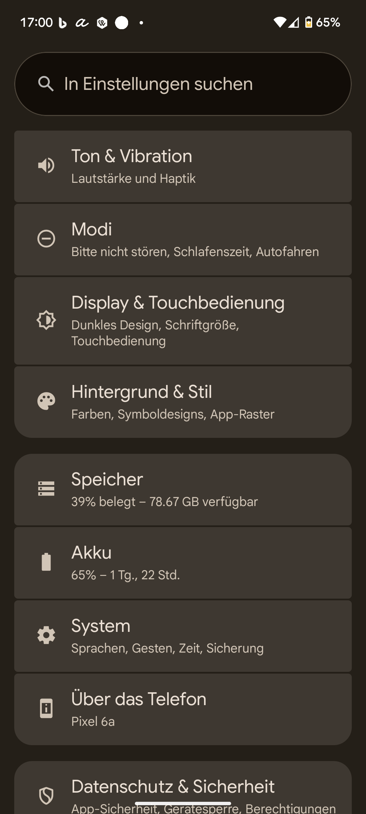

Scrolle nach unten und wähle __Optionen zum Zurücksetzen__ an.

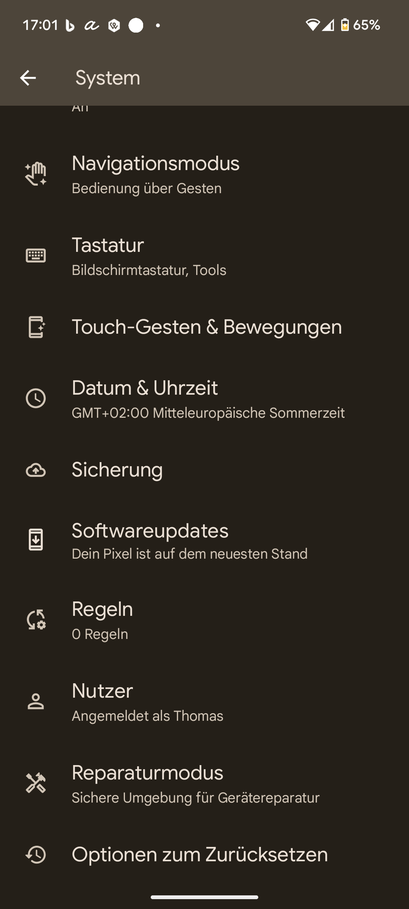

Wähle __Einstellungen für Mobilfunknetze zurücksetzen__ aus. 

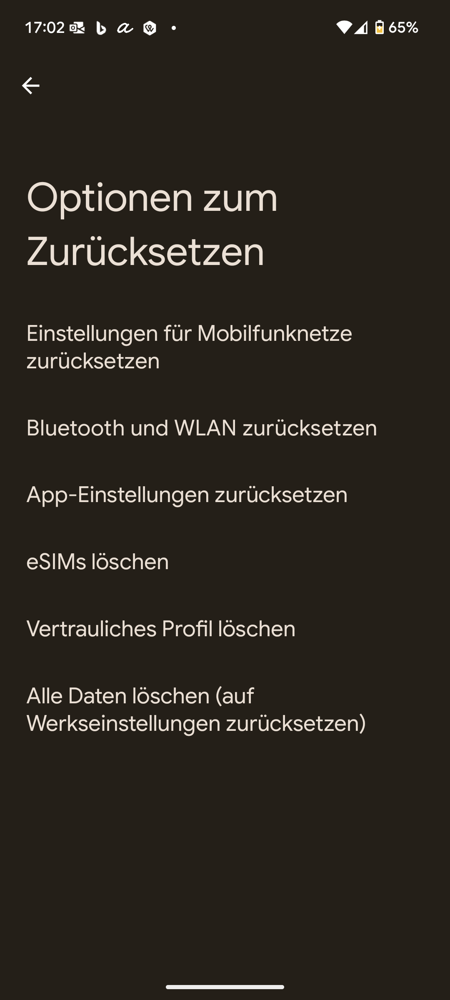
  </TabItem>
</Tabs>

:::

::::

</TabItem>
<TabItem value="Installation D-Gebäude" label="Installation D-Gebäude">

::::tip[Tipp]
Kleinere und einfachere Probleme löst du am schnellsten selber. Dazu findest du in D101 und D201 je eine rote Box mit Kabeln, Batterien, Fernbedienungen, Ladegeräten plus eine laminierte Anleitung mit den Flussidagrammen, die du hier unter "Beamer lässt sich nicht einschalten" und "Kamera funktioniert nicht" ebenfalls finden kannst.
::::

::::info[Ton]
Kein Ton bei einer Präsention, bei einem Film

:::solution[Lösung]
Kontrolliere, ob du den] Ton nicht auf stumm eingestellt hast auf deinem Gerät:

Bild einsetzen

Kontrolliere auf der Fernbedienung des Beamers __Volume__

Bild
:::
::::

::::info[Beamer lässt sich nicht einschalten]

:::solution[Lösung]
 
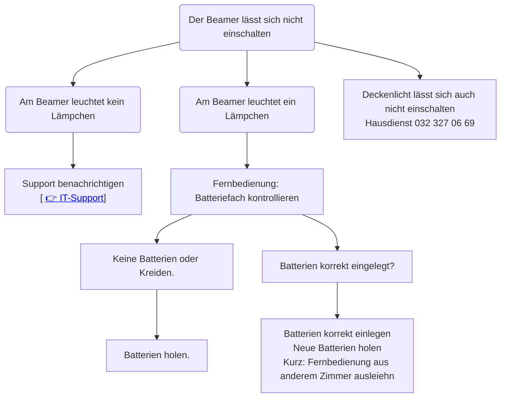
:::
::::

::::info[Kamera funktioniert nicht]

:::solution[Lösung]

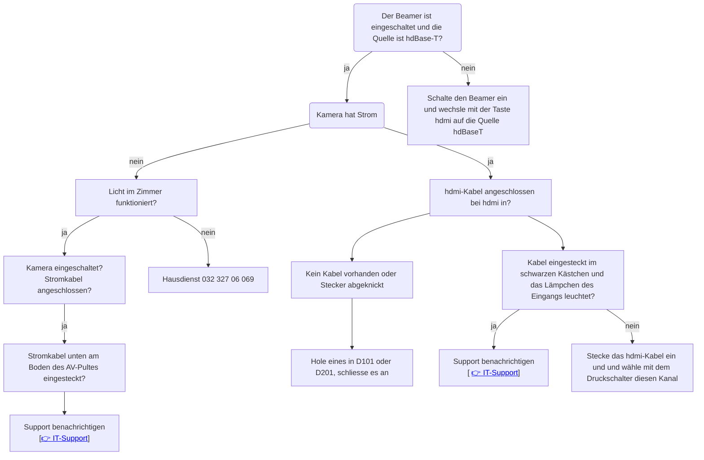
:::
::::

</TabItem>
<TabItem value="Installation M + G" label="Installation M + G">
Kein Strom bei Kamera, Verstärker

</TabItem>
</Tabs>
