```mermaid
flowchart TD
    C("Der Beamer ist eingeschaltet und die Quelle ist hdBase-T?") -- ja --> n2["Kamera hat Strom"]
    n2 -- nein --> n3["Licht im Zimmer funktioniert?"]
    n2 -- ja --> n4["hdmi-Kabel angeschlossen bei hdmi in?"]
    n3 -- ja --> n5["Kamera eingeschaltet?<br>Stromkabel angeschlossen?"]
    n3 -- nein --> n6["Hausdienst 032 327 06 069"]
    n5 -- ja --> n7["Stromkabel unten am Boden des AV-Pultes eingesteckt?"]
    n7 --> n8["Support benachrichtigen<br>[<a href="https://forms.office.com/r/akUrVUFaRu" target="_blank">👉 IT-Support</a>]"]
    n4 --> n9["Kein Kabel vorhanden oder Stecker abgeknickt"] & n11["Kabel eingesteckt im schwarzen Kästchen und das Lämpchen des Eingangs leuchtet?"]
    n9 --> n10["Hole eines in D101 oder D201, schliesse es an"]
    n11 -- ja --> n12["Support benachrichtigen<br>[ <a href="https://forms.office.com/r/akUrVUFaRu" target="_blank">👉 IT-Support</a>]"]
    n11 -- nein --> n13["Stecke das hdmi-Kabel ein und und wähle mit dem Druckschalter diesen Kanal"]
    C -- nein --> n14["Schalte den Beamer ein und wechsle mit der Taste hdmi auf die Quelle hdBaseT"]

    n2@{ shape: rounded}

```

# IT-Hilfe zur Selbsthilfe

Hier solltest du Lösungen für dein technisches Problem finden können.

Falls für dein Problem keine Lösung zu finden ist oder du eine Lösung ausprobiert hast, aber dein Problem damit nicht gelöst werden konnte, so kannst du das hier melden. Gib bitte genau an, was das Problem ist und was du für Lösungen probiert hast. Screenshots sind hilfreich für den Support. 
[Mail schreiben](mailto:it-help-for-students@bernedu.ch?subject=IT-Hilfe%20zur%20Selbsthilfe&body=Guten%20Tag%0A%0AIch%20habe%20folgendes%20Problem%2C%20f%C3%BCr%20das%20auf%20ict.gbsl.website%20keine%20L%C3%B6sung%20zu%20finden%20ist%3A%0A%0A*Beschreibe%20das%20Problem%20genau%2C%20h%C3%A4nge%20Screenshots%20ans%20Mail%20an%2C%20wenn%20du%20es%20dadurch%20besser%20erkl%C3%A4ren%20kannst.*%0A%0Aoder%0A%0AIch%20habe%20folgendes%20Problem%2C%20f%C3%BCr%20das%20ich%20folgende%20hier%20gefundene%20L%C3%B6sung%20ausprobiert%20habe%2C%20aber%20mein%20Problem%20konnte%20dadurch%20nicht%20gel%C3%B6st%20werden%3A%0A%0A*Beschreibe%20das%20Problem%20und%20gib%20exakt%20an%2C%20was%20du%20ausprobiert%20hast%2C%20mach%20von%20eventuellen%20Fehlermeldungen%20Screenshots%20und%20h%C3%A4nge%20die%20ans%20Mail%20an.*%0A%0AW%C3%A4re%20es%20m%C3%B6glich%2C%20dass%20ich%20beim%20Support%20vorbeikommen%20kann%20und%20k%C3%B6nnen%20Sie%20mir%20einen%20Termin%20angeben%3F%0A%0ABesten%20Dank%20f%C3%BCr%20Ihre%20Hilfe%0A%0AMit%20freundlichen%20Gr%C3%BCssen)

<Tabs>
  <TabItem value="Mein Gerät" label="Mein Gerät">
::::info[Ich habe Probleme mit meinem Konto, mit Office 365, mit Authentifizieren]

:::solution[Lösung]
Melde, dass dein Konto zurückgesetzt werden muss, vergiss nicht deine Mailadresse und deine Mobilenummer anzugeben: [👉 :mdi[emailEditOutline]](mailto:soarhe.jahany@bernedu.ch?subject=Account%20Sch%C3%BCler%3Ain%20zur%C3%BCcksetzen&body=Guten%20Tag%20Herr%20Jahany%2C%0A%0ABitte%20setzen%20Sie%20meinen%20Account%20zur%C3%BCck%3A%0A%0A%40edu.gbsl.ch%0A%0ATel.%2007%0A%0ABesten%20Dank%20und%20freundliche%20Gr%C3%BCsse)
:::
::::

::::info[Smartphone verloren, gestohlen, kaputt, ein neues und kein Zugriff auf den Authenticator]
:::solution[Lösung]
Melde, dass dein Konto zurückgesetzt werden muss, vergiss nicht deine Mailadresse und deine Mobilenummer anzugeben: [👉 :mdi[emailEditOutline]](mailto:soarhe.jahany@bernedu.ch?subject=Account%20Sch%C3%BCler%3Ain%20zur%C3%BCcksetzen&body=Guten%20Tag%20Herr%20Jahany%2C%0A%0ABitte%20setzen%20Sie%20meinen%20Account%20zur%C3%BCck%3A%0A%0A%40edu.gbsl.ch%0A%0ATel.%2007%0A%0ABesten%20Dank%20und%20freundliche%20Gr%C3%BCsse)

Wenn du die Meldung erhalten hast, dass dein Account zurückgesetzt worden ist,  kannst du den Authenticator wieder einrichten auf deinem Smartphone oder es bei der Authentifikation über SMS belassen: [👉](docs\schulkonto\mfa\README.md)
:::
::::

::::info[Ich kann mich bei Word oder einer andern App nicht anmelden]
:::solution[Lösung]
## Hast du Probleme mit Anmelden, gibt es zwei Hauptursachen

### 1. Bei Anmeldung Häkchen nicht deaktiviert

Anmeldung nicht möglich tritt auf, wenn du folgendes Häkchen nicht gelöscht hast.

Versuche dich bei einer App anzumelden, wenn folgende Box angezeigt wird, Häkchen deaktivieren und markierte Variante anklicken:

Unten Links auf __Nein, nur bei dieser App anmelden__ klicken.

Taucht diese Box nicht auf, so schau hier nach:

### 2. Ein Schulkonto ist fälschlicherweise eingerichtet 

Entweder hast du von deiner alten Schule die Office-Installation nicht vollständig gelöscht oder du hast versehentlich ein Schulkonto hinzugefügt.

Um ein bestehendes Schulkonto zu entfernen, ist wie folgt vorzugehen:

<Tabs groupId="os">
  <TabItem value="win" label="Windows">

Unter __Einstellungen :mdi[cog]{.blue}__ klicke auf __Konten :mdi[account]{.cyan}__ scrolle runter auf __Auf Arbeits-, Schulkonto...zugreifen__ danach auf __trennen__ klicken.

  </TabItem>
  <TabItem value="osx" label="Mac">

Unter Mac OS X muss ein Tool für die Entfernung von bestehenden Konten verwendet werden. 

Anleitung
: [👉 Anleitung](https://support.microsoft.com/de-de/office/entfernen-von-office-lizenzdateien-auf-einem-mac-b032c0f6-a431-4dad-83a9-6b727c03b193)
Tool
: [👉 Removal-Tool](https://go.microsoft.com/fwlink/?linkid=849815)

  </TabItem>
</Tabs>
:::
::::

::::info[Ich komme mit meinem Macbook nicht ins Internert, obwohl ich im WLAN angemeldet bin]
:::solution[Lösung]
1. Installiere (daheim ober über Hotspot) einen andern Browser (Chrome, Opera, Edge) damit kommst du auch in der Schule ins Internet.
2. Kontrolliere, ob du ein iCloud+-Abo hast und __Privat-Relay__ eingeschaltet ist:

Klicke auf das Apple-Menü __:mdi[apple]__, wähle __Systemeinstellungen__ . Klicke dann oben in der Seitenleiste auf „[dein Name]“ und anschließend auf __iCloud__. Klicke anschliessend auf __Privat-Relay__.

Schalte es aus.

**Was ist Private-Relay und wieso gibt es Probleme?- Eine elegante Lösung**
Private-Relay schützt dich vor Angriffen aus dem Internet, indem es deine Identität verbirgt und deine Anfragen versteckt. Das macht durchaus Sinn etwa im WLAN daheim, aber nicht in gut gesicherten Netzwerken, weil in diesen gerade mit der Kontrolle der Identität die Sicherheit erhöht wird.

Die beste Lösung besteht darin, __Private-Relay__ nur für das BYOD-WLAN auszuschalten, so bist du weiterhin auch in den einfacheren Netzwerken gut geschützt:

Klicke auf das Apple-Menü __:mdi[apple]__, wähle __Systemeinstellungen__ . Klicke in der Seitenleiste auf __Netzwerk__ und anschliessend auf der rechten Seite __WLAN-BYOD__, Klicke auf die __:mdi[informationOutline]__.

Deaktiviere zum Schluss die Option __Tracking der IP-Adresse beschränken__.
:::
::::

::::info[WLAN]
Problem mit dem **Passwort** beim Anmelden
:::solution[Lösung]
Kein neues Passwort setzen im Anmeldeprozess des WLAN! 

Setze dir hier ein neues Passwort, das gilt für alle Anmeldungen in der Schule (Apps, WLAN, Mail): [👉 ](https://password.edubern.ch/)

Klappt auch das nicht, dann ist dein Account gesperrt und muss zurückgesetzt werden. Melde dich mit diesem Mail, gib deine gbsl-Mailadresse und deine Mobilenummer ein: [👉 :mdi[emailEditOutline]](mailto:soarhe.jahany@bernedu.ch?subject=Account%20Sch%C3%BCler%3Ain%20zur%C3%BCcksetzen&body=Guten%20Tag%20Herr%20Jahany%2C%0A%0ABitte%20setzen%20Sie%20meinen%20Account%20zur%C3%BCck%3A%0A%0A%40edu.gbsl.ch%0A%0ATel.%2007%0A%0ABesten%20Dank%20und%20freundliche%20Gr%C3%BCsse)

Wenn dein Account zurückgesetzt ist, kannst du dir ein neues Passwort setzen [👉 ](https://password.edubern.ch/) und dich danach damit wieder beim WLAN-BYOD anmelden.
:::
::::

::::info[Mein Windows-Notebook geht in den Ruhezustand oder der Bildschirm wird dunkel während einer Präsentation.]

:::solution[Lösung]
Eine einfache und praktische Lösung ist die Installation von __Microsoft PowerToys__ über den __Microsoft Store__. Interessant ist __PowerToys Awake__, das du aufrufen kannst, nachdem du __PowerToys__ installiert hast. Dort wählst du folgende Einstellungen:

:::
::::

</TabItem>
<TabItem value="Installation D-Gebäude" label="Installation D-Gebäude">

::::info[Ton]
Kein Ton bei einer Präsention, bei einem Film

:::solution[Lösung]
Kontrolliere, ob du den] Ton nicht auf stumm eingestellt hast auf deinem Gerät:

Bild einsetzen

Kontrolliere auf der Fernbedienung des Beamers __Volume__

Bild
:::
::::

::::info[Beamer lässt sich nicht einschalten]

:::solution[Lösung]
 

:::
::::

::::info[Kamera funktioniert nicht]

:::solution[Lösung]

:::
::::

</TabItem>
<TabItem value="Installation M + G" label="Installation M + G">
Kein Strom bei Kamera, Verstärker

</TabItem>
</Tabs>
