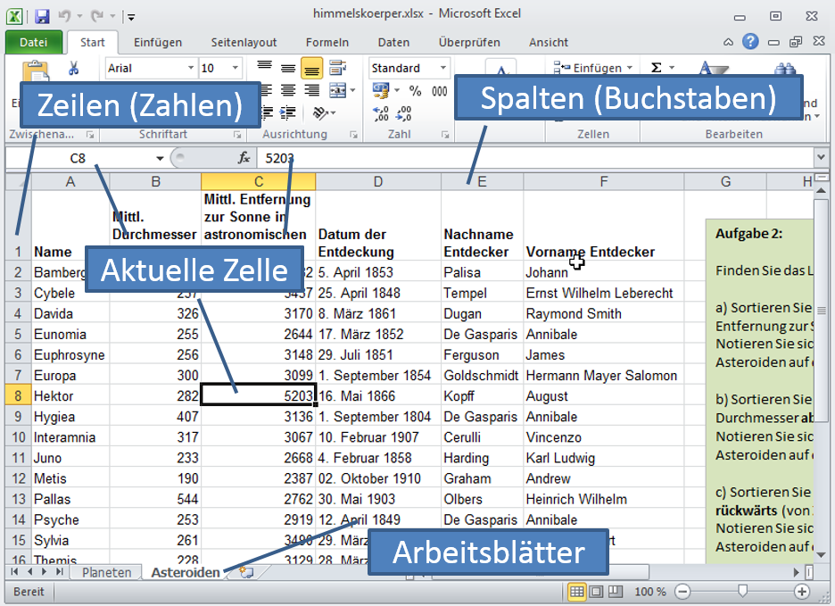

# Arbeitsmappe

Die Dateien, welche mit einem Tabellenkalkulationsprogramm bearbeitet werden, heissen **Arbeitsmappen**. Eine Arbeitsmappe enhält eine oder mehrere **Tabellen**. Eine Tabelle besteht aus **Zellen**, welche in Zeilen und Spalten angeordnet sind.

Die Zeilen werden mit Zahlen bezeichnet, die Spalten mit Buchstaben. So erhält jede Zelle einer Tabelle eine eindeutige Bezeichnung, z.B. `A13` oder `ZA210`.

In Tabellenkalkulationsprogrammen wird normalerweise nur eine Tabelle einer Arbeitsmappe angezeigt. Mit den Tabs am unteren Rand der Tabelle kann zu den anderen Tabellen in der Arbeitsmappe gewechselt werden.

Im Tabellenkalkulationsprogramm ist immer eine Zelle ausgewählt. Sie wird als **aktuelle** oder **aktive** Zelle bezeichnet. Oberhalb der Tabelle wird die Bezeichnung sowie der Inhalt der aktuellen Zelle dargestellt.
