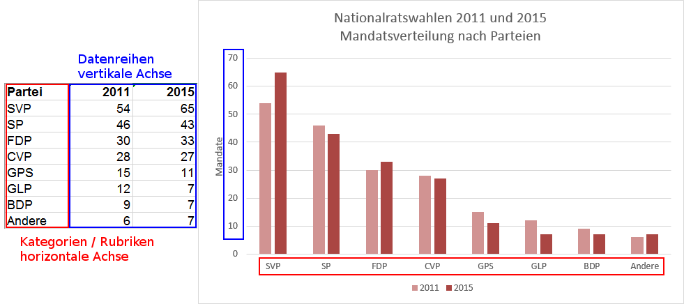
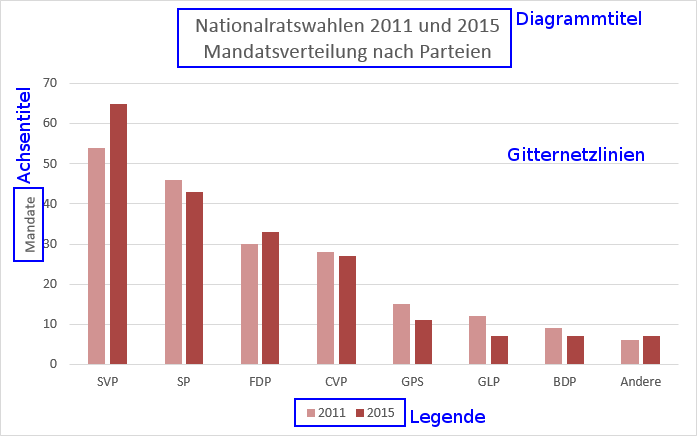

# Aufbau eines Diagramms

## Kategorien und Datenreihen

Ein Diagramm ist die grafische Darstellung von Daten. Dabei werden mehrere **Kategorien** oder **Rubriken** verglichen.
Für jeden Kategorie liegt ein oder mehrere **Zahlenwerte** vor, die **Datenreihen**.

Beispielsweise werden für Parteien (die Kategorien) die Mandate in verschiedenen Nationalratswahlen (die Datenreihen) verglichen:

Beim Säulendiagramm werden die Kategorien auf der horizontalen Achse abgebildet, die Datenreihen auf der vertikalen.

## Aufbau eines Diagramms

Ein aussagekräftiges Diagramm enthält mindestens

- einen **Diagrammtitel**,
- einen **Achsentitel** für die Datenreihen,
- **Gitternetzlinien**, um  die Werte der Datenreihen gut ablesen zu können,
- eine **Legende**, sofern mehr als eine Datenreihe dargestellt wird.

