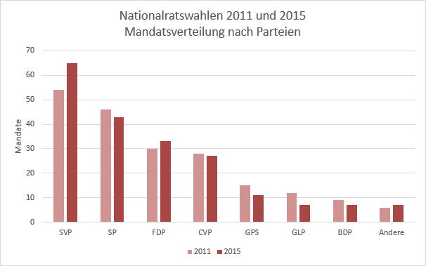
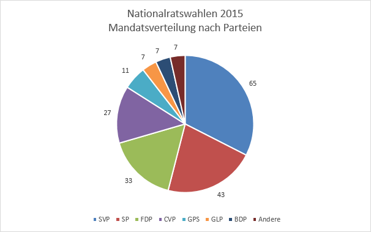
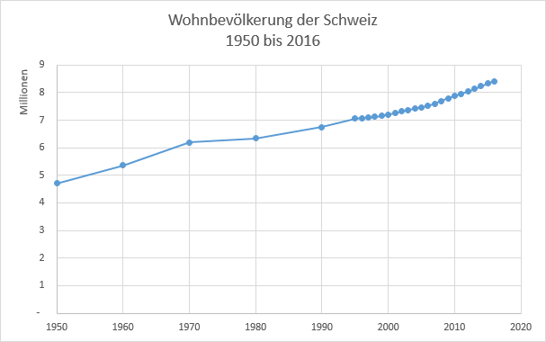
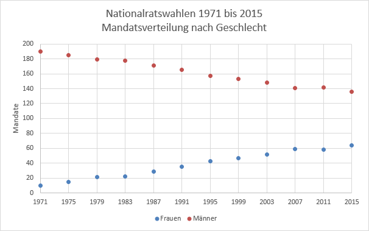

# Diagrammtypen

## Säulendiagramm

Mit einem **Säulendiagramm** (engl. *bar chart*) werden **absolute Zahlen** dargestellt (z.B. die genaue Anzahl der Mandate). Ein Säulendiagramm eignet sich inbesondere, um verschiedene Datenreihen zu vergleichen. Die vertikale Achse hat eine Skala. Horizontale Gitternetzlinien helfen dabei, die Werte der einzelnen Säulen an der Skala abzulesen.

## Kreisdiagramm

Ein **Kreisdiagramm** (auch «Kuchendiagramm», engl. *pie chart*) wird verwendet, um **Daten relativ** zueinander (also **Verhältnisse**) darzustellen.

In einem Kreisdiagramm kann nur eine Datenreihe sinnvoll dargestellt werden.

Beim Kreisdiagramm sollten die **Datenbeschriftungen** angezeigt werden, da die Werte nicht an einer Skala abgelesen werden können.

## Punktdiagramm / XY-Diagramm

Wenn die Kategorien Zahlen sind werden **Punktdiagramme** verwendet. Ein typisches Beispiel sind Jahrzahlen. Eine zeitliche Entwicklung lässt sich also gut mit einem Punktdiagramm darstellen.

Im folgenden Beispiel wird die Entwicklung der Schweizer Wohnbevölkerung als Punktdiagramm dargestellt. Da sich die Bevölkerung zwischen den bekannten Datenpunkten vermutlich kontinuierlich entwickelt hat, ist es legitim, die Datenpunkt mit Linien zu verbinden:

Das nächste Beispiel zeigt die zeitliche Entwicklung der Mandatsverteilung im Nationalrat nach Geschlecht. Hier sollten die Punkte nicht verbunden werden, die Anzahl Mandate hat sich ja zwischen den Wahlen nicht verändert:

