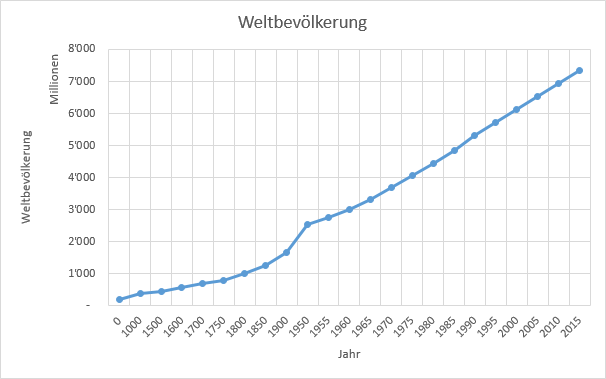
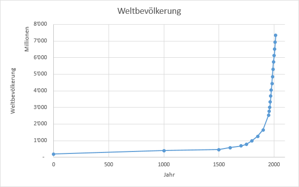

# Punkt- oder Liniendiagramm

## Liniendiagramme

Ein Liniendiagramm stellt – wie das Balkendiagramm – die *Kategorien* auf der horizontalen Achse in einem **gleichmässigen Abstand** dar.

:::danger
Wenn die Kategorien **Zahlen mit einen ungleichmässigen Abstand** sind, führt dies zu einer irreführenden Darstellung.
:::

Im untenstehenden Diagramm wird das Wachstum der Weltbevölkerung als Liniendiagramm dargestellt. Die Entwicklung zwischen 1900 und 2015 nimmt dabei einen grösseren Bereich ein als die Entwicklung zwischen dem Jahr 0 und 1900, obschon die Zeitraum im zweiten Bereich viel grösser ist.

Dies führt zu einer **verzerrten Darstellung** des Wachstums, welches auf den ersten Blick als **linear** interpretiert wird.

## Punktdiagramme (XY-Diagramme)

Das Punktdiagramm ist der einzige Diagrammtyp, welcher auf beiden Achsen **Zahlenwerte** darstellt.

Das Wachstum der Weltbevölkerung wird in diesem Fall korrekt dargestellt, da die Datenpunkte auch horizontal die korrekten Abstände haben. Anhand des untenstehenden Diagramms ist das **exponentiale** Wachstum ersichtlich:

:::warning Fazit
 Liniendiagramme dürfen nicht verwendet werden. Anstelle eines Liniendiagramms sollte immer ein Punktdiagramm verwendet werden. (Einzige Ausnahme: In Klimadiagrammen mit Monaten in der X-Achse kann/muss für den Temperaturverlauf ein Liniendiagramm ausgewählt werden.)
:::
