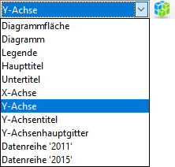
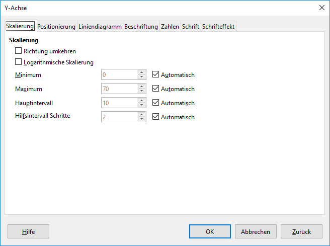

## Achse formatieren

Um in LibreOffice ein Diagramm zu bearbeiten, muss der Diagramm-Modus aktiviert werden. Dies geschieht durch einen Doppelklick auf das Diagramm.

Der Diagramm-Modus erkennt man an der veränderten Menüleiste.

Im Menübereich wird das aktuell gewählte Diagrammelement angezeigt. Die Auswahl kann entweder durch einen Klick auf das gewünschte Element oder über das Dropdown-Menü geändert werden.

Wähle einer der folgenden Diagrammelemente, um die entsprechende Achse zu formatieren:

- __X-Achse__
- __Y-Achse__

Klicke anschliessend auf die Schaltfläche  rechts der Auswahl, um den Formt-Dialog für das gewählte Element zu öffnen.

## Wichtige Achsenformatierungen

Mit **Minimum** und **Maximum** wird festgelegt, welcher Bereich der Achse angezeigt wird.

Das **Hauptintervall** legt fest, in welchem Abstand Werte auf der Achse angeschrieben werden. In diesem Abstand werden auch die Gitternetzlinien gezeichnet.

Damit die Werte manuell festgelegt werden können, muss der entsprechende Haken bei __Automatisch__ entfernt werden.
