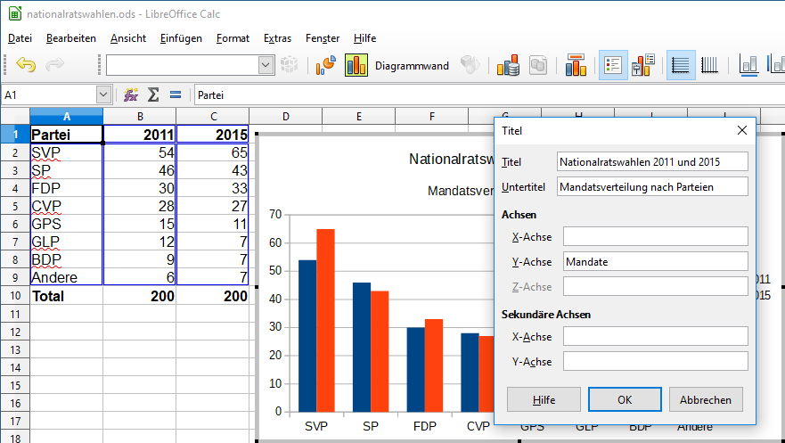

# Achsentitel

Um in LibreOffice ein Diagramm zu bearbeiten, muss der Diagramm-Modus aktiviert werden. Dies geschieht durch einen Doppelklick auf das Diagramm.

Der Diagramm-Modus erkennt man an der veränderten Menüleiste.

Wähle den Menüpunkt __Einfügen__ :mdi-chevron-right: __Titel__ aus. Es erscheint ein Dialog, in welchem die Achsentitel eingegeben werden können.

Durch das Ziehen am Rahmen der Titel können diese positioniert und in ihrer Grösse angepasst werden.
