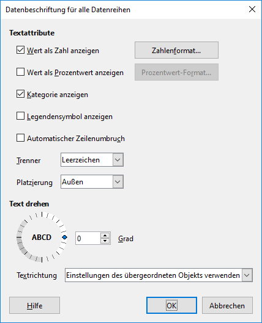

Um in LibreOffice ein Diagramm zu bearbeiten, muss der Diagramm-Modus aktiviert werden. Dies geschieht durch einen Doppelklick auf das Diagramm.

Der Diagramm-Modus erkennt man an der veränderten Menüleiste.

Wähle den Menüpunkt __Einfügen__ :mdi-chevron-right: __Datenbeschriftungen__ aus. Es erscheint ein Dialog, in welchem die Datenbeschriftungen angepasst werden können:

Wichtig sind vorallem die folgenden Möglichkeiten:

- **Wert als Text anzeigen** oder **Wert als Prozentwert anzeigen** zeigt den Datenwert an.
- **Kategorie anzeigen** zeigt die Bezeichnung der Kategorie bei jedem Datenwert an.

Ausserdem kann unter **Platzierung** die Beschriftung positioniert werden:

- __Innen__: die Beschriftung wird innerhalb der Fläche dargestellt
- __Aussen__: die Beschriftung wird ausserhalb der Fläche dargestellt
