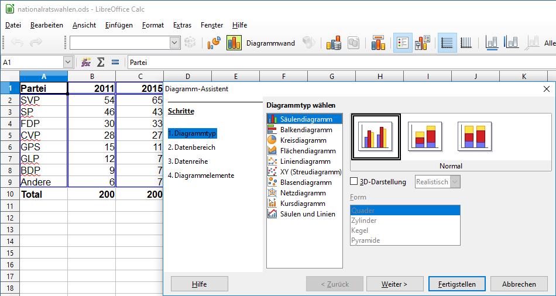

# Diagramm erstellen

## Voraussetzungen

Damit ein Diagramm ohne Komplikationen erstellt werden kann, muss der Datenbereich richtig vorbereitet werden. Folgende Punkte sind zu beachten:

- Die **Kategorien** müssen in der vordersten Spalte des Datenbereichs stehen
- Die **Datenreihen** müssen in den nachfolgenden Spalten stehen. Die Zellen der Datenreihen müssen Zahlen oder Formeln enthalten.
- Die **Überschriften der Datenreihen** müssen den Datentyp **Text** aufweisen. Einer Jahrzahl muss beispielsweise ein Apostroph vorangestellt werden.

## Daten auswählen

Wähle den Tabellenbereich, welcher die **Kategorien** und **Datenreihen** inklusiver **Überschriften** umfasst.

:::danger
Eine allfällige Summenzeile darf **nicht** mit ausgwählt werden.
:::

## Diagrammtyp auswählen

Wähle den Menüpunkt __Einfügen__ :mdi-chevron-right: __Diagramm__ aus. Der Dialog «Diagramm-Assistent» wird angezeigt. Hier kann der gewünscht Diagrammtyp ausgewählt werden.

Nach einem Klick auf __Fertigstellen__ wird das Diagramm erstellt.
