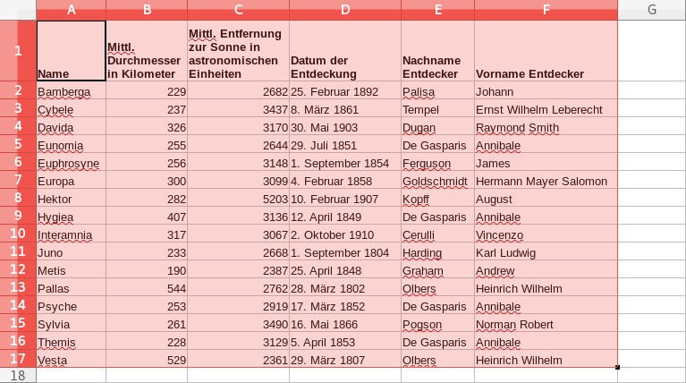
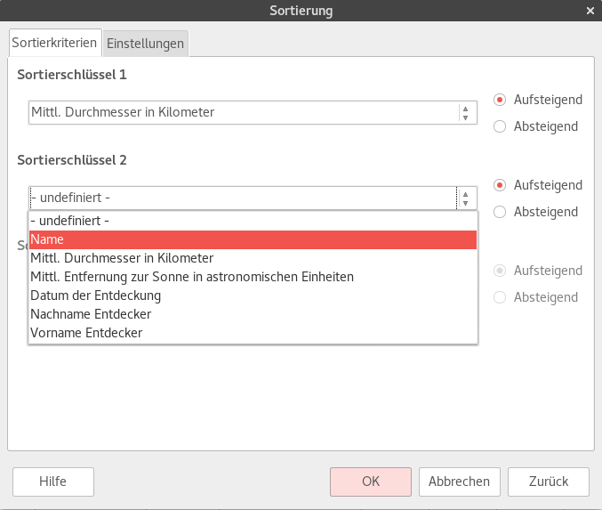

# Sortierung

Wähle zuerst den Bereich des Tabellenblatts aus, welcher sortiert werden soll. Dabei müssen unbedingt sämtliche Zeilen und Spalten, die zur Tabelle gehören, ausgewählt werden.

Anschliessend wird über den Menüpunkt __Daten__ :mdi-chevron-right: __Sortieren...__ der Dialog «Sortierung» geöffnet.

In diesem Dialog können mehrere Sortierschlüssel definiert werden. Für jede Ebene kann die Spalte, nach welcher sortiert werden soll sowie die Sortierreihenfolge ausgwählt werden:

