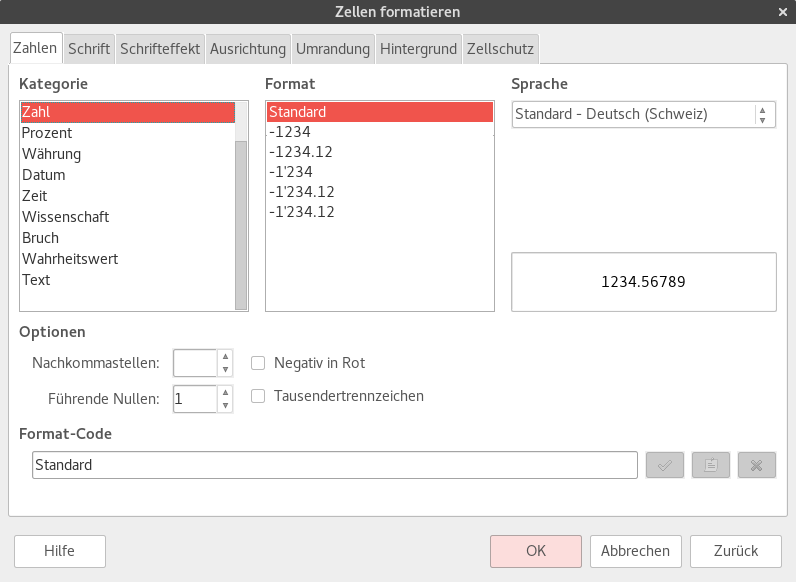

# 'Zahlenformate'

Die Darstellung von Zahlenwerten in einer Zelle kann durch die Wahl eines Zahlenformats beeinflusst werden.

In LibreOffice wird dazu das Menü __Format__ :mdi-chevron-right: __Zellen...__ verwendet, welches den Dialog «Zahlen formatieren» öffnet:

Es muss sichergestellt werden, dass das Tab «Zahlen» ausgwählt ist.

Im Dialog kann in der Liste «Kategorie» das gewünschte Zahlenformat ausgewählt werden. Anschliessend kann in der Liste «Format» die gewünschte Variatne gewählt werden.

Unter «Optionen» kann die Anzahl Nachkommastellen eingegeben sowie die Tausendertrennzeichen ein- oder ausgeschaltet werden.

Damit das Zahlenformat auf die ausgwählten Zellen angewendet wird, muss am Schluss auf __OK__ geklickt werden.

Im folgenden werden die wichtigsten Darstellungsarten kurz erläutert.

## Zahl

Wird in der Liste der Eintrag __Zahl__ ausgewählt, dann wird der Wert als «normale» Zahl dargestellt.

## Prozentwert

Eine Zahl kann auch als Prozentwert dargestellt werden. Die geschieht über den Eintrag __Prozent__ in der Liste geschehen.

:::danger
Hier ist zu beachten, dass der Prozentwert das hundertfache des Zahlwerts ist. Die Zahl 0.42 entspricht 42%.
:::

## Wissenschaftliche Notation

In der Wissenschaft werden sehr grosse oder sehr kleine Zahlen oft in der sogenannten **wissenschaftlichen Notation** dargestellt. Dabei wird eine grosse Anzahl Nullen durch eine Zehnerpotenz ersetzt. Anstelle von 1000000 schreibt man 106, anstelle von 2490000 schreibt man 2.49&middot;106.

In LibreOffice wird die wissenschaftliche Notation durch den Eintrag __Wissenschaft__ in der Liste ausgewählt.

## Datum und Zeit

Eine Zahl kann auch als Datum dargestellt werden. Das Datum, welches eine Zahl repräsentiert, ergibt sich, indem die Anzahl Tage seit dem 30. Dezember 1899 gezählt werden. So entspricht die Zahl 366 dem 31. Dezember 1900, die Zahl 43100 entspricht dem 31. Dezember 2018.
