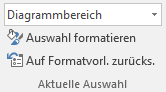
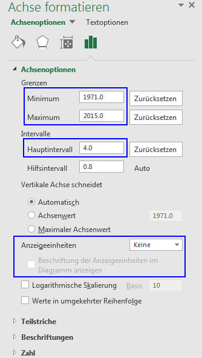

## Achse formatieren

Klicke auf das Diagramm und öffne das Menüband __Diagrammtools__ :mdi-chevron-right: __Format__.

Im Menübereich __Aktuelle Auswahl__ wird das aktuell gewählte Diagrammelement angezeigt. Die Auswahl kann entweder durch einen Klick auf das gewünschte Element oder über das Dropdown-Menü geändert werden.

Wähle eines der folgenden Diagrammelemente, um die entsprechende Achse zu formatieren:

- __Horizontal (Wert) Achse__
- __Vertikal (Wert) Achse__

Klicke anschliessend auf die Schaltfläche __Auswahl formatieren__, um am rechten Rand des Excel-Fensters den Bereich __Achse formatieren__ einzublenden:

## Wichtige Achsenformatierungen

Mit **Minimum** und **Maximum** wird festgelegt, welcher Bereich der Achse angezeigt wird.

Das **Hauptintervall** legt fest, in welchem Abstand Werte auf der Achse angeschrieben werden. In diesem Abstand werden auch die Gitternetzlinien gezeichnet.

Bei grossen Werten bietet es sich an, die **Anzeigeeinheiten** beispielsweise auf «Millionen» zu setzen. Die Achse wird dann automatisch entsprechend beschriftet, also z.B. mit «42» statt «42'000'000». Dabei sollte auch immer die Option __Beschriftung der Anzeigeeinheiten im Diagramm anzeigen__ eingeschaltet werden.
